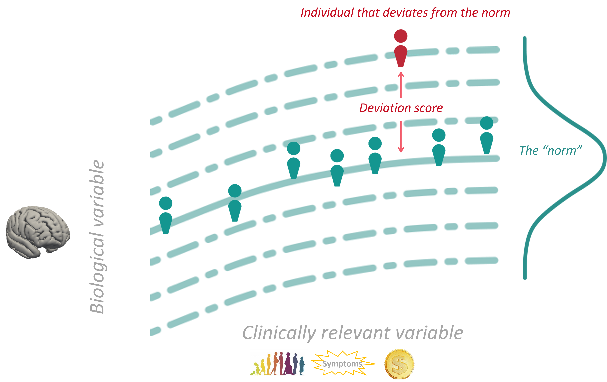

PCNtoolkit homepage
===================

.. raw:: html

   

     <h1 class="pcn-homepage-title">PCNtoolkit</h1>
     

       Open source Python software for normative modelling
     

   

PCNtoolkit implements normative modelling, a statistical
and machine learning framework that shifts away from
traditional case-control comparisons (healthy vs. patient
groups) and instead focuses on the individual. Rather than
asking how patient groups differ on average, normative
modelling asks: *"How does this specific individual deviate
from a large healthy reference population?"*

.. toctree::
   :maxdepth: 2
   :hidden:

   getting_started/index
   tutorials/index
   support/index
   development/index

      
