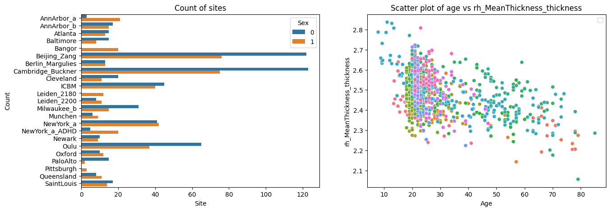

Command line interface
======================

The PCNtoolkit is a python package, but it can also be used from the
command line.

Here we show how to use the PCNtoolkit from the command line.

Furthermore, you can use this script to generate commands for the
command line interface. (Although if you are able to run this notebook,
why not just use it as a python package?)

.. code:: ipython3

    import pandas as pd
    import numpy as np
    from sklearn.model_selection import train_test_split
    import seaborn as sns
    import matplotlib.pyplot as plt
    import os
    import sys
    import pickle

BLR Example
-----------

Data preparation
~~~~~~~~~~~~~~~~

.. code:: ipython3

    # Download and split data first
    # If you are running this notebook for the first time, you need to download the dataset from github.
    # If you have already downloaded the dataset, you can comment out the following line
    os.makedirs("resources/data", exist_ok=True)
    pd.read_csv(
        "https://raw.githubusercontent.com/predictive-clinical-neuroscience/PCNtoolkit-demo/refs/heads/main/data/fcon1000.csv"
    ).to_csv("resources/data/fcon1000.csv", index=False)

.. code:: ipython3

    data = pd.read_csv("resources/data/fcon1000.csv")

.. code:: ipython3

    # Inspect the data
    fig, ax = plt.subplots(1, 2, figsize=(15, 5))
    sns.scatterplot(data=data, x=("age"), y=("rh_MeanThickness_thickness"), hue=("site"), ax=ax[1])
    ax[1].legend([], [])
    ax[1].set_title("Scatter plot of age vs rh_MeanThickness_thickness")
    ax[1].set_xlabel("Age")
    ax[1].set_ylabel("rh_MeanThickness_thickness")
    sns.countplot(data=data, y="site", hue="sex", ax=ax[0], orient="h")
    ax[0].legend(title="Sex")
    ax[0].set_title("Count of sites")
    ax[0].set_xlabel("Site")
    ax[0].set_ylabel("Count")
    plt.show()

.. code:: ipython3

    # Split into X, y, and batch effects
    covariate_columns = ["age"]
    batch_effect_columns = ["sex", "site"]
    response_columns = ["rh_MeanThickness_thickness", "WM-hypointensities"]
    
    X = data[covariate_columns]
    Y = data[response_columns]
    batch_effects = data[batch_effect_columns]
    
    batch_effects_strings = [str(b[0]) + " " + str(b[1]) for b in batch_effects.values]
    
    # Split into train and test set
    trainidx, testidx = train_test_split(data.index, test_size=0.2, random_state=42, stratify=batch_effects_strings)
    train_X = X.loc[trainidx]
    train_Y = Y.loc[trainidx]
    train_batch_effects = batch_effects.loc[trainidx]
    
    test_X = X.loc[testidx]
    test_Y = Y.loc[testidx]
    test_batch_effects = batch_effects.loc[testidx]

.. code:: ipython3

    # Save stuff
    root_dir = os.path.join("resources", "cli_example")
    data_dir = os.path.join(root_dir, "data")
    os.makedirs(data_dir, exist_ok=True)
    
    resp = os.path.abspath(os.path.join(data_dir, "responses.csv"))
    cov = os.path.abspath(os.path.join(data_dir, "covariates.csv"))
    be = os.path.abspath(os.path.join(data_dir, "batch_effects.csv"))
    
    t_resp = os.path.abspath(os.path.join(data_dir, "test_responses.csv"))
    t_cov = os.path.abspath(os.path.join(data_dir, "test_covariates.csv"))
    t_be = os.path.abspath(os.path.join(data_dir, "test_batch_effects.csv"))
    
    
    with open(cov, "wb") as f:
        pickle.dump(train_X, f)
    with open(resp, "wb") as f:
        pickle.dump(train_Y, f)
    with open(be, "wb") as f:
        pickle.dump(train_batch_effects, f)
    with open(t_cov, "wb") as f:
        pickle.dump(test_X, f)
    with open(t_resp, "wb") as f:
        pickle.dump(test_Y, f)
    with open(t_be, "wb") as f:
        pickle.dump(test_batch_effects, f)

BLR configuration
~~~~~~~~~~~~~~~~~

.. code:: ipython3

    alg = "blr"
    func = "fit_predict"
    
    # normative model configuration
    save_dir = os.path.join(root_dir, "blr_cli", "save_dir")
    savemodel = True
    saveresults = True
    basis_function = "linear"
    inscaler = "standardize"
    outscaler = "standardize"
    
    # Regression model configuration
    optimizer = "l-bfgs-b"
    n_iter = 200
    heteroskedastic = True
    fixed_effect = True
    warp = "WarpSinhArcsinh"
    warp_reparam = True
    
    # runner configuration
    cross_validate = True
    cv_folds = 5
    parallelize = False
    job_type = "local"
    n_jobs = 2
    temp_dir = os.path.join(root_dir, "temp")
    log_dir = os.path.join(root_dir, "log")
    python_env = os.path.join(os.path.dirname(os.path.dirname(sys.executable)))

Constructing command
~~~~~~~~~~~~~~~~~~~~

.. code:: ipython3

    command = "normative"
    args = f"-a {alg} -f {func} -c {cov} -r {resp} -t {t_resp} -e {t_cov} -k {cv_folds}"
    kwargs = f"be={be} t_be={t_be}"
    normative_model_kwargs = f"save_dir={save_dir} savemodel={savemodel} saveresults={saveresults} basis_function={basis_function} inscaler={inscaler} outscaler={outscaler}"
    runner_kwargs = f"cross_validate={cross_validate} parallelize={parallelize} job_type={job_type} n_jobs={n_jobs} temp_dir={temp_dir} log_dir={log_dir} environment={python_env}"
    blr_kwargs = f"optimizer={optimizer} n_iter={n_iter} heteroskedastic={heteroskedastic} fixed_effect={fixed_effect} warp={warp} warp_reparam={warp_reparam}"
    full_command = f"{command} {args} {kwargs} {runner_kwargs} {normative_model_kwargs} {blr_kwargs}"

.. code:: ipython3

    print(full_command)

.. parsed-literal::

    normative -a blr -f fit_predict -c /home/runner/work/PCNtoolkit/PCNtoolkit/resources/cli_example/data/covariates.csv -r /home/runner/work/PCNtoolkit/PCNtoolkit/resources/cli_example/data/responses.csv -t /home/runner/work/PCNtoolkit/PCNtoolkit/resources/cli_example/data/test_responses.csv -e /home/runner/work/PCNtoolkit/PCNtoolkit/resources/cli_example/data/test_covariates.csv -k 5 be=/home/runner/work/PCNtoolkit/PCNtoolkit/resources/cli_example/data/batch_effects.csv t_be=/home/runner/work/PCNtoolkit/PCNtoolkit/resources/cli_example/data/test_batch_effects.csv cross_validate=True parallelize=False job_type=local n_jobs=2 temp_dir=resources/cli_example/temp log_dir=resources/cli_example/log environment=/opt/hostedtoolcache/Python/3.12.13/x64 save_dir=resources/cli_example/blr_cli/save_dir savemodel=True saveresults=True basis_function=linear inscaler=standardize outscaler=standardize optimizer=l-bfgs-b n_iter=200 heteroskedastic=True fixed_effect=True warp=WarpSinhArcsinh warp_reparam=True

Running command
~~~~~~~~~~~~~~~

.. code:: ipython3

    !{full_command}

.. parsed-literal::

    Process: 3428 - 2026-05-22 16:18:50 - Dataset "fit_data" created.
        - 862 observations
        - 862 unique subjects
        - 1 covariates
        - 2 response variables
        - 2 batch effects:
        	batch_effect_0 (2)
    	batch_effect_1 (23)
        
    Process: 3428 - 2026-05-22 16:18:50 - Dataset "predict_data" created.
        - 216 observations
        - 216 unique subjects
        - 1 covariates
        - 2 response variables
        - 2 batch effects:
        	batch_effect_0 (2)
    	batch_effect_1 (23)
        
    Process: 3428 - 2026-05-22 16:18:50 - Task ID created: fit_predict_fit_data__2026-05-22_16:18:50_37.795898
    Process: 3428 - 2026-05-22 16:18:50 - Temporary directory created:
    	/home/runner/work/PCNtoolkit/PCNtoolkit/resources/cli_example/temp/fit_predict_fit_data__2026-05-22_16:18:50_37.795898
    Process: 3428 - 2026-05-22 16:18:50 - Log directory created:
    	/home/runner/work/PCNtoolkit/PCNtoolkit/resources/cli_example/log/fit_predict_fit_data__2026-05-22_16:18:50_37.795898
    /home/runner/work/PCNtoolkit/PCNtoolkit/pcntoolkit/util/output.py:296: UserWarning: Process: 3428 - 2026-05-22 16:18:50 - Predict data not used in k-fold cross-validation
      warnings.warn(message, category)
    /opt/hostedtoolcache/Python/3.12.13/x64/lib/python3.12/site-packages/sklearn/model_selection/_split.py:813: UserWarning: The least populated class in y has only 2 members, which is less than n_splits=5.
      warnings.warn(
    Process: 3428 - 2026-05-22 16:18:50 - Fitting models on 2 response variables.
    Process: 3428 - 2026-05-22 16:18:50 - Fitting model for response_var_0.
    Process: 3428 - 2026-05-22 16:18:50 - Fitting model for response_var_1.
    /home/runner/work/PCNtoolkit/PCNtoolkit/pcntoolkit/regression_model/blr.py:716: LinAlgWarning: An ill-conditioned matrix detected: slice 0 has rcond = 5.523723946631791e-27.
      invAXt: np.ndarray = linalg.solve(self.A, X.T, check_finite=False)
    /home/runner/work/PCNtoolkit/PCNtoolkit/pcntoolkit/util/output.py:296: UserWarning: Process: 3428 - 2026-05-22 16:18:50 - Posterior estimation failed: 
    Matrix is not positive definite. 
    The optimizer could not find a stable solution. Retrying optimization.
      warnings.warn(message, category)
    /home/runner/work/PCNtoolkit/PCNtoolkit/pcntoolkit/regression_model/blr.py:716: LinAlgWarning: An ill-conditioned matrix detected: slice 0 has rcond = 6.375496563279125e-27.
      invAXt: np.ndarray = linalg.solve(self.A, X.T, check_finite=False)
    /home/runner/work/PCNtoolkit/PCNtoolkit/pcntoolkit/regression_model/blr.py:716: LinAlgWarning: An ill-conditioned matrix detected: slice 0 has rcond = 4.9980721138137064e-27.
      invAXt: np.ndarray = linalg.solve(self.A, X.T, check_finite=False)
    /home/runner/work/PCNtoolkit/PCNtoolkit/pcntoolkit/regression_model/blr.py:716: LinAlgWarning: An ill-conditioned matrix detected: slice 0 has rcond = 6.746691663731469e-27.
      invAXt: np.ndarray = linalg.solve(self.A, X.T, check_finite=False)
    /home/runner/work/PCNtoolkit/PCNtoolkit/pcntoolkit/regression_model/blr.py:716: LinAlgWarning: An ill-conditioned matrix detected: slice 0 has rcond = 6.104659065295494e-27.
      invAXt: np.ndarray = linalg.solve(self.A, X.T, check_finite=False)
    Process: 3428 - 2026-05-22 16:18:50 - Saving model to:
    	resources/cli_example/blr_cli/save_dir/folds/fold_0.
    Process: 3428 - 2026-05-22 16:18:50 - Making predictions on 2 response variables.
    Process: 3428 - 2026-05-22 16:18:50 - Computing z-scores for 2 response variables.
    Process: 3428 - 2026-05-22 16:18:50 - Computing z-scores for response_var_0.
    Process: 3428 - 2026-05-22 16:18:50 - Computing z-scores for response_var_1.
    Process: 3428 - 2026-05-22 16:18:50 - Computing centiles for 2 response variables.
    Process: 3428 - 2026-05-22 16:18:50 - Computing centiles for response_var_0.
    Process: 3428 - 2026-05-22 16:18:50 - Computing centiles for response_var_1.
    Process: 3428 - 2026-05-22 16:18:50 - Computing log-probabilities for 2 response variables.
    Process: 3428 - 2026-05-22 16:18:50 - Computing log-probabilities for 2 response variables.
    Process: 3428 - 2026-05-22 16:18:50 - Computing log-probabilities for response_var_0.
    Process: 3428 - 2026-05-22 16:18:50 - Computing log-probabilities for response_var_1.
    Process: 3428 - 2026-05-22 16:18:50 - Computing yhat for 2 response variables.
    Process: 3428 - 2026-05-22 16:18:50 - Computing yhat for response_var_0.
    Process: 3428 - 2026-05-22 16:18:50 - Computing yhat for response_var_1.
    Process: 3428 - 2026-05-22 16:18:51 - Dataset "centile" created.
        - 150 observations
        - 150 unique subjects
        - 1 covariates
        - 2 response variables
        - 2 batch effects:
        	batch_effect_0 (1)
    	batch_effect_1 (1)
        
    Process: 3428 - 2026-05-22 16:18:51 - Computing centiles for 2 response variables.
    Process: 3428 - 2026-05-22 16:18:51 - Computing centiles for response_var_0.
    Process: 3428 - 2026-05-22 16:18:51 - Computing centiles for response_var_1.
    Process: 3428 - 2026-05-22 16:18:51 - Harmonizing data on 2 response variables.
    Process: 3428 - 2026-05-22 16:18:51 - Harmonizing data for response_var_0.
    Process: 3428 - 2026-05-22 16:18:51 - Harmonizing data for response_var_1.
    Process: 3428 - 2026-05-22 16:18:52 - Making predictions on 2 response variables.
    Process: 3428 - 2026-05-22 16:18:52 - Computing z-scores for 2 response variables.
    Process: 3428 - 2026-05-22 16:18:52 - Computing z-scores for response_var_0.
    Process: 3428 - 2026-05-22 16:18:52 - Computing z-scores for response_var_1.
    Process: 3428 - 2026-05-22 16:18:52 - Computing centiles for 2 response variables.
    Process: 3428 - 2026-05-22 16:18:52 - Computing centiles for response_var_0.
    Process: 3428 - 2026-05-22 16:18:52 - Computing centiles for response_var_1.
    Process: 3428 - 2026-05-22 16:18:52 - Computing log-probabilities for 2 response variables.
    Process: 3428 - 2026-05-22 16:18:52 - Computing log-probabilities for 2 response variables.
    Process: 3428 - 2026-05-22 16:18:52 - Computing log-probabilities for response_var_0.
    Process: 3428 - 2026-05-22 16:18:52 - Computing log-probabilities for response_var_1.
    Process: 3428 - 2026-05-22 16:18:52 - Computing yhat for 2 response variables.
    Process: 3428 - 2026-05-22 16:18:52 - Computing yhat for response_var_0.
    Process: 3428 - 2026-05-22 16:18:52 - Computing yhat for response_var_1.
    Process: 3428 - 2026-05-22 16:18:53 - Dataset "centile" created.
        - 150 observations
        - 150 unique subjects
        - 1 covariates
        - 2 response variables
        - 2 batch effects:
        	batch_effect_0 (1)
    	batch_effect_1 (1)
        
    Process: 3428 - 2026-05-22 16:18:53 - Computing centiles for 2 response variables.
    Process: 3428 - 2026-05-22 16:18:53 - Computing centiles for response_var_0.
    Process: 3428 - 2026-05-22 16:18:53 - Computing centiles for response_var_1.
    Process: 3428 - 2026-05-22 16:18:53 - Harmonizing data on 2 response variables.
    Process: 3428 - 2026-05-22 16:18:53 - Harmonizing data for response_var_0.
    Process: 3428 - 2026-05-22 16:18:53 - Harmonizing data for response_var_1.
    Process: 3428 - 2026-05-22 16:18:53 - Fitting models on 2 response variables.
    Process: 3428 - 2026-05-22 16:18:53 - Fitting model for response_var_0.
    Process: 3428 - 2026-05-22 16:18:54 - Fitting model for response_var_1.
    /home/runner/work/PCNtoolkit/PCNtoolkit/pcntoolkit/regression_model/blr.py:716: LinAlgWarning: An ill-conditioned matrix detected: slice 0 has rcond = 4.2455126268504203e-20.
      invAXt: np.ndarray = linalg.solve(self.A, X.T, check_finite=False)
    /home/runner/work/PCNtoolkit/PCNtoolkit/pcntoolkit/util/output.py:296: UserWarning: Process: 3428 - 2026-05-22 16:18:54 - Posterior estimation failed: 
    Matrix is not positive definite. 
    The optimizer could not find a stable solution. Retrying optimization.
      warnings.warn(message, category)
    /home/runner/work/PCNtoolkit/PCNtoolkit/pcntoolkit/regression_model/blr.py:716: LinAlgWarning: An ill-conditioned matrix detected: slice 0 has rcond = 4.910057133212752e-20.
      invAXt: np.ndarray = linalg.solve(self.A, X.T, check_finite=False)
    /home/runner/work/PCNtoolkit/PCNtoolkit/pcntoolkit/regression_model/blr.py:716: LinAlgWarning: An ill-conditioned matrix detected: slice 0 has rcond = 3.8415638861183265e-20.
      invAXt: np.ndarray = linalg.solve(self.A, X.T, check_finite=False)
    /home/runner/work/PCNtoolkit/PCNtoolkit/pcntoolkit/regression_model/blr.py:716: LinAlgWarning: An ill-conditioned matrix detected: slice 0 has rcond = 5.185259614266013e-20.
      invAXt: np.ndarray = linalg.solve(self.A, X.T, check_finite=False)
    /home/runner/work/PCNtoolkit/PCNtoolkit/pcntoolkit/regression_model/blr.py:716: LinAlgWarning: An ill-conditioned matrix detected: slice 0 has rcond = 4.691929377086917e-20.
      invAXt: np.ndarray = linalg.solve(self.A, X.T, check_finite=False)
    /opt/hostedtoolcache/Python/3.12.13/x64/lib/python3.12/site-packages/scipy/optimize/_numdiff.py:687: RuntimeWarning: overflow encountered in divide
      df_dx = [delf / delx for delf, delx in zip(df, dx)]
    Process: 3428 - 2026-05-22 16:18:54 - Saving model to:
    	resources/cli_example/blr_cli/save_dir/folds/fold_1.
    Process: 3428 - 2026-05-22 16:18:54 - Making predictions on 2 response variables.
    Process: 3428 - 2026-05-22 16:18:54 - Computing z-scores for 2 response variables.
    Process: 3428 - 2026-05-22 16:18:54 - Computing z-scores for response_var_0.
    Process: 3428 - 2026-05-22 16:18:54 - Computing z-scores for response_var_1.
    Process: 3428 - 2026-05-22 16:18:54 - Computing centiles for 2 response variables.
    Process: 3428 - 2026-05-22 16:18:54 - Computing centiles for response_var_0.
    Process: 3428 - 2026-05-22 16:18:54 - Computing centiles for response_var_1.
    Process: 3428 - 2026-05-22 16:18:54 - Computing log-probabilities for 2 response variables.
    Process: 3428 - 2026-05-22 16:18:54 - Computing log-probabilities for 2 response variables.
    Process: 3428 - 2026-05-22 16:18:54 - Computing log-probabilities for response_var_0.
    Process: 3428 - 2026-05-22 16:18:54 - Computing log-probabilities for response_var_1.
    Process: 3428 - 2026-05-22 16:18:54 - Computing yhat for 2 response variables.
    Process: 3428 - 2026-05-22 16:18:54 - Computing yhat for response_var_0.
    Process: 3428 - 2026-05-22 16:18:54 - Computing yhat for response_var_1.
    Process: 3428 - 2026-05-22 16:18:55 - Dataset "centile" created.
        - 150 observations
        - 150 unique subjects
        - 1 covariates
        - 2 response variables
        - 2 batch effects:
        	batch_effect_0 (1)
    	batch_effect_1 (1)
        
    Process: 3428 - 2026-05-22 16:18:55 - Computing centiles for 2 response variables.
    Process: 3428 - 2026-05-22 16:18:55 - Computing centiles for response_var_0.
    Process: 3428 - 2026-05-22 16:18:55 - Computing centiles for response_var_1.
    Process: 3428 - 2026-05-22 16:18:55 - Harmonizing data on 2 response variables.
    Process: 3428 - 2026-05-22 16:18:55 - Harmonizing data for response_var_0.
    Process: 3428 - 2026-05-22 16:18:55 - Harmonizing data for response_var_1.
    Process: 3428 - 2026-05-22 16:18:56 - Making predictions on 2 response variables.
    Process: 3428 - 2026-05-22 16:18:56 - Computing z-scores for 2 response variables.
    Process: 3428 - 2026-05-22 16:18:56 - Computing z-scores for response_var_0.
    Process: 3428 - 2026-05-22 16:18:56 - Computing z-scores for response_var_1.
    Process: 3428 - 2026-05-22 16:18:56 - Computing centiles for 2 response variables.
    Process: 3428 - 2026-05-22 16:18:56 - Computing centiles for response_var_0.
    Process: 3428 - 2026-05-22 16:18:56 - Computing centiles for response_var_1.
    Process: 3428 - 2026-05-22 16:18:56 - Computing log-probabilities for 2 response variables.
    Process: 3428 - 2026-05-22 16:18:56 - Computing log-probabilities for 2 response variables.
    Process: 3428 - 2026-05-22 16:18:56 - Computing log-probabilities for response_var_0.
    Process: 3428 - 2026-05-22 16:18:56 - Computing log-probabilities for response_var_1.
    Process: 3428 - 2026-05-22 16:18:56 - Computing yhat for 2 response variables.
    Process: 3428 - 2026-05-22 16:18:56 - Computing yhat for response_var_0.
    Process: 3428 - 2026-05-22 16:18:56 - Computing yhat for response_var_1.
    Process: 3428 - 2026-05-22 16:18:57 - Dataset "centile" created.
        - 150 observations
        - 150 unique subjects
        - 1 covariates
        - 2 response variables
        - 2 batch effects:
        	batch_effect_0 (1)
    	batch_effect_1 (1)
        
    Process: 3428 - 2026-05-22 16:18:57 - Computing centiles for 2 response variables.
    Process: 3428 - 2026-05-22 16:18:57 - Computing centiles for response_var_0.
    Process: 3428 - 2026-05-22 16:18:57 - Computing centiles for response_var_1.
    Process: 3428 - 2026-05-22 16:18:57 - Harmonizing data on 2 response variables.
    Process: 3428 - 2026-05-22 16:18:57 - Harmonizing data for response_var_0.
    Process: 3428 - 2026-05-22 16:18:57 - Harmonizing data for response_var_1.
    Process: 3428 - 2026-05-22 16:18:57 - Fitting models on 2 response variables.
    Process: 3428 - 2026-05-22 16:18:57 - Fitting model for response_var_0.
    Process: 3428 - 2026-05-22 16:18:58 - Fitting model for response_var_1.
    /home/runner/work/PCNtoolkit/PCNtoolkit/pcntoolkit/regression_model/blr.py:716: LinAlgWarning: An ill-conditioned matrix detected: slice 0 has rcond = 1.701875421761123e-19.
      invAXt: np.ndarray = linalg.solve(self.A, X.T, check_finite=False)
    /home/runner/work/PCNtoolkit/PCNtoolkit/pcntoolkit/util/output.py:296: UserWarning: Process: 3428 - 2026-05-22 16:18:58 - Posterior estimation failed: 
    Matrix is not positive definite. 
    The optimizer could not find a stable solution. Retrying optimization.
      warnings.warn(message, category)
    /home/runner/work/PCNtoolkit/PCNtoolkit/pcntoolkit/regression_model/blr.py:716: LinAlgWarning: An ill-conditioned matrix detected: slice 0 has rcond = 3.6521548448675865e-19.
      invAXt: np.ndarray = linalg.solve(self.A, X.T, check_finite=False)
    /home/runner/work/PCNtoolkit/PCNtoolkit/pcntoolkit/regression_model/blr.py:716: LinAlgWarning: An ill-conditioned matrix detected: slice 0 has rcond = 4.3656485817707845e-19.
      invAXt: np.ndarray = linalg.solve(self.A, X.T, check_finite=False)
    /home/runner/work/PCNtoolkit/PCNtoolkit/pcntoolkit/regression_model/blr.py:716: LinAlgWarning: An ill-conditioned matrix detected: slice 0 has rcond = 4.502124577440806e-19.
      invAXt: np.ndarray = linalg.solve(self.A, X.T, check_finite=False)
    Process: 3428 - 2026-05-22 16:18:58 - Saving model to:
    	resources/cli_example/blr_cli/save_dir/folds/fold_2.
    Process: 3428 - 2026-05-22 16:18:58 - Making predictions on 2 response variables.
    Process: 3428 - 2026-05-22 16:18:58 - Computing z-scores for 2 response variables.
    Process: 3428 - 2026-05-22 16:18:58 - Computing z-scores for response_var_0.
    Process: 3428 - 2026-05-22 16:18:58 - Computing z-scores for response_var_1.
    Process: 3428 - 2026-05-22 16:18:58 - Computing centiles for 2 response variables.
    Process: 3428 - 2026-05-22 16:18:58 - Computing centiles for response_var_0.
    Process: 3428 - 2026-05-22 16:18:58 - Computing centiles for response_var_1.
    Process: 3428 - 2026-05-22 16:18:58 - Computing log-probabilities for 2 response variables.
    Process: 3428 - 2026-05-22 16:18:58 - Computing log-probabilities for 2 response variables.
    Process: 3428 - 2026-05-22 16:18:58 - Computing log-probabilities for response_var_0.
    Process: 3428 - 2026-05-22 16:18:58 - Computing log-probabilities for response_var_1.
    Process: 3428 - 2026-05-22 16:18:58 - Computing yhat for 2 response variables.
    Process: 3428 - 2026-05-22 16:18:58 - Computing yhat for response_var_0.
    Process: 3428 - 2026-05-22 16:18:58 - Computing yhat for response_var_1.
    Process: 3428 - 2026-05-22 16:18:59 - Dataset "centile" created.
        - 150 observations
        - 150 unique subjects
        - 1 covariates
        - 2 response variables
        - 2 batch effects:
        	batch_effect_0 (1)
    	batch_effect_1 (1)
        
    Process: 3428 - 2026-05-22 16:18:59 - Computing centiles for 2 response variables.
    Process: 3428 - 2026-05-22 16:18:59 - Computing centiles for response_var_0.
    Process: 3428 - 2026-05-22 16:18:59 - Computing centiles for response_var_1.
    Process: 3428 - 2026-05-22 16:18:59 - Harmonizing data on 2 response variables.
    Process: 3428 - 2026-05-22 16:18:59 - Harmonizing data for response_var_0.
    Process: 3428 - 2026-05-22 16:18:59 - Harmonizing data for response_var_1.
    Process: 3428 - 2026-05-22 16:19:00 - Making predictions on 2 response variables.
    Process: 3428 - 2026-05-22 16:19:00 - Computing z-scores for 2 response variables.
    Process: 3428 - 2026-05-22 16:19:00 - Computing z-scores for response_var_0.
    Process: 3428 - 2026-05-22 16:19:00 - Computing z-scores for response_var_1.
    Process: 3428 - 2026-05-22 16:19:00 - Computing centiles for 2 response variables.
    Process: 3428 - 2026-05-22 16:19:00 - Computing centiles for response_var_0.
    Process: 3428 - 2026-05-22 16:19:00 - Computing centiles for response_var_1.
    Process: 3428 - 2026-05-22 16:19:00 - Computing log-probabilities for 2 response variables.
    Process: 3428 - 2026-05-22 16:19:00 - Computing log-probabilities for 2 response variables.
    Process: 3428 - 2026-05-22 16:19:00 - Computing log-probabilities for response_var_0.
    Process: 3428 - 2026-05-22 16:19:00 - Computing log-probabilities for response_var_1.
    Process: 3428 - 2026-05-22 16:19:00 - Computing yhat for 2 response variables.
    Process: 3428 - 2026-05-22 16:19:00 - Computing yhat for response_var_0.
    Process: 3428 - 2026-05-22 16:19:00 - Computing yhat for response_var_1.
    Process: 3428 - 2026-05-22 16:19:00 - Dataset "centile" created.
        - 150 observations
        - 150 unique subjects
        - 1 covariates
        - 2 response variables
        - 2 batch effects:
        	batch_effect_0 (1)
    	batch_effect_1 (1)
        
    Process: 3428 - 2026-05-22 16:19:00 - Computing centiles for 2 response variables.
    Process: 3428 - 2026-05-22 16:19:00 - Computing centiles for response_var_0.
    Process: 3428 - 2026-05-22 16:19:00 - Computing centiles for response_var_1.
    Process: 3428 - 2026-05-22 16:19:00 - Harmonizing data on 2 response variables.
    Process: 3428 - 2026-05-22 16:19:00 - Harmonizing data for response_var_0.
    Process: 3428 - 2026-05-22 16:19:00 - Harmonizing data for response_var_1.
    Process: 3428 - 2026-05-22 16:19:01 - Fitting models on 2 response variables.
    Process: 3428 - 2026-05-22 16:19:01 - Fitting model for response_var_0.
    Process: 3428 - 2026-05-22 16:19:01 - Fitting model for response_var_1.
    /home/runner/work/PCNtoolkit/PCNtoolkit/pcntoolkit/regression_model/blr.py:716: LinAlgWarning: An ill-conditioned matrix detected: slice 0 has rcond = 2.345402012863007e-18.
      invAXt: np.ndarray = linalg.solve(self.A, X.T, check_finite=False)
    /home/runner/work/PCNtoolkit/PCNtoolkit/pcntoolkit/util/output.py:296: UserWarning: Process: 3428 - 2026-05-22 16:19:02 - Posterior estimation failed: 
    Matrix is not positive definite. 
    The optimizer could not find a stable solution. Retrying optimization.
      warnings.warn(message, category)
    /home/runner/work/PCNtoolkit/PCNtoolkit/pcntoolkit/regression_model/blr.py:716: LinAlgWarning: An ill-conditioned matrix detected: slice 0 has rcond = 3.416128457233547e-18.
      invAXt: np.ndarray = linalg.solve(self.A, X.T, check_finite=False)
    /home/runner/work/PCNtoolkit/PCNtoolkit/pcntoolkit/regression_model/blr.py:716: LinAlgWarning: An ill-conditioned matrix detected: slice 0 has rcond = 5.01776121710389e-18.
      invAXt: np.ndarray = linalg.solve(self.A, X.T, check_finite=False)
    /home/runner/work/PCNtoolkit/PCNtoolkit/pcntoolkit/regression_model/blr.py:716: LinAlgWarning: An ill-conditioned matrix detected: slice 0 has rcond = 1.4551614365857112e-18.
      invAXt: np.ndarray = linalg.solve(self.A, X.T, check_finite=False)
    /opt/hostedtoolcache/Python/3.12.13/x64/lib/python3.12/site-packages/scipy/optimize/_numdiff.py:687: RuntimeWarning: overflow encountered in divide
      df_dx = [delf / delx for delf, delx in zip(df, dx)]
    Process: 3428 - 2026-05-22 16:19:02 - Saving model to:
    	resources/cli_example/blr_cli/save_dir/folds/fold_3.
    Process: 3428 - 2026-05-22 16:19:02 - Making predictions on 2 response variables.
    Process: 3428 - 2026-05-22 16:19:02 - Computing z-scores for 2 response variables.
    Process: 3428 - 2026-05-22 16:19:02 - Computing z-scores for response_var_0.
    Process: 3428 - 2026-05-22 16:19:02 - Computing z-scores for response_var_1.
    Process: 3428 - 2026-05-22 16:19:02 - Computing centiles for 2 response variables.
    Process: 3428 - 2026-05-22 16:19:02 - Computing centiles for response_var_0.
    Process: 3428 - 2026-05-22 16:19:02 - Computing centiles for response_var_1.
    Process: 3428 - 2026-05-22 16:19:02 - Computing log-probabilities for 2 response variables.
    Process: 3428 - 2026-05-22 16:19:02 - Computing log-probabilities for 2 response variables.
    Process: 3428 - 2026-05-22 16:19:02 - Computing log-probabilities for response_var_0.
    Process: 3428 - 2026-05-22 16:19:02 - Computing log-probabilities for response_var_1.
    Process: 3428 - 2026-05-22 16:19:02 - Computing yhat for 2 response variables.
    Process: 3428 - 2026-05-22 16:19:02 - Computing yhat for response_var_0.
    Process: 3428 - 2026-05-22 16:19:02 - Computing yhat for response_var_1.
    Process: 3428 - 2026-05-22 16:19:03 - Dataset "centile" created.
        - 150 observations
        - 150 unique subjects
        - 1 covariates
        - 2 response variables
        - 2 batch effects:
        	batch_effect_0 (1)
    	batch_effect_1 (1)
        
    Process: 3428 - 2026-05-22 16:19:03 - Computing centiles for 2 response variables.
    Process: 3428 - 2026-05-22 16:19:03 - Computing centiles for response_var_0.
    Process: 3428 - 2026-05-22 16:19:03 - Computing centiles for response_var_1.
    Process: 3428 - 2026-05-22 16:19:03 - Harmonizing data on 2 response variables.
    Process: 3428 - 2026-05-22 16:19:03 - Harmonizing data for response_var_0.
    Process: 3428 - 2026-05-22 16:19:03 - Harmonizing data for response_var_1.
    Process: 3428 - 2026-05-22 16:19:03 - Making predictions on 2 response variables.
    Process: 3428 - 2026-05-22 16:19:03 - Computing z-scores for 2 response variables.
    Process: 3428 - 2026-05-22 16:19:03 - Computing z-scores for response_var_0.
    Process: 3428 - 2026-05-22 16:19:03 - Computing z-scores for response_var_1.
    Process: 3428 - 2026-05-22 16:19:03 - Computing centiles for 2 response variables.
    Process: 3428 - 2026-05-22 16:19:03 - Computing centiles for response_var_0.
    Process: 3428 - 2026-05-22 16:19:03 - Computing centiles for response_var_1.
    Process: 3428 - 2026-05-22 16:19:03 - Computing log-probabilities for 2 response variables.
    Process: 3428 - 2026-05-22 16:19:03 - Computing log-probabilities for 2 response variables.
    Process: 3428 - 2026-05-22 16:19:03 - Computing log-probabilities for response_var_0.
    Process: 3428 - 2026-05-22 16:19:03 - Computing log-probabilities for response_var_1.
    Process: 3428 - 2026-05-22 16:19:03 - Computing yhat for 2 response variables.
    Process: 3428 - 2026-05-22 16:19:03 - Computing yhat for response_var_0.
    Process: 3428 - 2026-05-22 16:19:03 - Computing yhat for response_var_1.
    Process: 3428 - 2026-05-22 16:19:04 - Dataset "centile" created.
        - 150 observations
        - 150 unique subjects
        - 1 covariates
        - 2 response variables
        - 2 batch effects:
        	batch_effect_0 (1)
    	batch_effect_1 (1)
        
    Process: 3428 - 2026-05-22 16:19:04 - Computing centiles for 2 response variables.
    Process: 3428 - 2026-05-22 16:19:04 - Computing centiles for response_var_0.
    Process: 3428 - 2026-05-22 16:19:04 - Computing centiles for response_var_1.
    Process: 3428 - 2026-05-22 16:19:04 - Harmonizing data on 2 response variables.
    Process: 3428 - 2026-05-22 16:19:04 - Harmonizing data for response_var_0.
    Process: 3428 - 2026-05-22 16:19:04 - Harmonizing data for response_var_1.
    Process: 3428 - 2026-05-22 16:19:05 - Fitting models on 2 response variables.
    Process: 3428 - 2026-05-22 16:19:05 - Fitting model for response_var_0.
    Process: 3428 - 2026-05-22 16:19:05 - Fitting model for response_var_1.
    /home/runner/work/PCNtoolkit/PCNtoolkit/pcntoolkit/regression_model/blr.py:716: LinAlgWarning: An ill-conditioned matrix detected: slice 0 has rcond = 8.204862148507314e-55.
      invAXt: np.ndarray = linalg.solve(self.A, X.T, check_finite=False)
    /home/runner/work/PCNtoolkit/PCNtoolkit/pcntoolkit/util/output.py:296: UserWarning: Process: 3428 - 2026-05-22 16:19:05 - Posterior estimation failed: 
    Matrix is not positive definite. 
    The optimizer could not find a stable solution. Retrying optimization.
      warnings.warn(message, category)
    /home/runner/work/PCNtoolkit/PCNtoolkit/pcntoolkit/regression_model/blr.py:716: LinAlgWarning: An ill-conditioned matrix detected: slice 0 has rcond = 5.1618189276041684e-55.
      invAXt: np.ndarray = linalg.solve(self.A, X.T, check_finite=False)
    /home/runner/work/PCNtoolkit/PCNtoolkit/pcntoolkit/regression_model/blr.py:716: LinAlgWarning: An ill-conditioned matrix detected: slice 0 has rcond = 8.204835921010135e-55.
      invAXt: np.ndarray = linalg.solve(self.A, X.T, check_finite=False)
    /home/runner/work/PCNtoolkit/PCNtoolkit/pcntoolkit/regression_model/blr.py:716: LinAlgWarning: An ill-conditioned matrix detected: slice 0 has rcond = 8.204861445939724e-55.
      invAXt: np.ndarray = linalg.solve(self.A, X.T, check_finite=False)
    Process: 3428 - 2026-05-22 16:19:05 - Saving model to:
    	resources/cli_example/blr_cli/save_dir/folds/fold_4.
    Process: 3428 - 2026-05-22 16:19:05 - Making predictions on 2 response variables.
    Process: 3428 - 2026-05-22 16:19:05 - Computing z-scores for 2 response variables.
    Process: 3428 - 2026-05-22 16:19:05 - Computing z-scores for response_var_0.
    Process: 3428 - 2026-05-22 16:19:05 - Computing z-scores for response_var_1.
    Process: 3428 - 2026-05-22 16:19:05 - Computing centiles for 2 response variables.
    Process: 3428 - 2026-05-22 16:19:05 - Computing centiles for response_var_0.
    Process: 3428 - 2026-05-22 16:19:05 - Computing centiles for response_var_1.
    Process: 3428 - 2026-05-22 16:19:05 - Computing log-probabilities for 2 response variables.
    Process: 3428 - 2026-05-22 16:19:05 - Computing log-probabilities for 2 response variables.
    Process: 3428 - 2026-05-22 16:19:05 - Computing log-probabilities for response_var_0.
    Process: 3428 - 2026-05-22 16:19:05 - Computing log-probabilities for response_var_1.
    Process: 3428 - 2026-05-22 16:19:05 - Computing yhat for 2 response variables.
    Process: 3428 - 2026-05-22 16:19:05 - Computing yhat for response_var_0.
    Process: 3428 - 2026-05-22 16:19:06 - Computing yhat for response_var_1.
    Process: 3428 - 2026-05-22 16:19:06 - Dataset "centile" created.
        - 150 observations
        - 150 unique subjects
        - 1 covariates
        - 2 response variables
        - 2 batch effects:
        	batch_effect_0 (1)
    	batch_effect_1 (1)
        
    Process: 3428 - 2026-05-22 16:19:06 - Computing centiles for 2 response variables.
    Process: 3428 - 2026-05-22 16:19:06 - Computing centiles for response_var_0.
    Process: 3428 - 2026-05-22 16:19:06 - Computing centiles for response_var_1.
    Process: 3428 - 2026-05-22 16:19:06 - Harmonizing data on 2 response variables.
    Process: 3428 - 2026-05-22 16:19:06 - Harmonizing data for response_var_0.
    Process: 3428 - 2026-05-22 16:19:06 - Harmonizing data for response_var_1.
    Process: 3428 - 2026-05-22 16:19:07 - Making predictions on 2 response variables.
    Process: 3428 - 2026-05-22 16:19:07 - Computing z-scores for 2 response variables.
    Process: 3428 - 2026-05-22 16:19:07 - Computing z-scores for response_var_0.
    Process: 3428 - 2026-05-22 16:19:07 - Computing z-scores for response_var_1.
    Process: 3428 - 2026-05-22 16:19:07 - Computing centiles for 2 response variables.
    Process: 3428 - 2026-05-22 16:19:07 - Computing centiles for response_var_0.
    Process: 3428 - 2026-05-22 16:19:07 - Computing centiles for response_var_1.
    Process: 3428 - 2026-05-22 16:19:07 - Computing log-probabilities for 2 response variables.
    Process: 3428 - 2026-05-22 16:19:07 - Computing log-probabilities for 2 response variables.
    Process: 3428 - 2026-05-22 16:19:07 - Computing log-probabilities for response_var_0.
    Process: 3428 - 2026-05-22 16:19:07 - Computing log-probabilities for response_var_1.
    Process: 3428 - 2026-05-22 16:19:07 - Computing yhat for 2 response variables.
    Process: 3428 - 2026-05-22 16:19:07 - Computing yhat for response_var_0.
    Process: 3428 - 2026-05-22 16:19:07 - Computing yhat for response_var_1.
    Process: 3428 - 2026-05-22 16:19:08 - Dataset "centile" created.
        - 150 observations
        - 150 unique subjects
        - 1 covariates
        - 2 response variables
        - 2 batch effects:
        	batch_effect_0 (1)
    	batch_effect_1 (1)
        
    Process: 3428 - 2026-05-22 16:19:08 - Computing centiles for 2 response variables.
    Process: 3428 - 2026-05-22 16:19:08 - Computing centiles for response_var_0.
    Process: 3428 - 2026-05-22 16:19:08 - Computing centiles for response_var_1.
    Process: 3428 - 2026-05-22 16:19:08 - Harmonizing data on 2 response variables.
    Process: 3428 - 2026-05-22 16:19:08 - Harmonizing data for response_var_0.
    Process: 3428 - 2026-05-22 16:19:08 - Harmonizing data for response_var_1.

You can find the results in the
``resources/cli_example/blr_cli/save_dir`` folder.

.. code:: ipython3

    results_path = os.path.join(
        save_dir,
        "folds",
        "fold_1",
        "results",
        "statistics_fit_data_fold_1_predict.csv",
    )
    a = pd.read_csv(results_path, index_col=0)
    display(a)

.. raw:: html

    

    
    <table border="1" class="dataframe">
      <thead>
        <tr style="text-align: right;">
          <th></th>
          <th>response_var_0</th>
          <th>response_var_1</th>
        </tr>
        <tr>
          <th>statistic</th>
          <th></th>
          <th></th>
        </tr>
      </thead>
      <tbody>
        <tr>
          <th>EXPV</th>
          <td>4.678718e-01</td>
          <td>2.027784e-01</td>
        </tr>
        <tr>
          <th>Kurtosis</th>
          <td>-1.804822e-01</td>
          <td>-8.249590e-02</td>
        </tr>
        <tr>
          <th>MACE</th>
          <td>1.615801e-01</td>
          <td>1.748506e-01</td>
        </tr>
        <tr>
          <th>MAPE</th>
          <td>2.359962e-02</td>
          <td>3.068768e-01</td>
        </tr>
        <tr>
          <th>MLL</th>
          <td>1.128491e+00</td>
          <td>8.335007e-01</td>
        </tr>
        <tr>
          <th>MSLL</th>
          <td>-3.151540e-01</td>
          <td>-8.652691e-01</td>
        </tr>
        <tr>
          <th>R2</th>
          <td>4.678505e-01</td>
          <td>2.008805e-01</td>
        </tr>
        <tr>
          <th>RMSE</th>
          <td>7.323381e-02</td>
          <td>9.002539e+02</td>
        </tr>
        <tr>
          <th>Rho</th>
          <td>6.422068e-01</td>
          <td>4.885517e-01</td>
        </tr>
        <tr>
          <th>Rho_p</th>
          <td>1.691404e-21</td>
          <td>9.164062e-12</td>
        </tr>
        <tr>
          <th>SMSE</th>
          <td>5.321495e-01</td>
          <td>7.991195e-01</td>
        </tr>
        <tr>
          <th>ShapiroW</th>
          <td>9.839388e-01</td>
          <td>9.563680e-01</td>
        </tr>
        <tr>
          <th>Skewness</th>
          <td>-2.081598e-01</td>
          <td>6.883883e-01</td>
        </tr>
      </tbody>
    </table>
    

HBR example
-----------

.. code:: ipython3

    alg = "hbr"
    func = "fit_predict"
    
    # normative model configuration
    save_dir = os.path.join(root_dir, "hbr", "save_dir")
    savemodel = True
    saveresults = True
    basis_function = "bspline"
    inscaler = "standardize"
    outscaler = "standardize"
    
    
    # Regression model configuration
    draws = 1000
    tune = 500
    chains = 4
    nuts_sampler = "nutpie"
    
    likelihood = "Normal"
    linear_mu = "True"
    random_intercept_mu = "True"
    random_slope_mu = "False"
    linear_sigma = "True"
    random_intercept_sigma = "False"
    random_slope_sigma = "False"

Constructing command
~~~~~~~~~~~~~~~~~~~~

.. code:: ipython3

    command = "normative"
    args = f"-a {alg} -f {func} -c {cov} -r {resp} -t {t_resp} -e {t_cov}"
    kwargs = f"be={be} t_be={t_be}"
    normative_model_kwargs = f"save_dir={save_dir} savemodel={savemodel} saveresults={saveresults} basis_function={basis_function} inscaler={inscaler} outscaler={outscaler}"
    hbr_kwargs = f"draws={draws} tune={tune} chains={chains} nuts_sampler={nuts_sampler} likelihood={likelihood} linear_mu={linear_mu} random_intercept_mu={random_intercept_mu} random_slope_mu={random_slope_mu} linear_sigma={linear_sigma} random_intercept_sigma={random_intercept_sigma} random_slope_sigma={random_slope_sigma}"
    full_command = f"{command} {args} {kwargs} {normative_model_kwargs} {hbr_kwargs}"
    print(full_command)

.. parsed-literal::

    normative -a hbr -f fit_predict -c /home/runner/work/PCNtoolkit/PCNtoolkit/resources/cli_example/data/covariates.csv -r /home/runner/work/PCNtoolkit/PCNtoolkit/resources/cli_example/data/responses.csv -t /home/runner/work/PCNtoolkit/PCNtoolkit/resources/cli_example/data/test_responses.csv -e /home/runner/work/PCNtoolkit/PCNtoolkit/resources/cli_example/data/test_covariates.csv be=/home/runner/work/PCNtoolkit/PCNtoolkit/resources/cli_example/data/batch_effects.csv t_be=/home/runner/work/PCNtoolkit/PCNtoolkit/resources/cli_example/data/test_batch_effects.csv save_dir=resources/cli_example/hbr/save_dir savemodel=True saveresults=True basis_function=bspline inscaler=standardize outscaler=standardize draws=1000 tune=500 chains=4 nuts_sampler=nutpie likelihood=Normal linear_mu=True random_intercept_mu=True random_slope_mu=False linear_sigma=True random_intercept_sigma=False random_slope_sigma=False

Running command
~~~~~~~~~~~~~~~

.. code:: ipython3

    !{full_command}

.. parsed-literal::

    Process: 3439 - 2026-05-22 16:19:13 - No log directory specified. Using default log directory: /home/runner/.pcntoolkit/logs
    Process: 3439 - 2026-05-22 16:19:13 - No temporary directory specified. Using default temporary directory: /home/runner/.pcntoolkit/temp
    Process: 3439 - 2026-05-22 16:19:13 - Dataset "fit_data" created.
        - 862 observations
        - 862 unique subjects
        - 1 covariates
        - 2 response variables
        - 2 batch effects:
        	batch_effect_0 (2)
    	batch_effect_1 (23)
        
    Process: 3439 - 2026-05-22 16:19:13 - Dataset "predict_data" created.
        - 216 observations
        - 216 unique subjects
        - 1 covariates
        - 2 response variables
        - 2 batch effects:
        	batch_effect_0 (2)
    	batch_effect_1 (23)
        
    Process: 3439 - 2026-05-22 16:19:13 - Task ID created: fit_predict_fit_data__2026-05-22_16:19:13_834.155273
    Process: 3439 - 2026-05-22 16:19:13 - Temporary directory created:
    	/home/runner/.pcntoolkit/temp/fit_predict_fit_data__2026-05-22_16:19:13_834.155273
    Process: 3439 - 2026-05-22 16:19:13 - Log directory created:
    	/home/runner/.pcntoolkit/logs/fit_predict_fit_data__2026-05-22_16:19:13_834.155273
    Process: 3439 - 2026-05-22 16:19:13 - Fitting models on 2 response variables.
    Process: 3439 - 2026-05-22 16:19:13 - Fitting model for response_var_0.
    /opt/hostedtoolcache/Python/3.12.13/x64/lib/python3.12/site-packages/pytensor/link/c/cmodule.py:2986: UserWarning: PyTensor could not link to a BLAS installation. Operations that might benefit from BLAS will be severely degraded.
    This usually happens when PyTensor is installed via pip. We recommend it be installed via conda/mamba/pixi instead.
    Alternatively, you can use an experimental backend such as Numba or JAX that perform their own BLAS optimizations, by setting `pytensor.config.mode == 'NUMBA'` or passing `mode='NUMBA'` when compiling a PyTensor function.
    For more options and details see https://pytensor.readthedocs.io/en/latest/troubleshooting.html#how-do-i-configure-test-my-blas-library
      warnings.warn(
      Progress                              Draws      Divergences  Step size   Grad evals   Elapsed    Remaining 
      Progress                              Draws      Divergences  Step size   Grad evals   Elapsed    Remaining 
      Progress                              Draws      Divergences  Step size   Grad evals   Elapsed    Remaining 
     ─────────────────────────────────────────────────────────────────────────────────────────────────────────────
      Progress                              Draws      Divergences  Step size   Grad evals   Elapsed    Remaining 
     ─────────────────────────────────────────────────────────────────────────────────────────────────────────────
      Progress                              Draws      Divergences  Step size   Grad evals   Elapsed    Remaining 
     ─────────────────────────────────────────────────────────────────────────────────────────────────────────────
      ━━                                    75         0            0.21        31           0s         2s        
      Progress                              Draws      Divergences  Step size   Grad evals   Elapsed    Remaining 
     ─────────────────────────────────────────────────────────────────────────────────────────────────────────────
      ━━                                    75         0            0.21        31           0s         2s        
      Progress                              Draws      Divergences  Step size   Grad evals   Elapsed    Remaining 
     ─────────────────────────────────────────────────────────────────────────────────────────────────────────────
      ━━                                    75         0            0.21        31           0s         2s        
      ━╸                                    69         0            0.28        15           0s         2s        
      Progress                              Draws      Divergences  Step size   Grad evals   Elapsed    Remaining 
     ─────────────────────────────────────────────────────────────────────────────────────────────────────────────
      ━━                                    75         0            0.21        31           0s         2s        
      ━╸                                    69         0            0.28        15           0s         2s        
      Progress                              Draws      Divergences  Step size   Grad evals   Elapsed    Remaining 
     ─────────────────────────────────────────────────────────────────────────────────────────────────────────────
      ━━                                    75         0            0.21        31           0s         2s        
      ━╸                                    69         0            0.28        15           0s         2s        
      ━╸                                    63         0            0.17        31           0s         2s        
      Progress                              Draws      Divergences  Step size   Grad evals   Elapsed    Remaining 
     ─────────────────────────────────────────────────────────────────────────────────────────────────────────────
      ━━                                    75         0            0.21        31           0s         2s        
      ━╸                                    69         0            0.28        15           0s         2s        
      ━╸                                    63         0            0.17        31           0s         2s        
      Progress                              Draws      Divergences  Step size   Grad evals   Elapsed    Remaining 
     ─────────────────────────────────────────────────────────────────────────────────────────────────────────────
      ━━━╸                                  152        0            0.21        31           0s         2s        
      ━╸                                    69         0            0.28        15           0s         2s        
      ━╸                                    63         0            0.17        31           0s         2s        
      Progress                              Draws      Divergences  Step size   Grad evals   Elapsed    Remaining 
     ─────────────────────────────────────────────────────────────────────────────────────────────────────────────
      ━━━╸                                  152        0            0.16        31           0s         2s        
      ━╸                                    69         0            0.28        15           0s         2s        
      ━╸                                    63         0            0.17        31           0s         2s        
      Progress                              Draws      Divergences  Step size   Grad evals   Elapsed    Remaining 
     ─────────────────────────────────────────────────────────────────────────────────────────────────────────────
      ━━━╸                                  152        0            0.16        31           0s         2s        
      ━━━╸                                  150        0            0.28        15           0s         2s        
      ━╸                                    63         0            0.17        31           0s         2s        
      Progress                              Draws      Divergences  Step size   Grad evals   Elapsed    Remaining 
     ─────────────────────────────────────────────────────────────────────────────────────────────────────────────
      ━━━╸                                  152        0            0.16        31           0s         2s        
      ━━━╸                                  150        0            0.21        7            0s         2s        
      ━╸                                    63         0            0.17        31           0s         2s        
      Progress                              Draws      Divergences  Step size   Grad evals   Elapsed    Remaining 
     ─────────────────────────────────────────────────────────────────────────────────────────────────────────────
      ━━━╸                                  152        0            0.16        31           0s         2s        
      ━━━╸                                  150        0            0.21        7            0s         2s        
      ━━━╸                                  153        0            0.17        31           0s         2s        
      Progress                              Draws      Divergences  Step size   Grad evals   Elapsed    Remaining 
     ─────────────────────────────────────────────────────────────────────────────────────────────────────────────
      ━━━╸                                  152        0            0.16        31           0s         2s        
      ━━━╸                                  150        0            0.21        7            0s         2s        
      ━━━╸                                  153        0            0.14        23           0s         2s        
      Progress                              Draws      Divergences  Step size   Grad evals   Elapsed    Remaining 
     ─────────────────────────────────────────────────────────────────────────────────────────────────────────────
      ━━━╸                                  152        0            0.16        31           0s         2s        
      ━━━╸                                  150        0            0.21        7            0s         2s        
      ━━━╸                                  153        0            0.14        23           0s         2s        
      Progress                              Draws      Divergences  Step size   Grad evals   Elapsed    Remaining 
     ─────────────────────────────────────────────────────────────────────────────────────────────────────────────
      ━━━╸                                  152        0            0.16        31           0s         2s        
      ━━━╸                                  150        0            0.21        7            0s         2s        
      ━━━╸                                  153        0            0.14        23           0s         2s        
      Progress                              Draws      Divergences  Step size   Grad evals   Elapsed    Remaining 
     ─────────────────────────────────────────────────────────────────────────────────────────────────────────────
      ━━━━━━                                248        0            0.16        31           0s         2s        
      ━━━╸                                  150        0            0.21        7            0s         2s        
      ━━━╸                                  153        0            0.14        23           0s         2s        
      Progress                              Draws      Divergences  Step size   Grad evals   Elapsed    Remaining 
     ─────────────────────────────────────────────────────────────────────────────────────────────────────────────
      ━━━━━━                                248        0            0.18        31           0s         2s        
      ━━━╸                                  150        0            0.21        7            0s         2s        
      ━━━╸                                  153        0            0.14        23           0s         2s        
      Progress                              Draws      Divergences  Step size   Grad evals   Elapsed    Remaining 
     ─────────────────────────────────────────────────────────────────────────────────────────────────────────────
      ━━━━━━                                248        0            0.18        31           0s         2s        
      ━━━━━╸                                233        0            0.21        7            0s         2s        
      ━━━╸                                  153        0            0.14        23           0s         2s        
      Progress                              Draws      Divergences  Step size   Grad evals   Elapsed    Remaining 
     ─────────────────────────────────────────────────────────────────────────────────────────────────────────────
      ━━━━━━                                248        0            0.18        31           0s         2s        
      ━━━━━╸                                233        0            0.12        15           0s         2s        
      ━━━╸                                  153        0            0.14        23           0s         2s        
      Progress                              Draws      Divergences  Step size   Grad evals   Elapsed    Remaining 
     ─────────────────────────────────────────────────────────────────────────────────────────────────────────────
      ━━━━━━                                248        0            0.18        31           0s         2s        
      ━━━━━╸                                233        0            0.12        15           0s         2s        
      ━━━━━╸                                242        0            0.14        23           0s         2s        
      Progress                              Draws      Divergences  Step size   Grad evals   Elapsed    Remaining 
     ─────────────────────────────────────────────────────────────────────────────────────────────────────────────
      ━━━━━━                                248        0            0.18        31           0s         2s        
      ━━━━━╸                                233        0            0.12        15           0s         2s        
      ━━━━━╸                                242        0            0.24        15           0s         2s        
      Progress                              Draws      Divergences  Step size   Grad evals   Elapsed    Remaining 
     ─────────────────────────────────────────────────────────────────────────────────────────────────────────────
      ━━━━━━━╸                              320        0            0.18        31           0s         2s        
      ━━━━━╸                                233        0            0.12        15           0s         2s        
      ━━━━━╸                                242        0            0.24        15           0s         2s        
      Progress                              Draws      Divergences  Step size   Grad evals   Elapsed    Remaining 
     ─────────────────────────────────────────────────────────────────────────────────────────────────────────────
      ━━━━━━━╸                              320        0            0.23        31           0s         2s        
      ━━━━━╸                                233        0            0.12        15           0s         2s        
      ━━━━━╸                                242        0            0.24        15           0s         2s        
      Progress                              Draws      Divergences  Step size   Grad evals   Elapsed    Remaining 
     ─────────────────────────────────────────────────────────────────────────────────────────────────────────────
      ━━━━━━━━━                             392        0            0.23        31           1s         1s        
      ━━━━━━━╸                              323        0            0.29        15           0s         2s        
      ━━━━━━━╸                              322        0            0.43        7            0s         2s        
      Progress                              Draws      Divergences  Step size   Grad evals   Elapsed    Remaining 
     ─────────────────────────────────────────────────────────────────────────────────────────────────────────────
      ━━━━━━━━━                             392        0            0.30        15           1s         1s        
      ━━━━━━━╸                              323        0            0.29        15           0s         2s        
      ━━━━━━━╸                              322        0            0.43        7            0s         2s        
      Progress                              Draws      Divergences  Step size   Grad evals   Elapsed    Remaining 
     ─────────────────────────────────────────────────────────────────────────────────────────────────────────────
      ━━━━━━━━━━━                           464        0            0.30        15           1s         1s        
      ━━━━━━━━━                             399        0            0.22        31           1s         1s        
      ━━━━━━━━━━                            424        0            0.31        15           1s         1s        
      Progress                              Draws      Divergences  Step size   Grad evals   Elapsed    Remaining 
     ─────────────────────────────────────────────────────────────────────────────────────────────────────────────
      ━━━━━━━━━━━                           464        0            0.22        15           1s         1s        
      ━━━━━━━━━                             399        0            0.22        31           1s         1s        
      ━━━━━━━━━━                            424        0            0.31        15           1s         1s        
      Progress                              Draws      Divergences  Step size   Grad evals   Elapsed    Remaining 
     ─────────────────────────────────────────────────────────────────────────────────────────────────────────────
      ━━━━━━━━━━━━━                         552        0            0.22        15           1s         1s        
      ━━━━━━━━━━━                           478        0            0.19        15           1s         1s        
      ━━━━━━━━━━━╸                          497        0            0.32        23           1s         1s        
      Progress                              Draws      Divergences  Step size   Grad evals   Elapsed    Remaining 
     ─────────────────────────────────────────────────────────────────────────────────────────────────────────────
      ━━━━━━━━━━━━━                         552        0            0.27        15           1s         1s        
      ━━━━━━━━━━━                           478        0            0.19        15           1s         1s        
      ━━━━━━━━━━━╸                          497        0            0.32        23           1s         1s        
      Progress                              Draws      Divergences  Step size   Grad evals   Elapsed    Remaining 
     ─────────────────────────────────────────────────────────────────────────────────────────────────────────────
      ━━━━━━━━━━━━━━━                       633        0            0.27        15           1s         1s        
      ━━━━━━━━━━━━━                         554        1            0.30        17           1s         1s        
      ━━━━━━━━━━━━━━                        590        4            0.30        7            1s         1s        
      Progress                              Draws      Divergences  Step size   Grad evals   Elapsed    Remaining 
     ─────────────────────────────────────────────────────────────────────────────────────────────────────────────
      ━━━━━━━━━━━━━━━                       633        0            0.26        31           1s         1s        
      ━━━━━━━━━━━━━                         554        1            0.30        17           1s         1s        
      ━━━━━━━━━━━━━━                        590        4            0.30        7            1s         1s        
      Progress                              Draws      Divergences  Step size   Grad evals   Elapsed    Remaining 
     ─────────────────────────────────────────────────────────────────────────────────────────────────────────────
      ━━━━━━━━━━━━━━━━━                     719        0            0.26        31           1s         1s        
      ━━━━━━━━━━━━━━━                       639        3            0.30        15           1s         1s        
      ━━━━━━━━━━━━━━━━                      677        5            0.32        15           1s         1s        
      Progress                              Draws      Divergences  Step size   Grad evals   Elapsed    Remaining 
     ─────────────────────────────────────────────────────────────────────────────────────────────────────────────
      ━━━━━━━━━━━━━━━━━                     719        0            0.30        15           1s         1s        
      ━━━━━━━━━━━━━━━                       639        3            0.30        15           1s         1s        
      ━━━━━━━━━━━━━━━━                      677        5            0.32        15           1s         1s        
      Progress                              Draws      Divergences  Step size   Grad evals   Elapsed    Remaining 
     ─────────────────────────────────────────────────────────────────────────────────────────────────────────────
      ━━━━━━━━━━━━━━━━━━━                   814        0            0.30        15           1s         1s        
      ━━━━━━━━━━━━━━━━━                     717        7            0.26        15           1s         1s        
      ━━━━━━━━━━━━━━━━━━                    769        7            0.27        31           1s         1s        
      Progress                              Draws      Divergences  Step size   Grad evals   Elapsed    Remaining 
     ─────────────────────────────────────────────────────────────────────────────────────────────────────────────
      ━━━━━━━━━━━━━━━━━━━                   814        0            0.30        15           1s         1s        
      ━━━━━━━━━━━━━━━━━                     717        7            0.26        15           1s         1s        
      ━━━━━━━━━━━━━━━━━━                    769        7            0.27        31           1s         1s        
      Progress                              Draws      Divergences  Step size   Grad evals   Elapsed    Remaining 
     ─────────────────────────────────────────────────────────────────────────────────────────────────────────────
      ━━━━━━━━━━━━━━━━━━━━━                 904        0            0.30        15           1s         1s        
      ━━━━━━━━━━━━━━━━━━━                   800        9            0.27        15           1s         1s        
      ━━━━━━━━━━━━━━━━━━━━                  863        8            0.30        15           1s         1s        
      Progress                              Draws      Divergences  Step size   Grad evals   Elapsed    Remaining 
     ─────────────────────────────────────────────────────────────────────────────────────────────────────────────
      ━━━━━━━━━━━━━━━━━━━━━                 904        2            0.28        15           1s         1s        
      ━━━━━━━━━━━━━━━━━━━                   800        9            0.27        15           1s         1s        
      ━━━━━━━━━━━━━━━━━━━━                  863        8            0.30        15           1s         1s        
      Progress                              Draws      Divergences  Step size   Grad evals   Elapsed    Remaining 
     ─────────────────────────────────────────────────────────────────────────────────────────────────────────────
      ━━━━━━━━━━━━━━━━━━━━━━━               988        2            0.28        15           1s         1s        
      ━━━━━━━━━━━━━━━━━━━━╸                 882        12           0.25        15           1s         1s        
      ━━━━━━━━━━━━━━━━━━━━━━                948        11           0.29        15           1s         1s        
      Progress                              Draws      Divergences  Step size   Grad evals   Elapsed    Remaining 
     ─────────────────────────────────────────────────────────────────────────────────────────────────────────────
      ━━━━━━━━━━━━━━━━━━━━━━━               988        3            0.27        15           1s         1s        
      ━━━━━━━━━━━━━━━━━━━━╸                 882        12           0.25        15           1s         1s        
      ━━━━━━━━━━━━━━━━━━━━━━                948        11           0.29        15           1s         1s        
      Progress                              Draws      Divergences  Step size   Grad evals   Elapsed    Remaining 
     ─────────────────────────────────────────────────────────────────────────────────────────────────────────────
      ━━━━━━━━━━━━━━━━━━━━━━━━━             1061       3            0.27        15           1s         1s        
      ━━━━━━━━━━━━━━━━━━━━━━╸               966        17           0.30        15           1s         1s        
      ━━━━━━━━━━━━━━━━━━━━━━━━              1039       11           0.26        15           1s         1s        
      Progress                              Draws      Divergences  Step size   Grad evals   Elapsed    Remaining 
     ─────────────────────────────────────────────────────────────────────────────────────────────────────────────
      ━━━━━━━━━━━━━━━━━━━━━━━━━             1061       3            0.27        31           1s         1s        
      ━━━━━━━━━━━━━━━━━━━━━━╸               966        17           0.30        15           1s         1s        
      ━━━━━━━━━━━━━━━━━━━━━━━━              1039       11           0.26        15           1s         1s        
      Progress                              Draws      Divergences  Step size   Grad evals   Elapsed    Remaining 
     ─────────────────────────────────────────────────────────────────────────────────────────────────────────────
      ━━━━━━━━━━━━━━━━━━━━━━━━━━━           1154       3            0.27        31           1s         0s        
      ━━━━━━━━━━━━━━━━━━━━━━━━━╸            1086       39           0.29        15           1s         1s        
      ━━━━━━━━━━━━━━━━━━━━━━━━━━╸           1135       14           0.29        15           1s         0s        
      Progress                              Draws      Divergences  Step size   Grad evals   Elapsed    Remaining 
     ─────────────────────────────────────────────────────────────────────────────────────────────────────────────
      ━━━━━━━━━━━━━━━━━━━━━━━━━━━           1154       5            0.30        15           1s         0s        
      ━━━━━━━━━━━━━━━━━━━━━━━━━╸            1086       39           0.29        15           1s         1s        
      ━━━━━━━━━━━━━━━━━━━━━━━━━━╸           1135       14           0.29        15           1s         0s        
      Progress                              Draws      Divergences  Step size   Grad evals   Elapsed    Remaining 
     ─────────────────────────────────────────────────────────────────────────────────────────────────────────────
      ━━━━━━━━━━━━━━━━━━━━━━━━━━━━━         1241       5            0.30        15           2s         0s        
      ━━━━━━━━━━━━━━━━━━━━━━━━━━━╸          1181       45           0.27        15           1s         0s        
      ━━━━━━━━━━━━━━━━━━━━━━━━━━━━╸         1225       19           0.28        15           1s         0s        
      Progress                              Draws      Divergences  Step size   Grad evals   Elapsed    Remaining 
     ─────────────────────────────────────────────────────────────────────────────────────────────────────────────
      ━━━━━━━━━━━━━━━━━━━━━━━━━━━━━         1241       5            0.32        15           2s         0s        
      ━━━━━━━━━━━━━━━━━━━━━━━━━━━╸          1181       45           0.27        15           1s         0s        
      ━━━━━━━━━━━━━━━━━━━━━━━━━━━━╸         1225       19           0.28        15           1s         0s        
      Progress                              Draws      Divergences  Step size   Grad evals   Elapsed    Remaining 
     ─────────────────────────────────────────────────────────────────────────────────────────────────────────────
      ━━━━━━━━━━━━━━━━━━━━━━━━━━━━━━━       1324       5            0.32        15           2s         0s        
      ━━━━━━━━━━━━━━━━━━━━━━━━━━━━━╸        1263       47           0.29        15           2s         0s        
      ━━━━━━━━━━━━━━━━━━━━━━━━━━━━━━╸       1306       19           0.27        15           2s         0s        
      Progress                              Draws      Divergences  Step size   Grad evals   Elapsed    Remaining 
     ─────────────────────────────────────────────────────────────────────────────────────────────────────────────
      ━━━━━━━━━━━━━━━━━━━━━━━━━━━━━━━       1324       7            0.29        15           2s         0s        
      ━━━━━━━━━━━━━━━━━━━━━━━━━━━━━╸        1263       47           0.29        15           2s         0s        
      ━━━━━━━━━━━━━━━━━━━━━━━━━━━━━━╸       1306       19           0.27        15           2s         0s        
      Progress                              Draws      Divergences  Step size   Grad evals   Elapsed    Remaining 
     ─────────────────────────────────────────────────────────────────────────────────────────────────────────────
      ━━━━━━━━━━━━━━━━━━━━━━━━━━━━━━━━━     1407       7            0.29        15           2s         0s        
      ━━━━━━━━━━━━━━━━━━━━━━━━━━━━━━━╸      1351       49           0.29        15           2s         0s        
      ━━━━━━━━━━━━━━━━━━━━━━━━━━━━━━━━╸     1386       20           0.31        15           2s         0s        
      Progress                              Draws      Divergences  Step size   Grad evals   Elapsed    Remaining 
     ─────────────────────────────────────────────────────────────────────────────────────────────────────────────
      ━━━━━━━━━━━━━━━━━━━━━━━━━━━━━━━━━     1407       10           0.28        15           2s         0s        
      ━━━━━━━━━━━━━━━━━━━━━━━━━━━━━━━╸      1351       49           0.29        15           2s         0s        
      ━━━━━━━━━━━━━━━━━━━━━━━━━━━━━━━━╸     1386       20           0.31        15           2s         0s        
      Progress                              Draws      Divergences  Step size   Grad evals   Elapsed    Remaining 
     ─────────────────────────────────────────────────────────────────────────────────────────────────────────────
      ━━━━━━━━━━━━━━━━━━━━━━━━━━━━━━━━━━━   1500       10           0.28        15           2s         0s        
      ━━━━━━━━━━━━━━━━━━━━━━━━━━━━━━━━━╸    1441       55           0.26        23           2s         0s        
      ━━━━━━━━━━━━━━━━━━━━━━━━━━━━━━━━━━    1463       22           0.28        15           2s         0s        
      Progress                              Draws      Divergences  Step size   Grad evals   Elapsed    Remaining 
     ─────────────────────────────────────────────────────────────────────────────────────────────────────────────
      ━━━━━━━━━━━━━━━━━━━━━━━━━━━━━━━━━━━   1500       10           0.28        15           2s         0s        
      ━━━━━━━━━━━━━━━━━━━━━━━━━━━━━━━━━╸    1441       55           0.26        23           2s         0s        
      ━━━━━━━━━━━━━━━━━━━━━━━━━━━━━━━━━━    1463       22           0.28        15           2s         0s        
      Progress                              Draws      Divergences  Step size   Grad evals   Elapsed    Remaining 
     ─────────────────────────────────────────────────────────────────────────────────────────────────────────────
      ━━━━━━━━━━━━━━━━━━━━━━━━━━━━━━━━━━━   1500       10           0.28        15           2s         0s        
      ━━━━━━━━━━━━━━━━━━━━━━━━━━━━━━━━━━━   1500       55           0.26        23           2s         0s        
      ━━━━━━━━━━━━━━━━━━━━━━━━━━━━━━━━━━    1463       22           0.28        15           2s         0s        
      Progress                              Draws      Divergences  Step size   Grad evals   Elapsed    Remaining 
     ─────────────────────────────────────────────────────────────────────────────────────────────────────────────
      ━━━━━━━━━━━━━━━━━━━━━━━━━━━━━━━━━━━   1500       10           0.28        15           2s         0s        
      ━━━━━━━━━━━━━━━━━━━━━━━━━━━━━━━━━━━   1500       55           0.26        23           2s         0s        
      ━━━━━━━━━━━━━━━━━━━━━━━━━━━━━━━━━━    1463       22           0.28        15           2s         0s        
      Progress                              Draws      Divergences  Step size   Grad evals   Elapsed    Remaining 
     ─────────────────────────────────────────────────────────────────────────────────────────────────────────────
      ━━━━━━━━━━━━━━━━━━━━━━━━━━━━━━━━━━━   1500       10           0.28        15           2s         0s        
      ━━━━━━━━━━━━━━━━━━━━━━━━━━━━━━━━━━━   1500       55           0.26        23           2s         0s        
      ━━━━━━━━━━━━━━━━━━━━━━━━━━━━━━━━━━━   1500       22           0.28        15           2s         0s        
      Progress                              Draws      Divergences  Step size   Grad evals   Elapsed    Remaining 
     ─────────────────────────────────────────────────────────────────────────────────────────────────────────────
      ━━━━━━━━━━━━━━━━━━━━━━━━━━━━━━━━━━━   1500       10           0.28        15           2s         0s        
      ━━━━━━━━━━━━━━━━━━━━━━━━━━━━━━━━━━━   1500       55           0.26        23           2s         0s        
      ━━━━━━━━━━━━━━━━━━━━━━━━━━━━━━━━━━━   1500       22           0.28        15           2s         0s        
      Progress                              Draws      Divergences  Step size   Grad evals   Elapsed    Remaining 
     ─────────────────────────────────────────────────────────────────────────────────────────────────────────────
      ━━━━━━━━━━━━━━━━━━━━━━━━━━━━━━━━━━━   1500       10           0.28        15           2s         0s        
      ━━━━━━━━━━━━━━━━━━━━━━━━━━━━━━━━━━━   1500       55           0.26        23           2s         0s        
      ━━━━━━━━━━━━━━━━━━━━━━━━━━━━━━━━━━━   1500       22           0.28        15           2s         0s        
      Progress                              Draws      Divergences  Step size   Grad evals   Elapsed    Remaining 
     ─────────────────────────────────────────────────────────────────────────────────────────────────────────────
      ━━━━━━━━━━━━━━━━━━━━━━━━━━━━━━━━━━━   1500       10           0.28        15           2s         0s        
      ━━━━━━━━━━━━━━━━━━━━━━━━━━━━━━━━━━━   1500       55           0.26        23           2s         0s        
      ━━━━━━━━━━━━━━━━━━━━━━━━━━━━━━━━━━━   1500       22           0.28        15           2s         0s        
      ━━━━━━━━━━━━━━━━━━━━━━━━━━━━━━━━━━━   1500       12           0.27        15           2s         0s                                                          Process: 3439 - 2026-05-22 16:19:30 - Fitting model for response_var_1.
      Progress                              Draws      Divergences  Step size   Grad evals   Elapsed    Remaining 
      Progress                              Draws      Divergences  Step size   Grad evals   Elapsed    Remaining 
      Progress                              Draws      Divergences  Step size   Grad evals   Elapsed    Remaining 
     ─────────────────────────────────────────────────────────────────────────────────────────────────────────────
      Progress                              Draws      Divergences  Step size   Grad evals   Elapsed    Remaining 
     ─────────────────────────────────────────────────────────────────────────────────────────────────────────────
      Progress                              Draws      Divergences  Step size   Grad evals   Elapsed    Remaining 
     ─────────────────────────────────────────────────────────────────────────────────────────────────────────────
      ━                                     49         0            0.13        63           0s         3s        
      Progress                              Draws      Divergences  Step size   Grad evals   Elapsed    Remaining 
     ─────────────────────────────────────────────────────────────────────────────────────────────────────────────
      ━                                     49         0            0.13        63           0s         3s        
      Progress                              Draws      Divergences  Step size   Grad evals   Elapsed    Remaining 
     ─────────────────────────────────────────────────────────────────────────────────────────────────────────────
      ━                                     49         0            0.13        63           0s         3s        
      ━                                     34         0            0.10        127          0s         4s        
      Progress                              Draws      Divergences  Step size   Grad evals   Elapsed    Remaining 
     ─────────────────────────────────────────────────────────────────────────────────────────────────────────────
      ━                                     49         0            0.13        63           0s         3s        
      ━                                     34         0            0.10        127          0s         4s        
      Progress                              Draws      Divergences  Step size   Grad evals   Elapsed    Remaining 
     ─────────────────────────────────────────────────────────────────────────────────────────────────────────────
      ━                                     49         0            0.13        63           0s         3s        
      ━                                     34         0            0.10        127          0s         4s        
      ━                                     52         0            0.18        7            0s         3s        
      Progress                              Draws      Divergences  Step size   Grad evals   Elapsed    Remaining 
     ─────────────────────────────────────────────────────────────────────────────────────────────────────────────
      ━                                     49         0            0.13        63           0s         3s        
      ━                                     34         0            0.10        127          0s         4s        
      ━                                     52         0            0.18        7            0s         3s        
      Progress                              Draws      Divergences  Step size   Grad evals   Elapsed    Remaining 
     ─────────────────────────────────────────────────────────────────────────────────────────────────────────────
      ━━━                                   136        0            0.13        63           0s         2s        
      ━                                     34         0            0.10        127          0s         4s        
      ━                                     52         0            0.18        7            0s         3s        
      Progress                              Draws      Divergences  Step size   Grad evals   Elapsed    Remaining 
     ─────────────────────────────────────────────────────────────────────────────────────────────────────────────
      ━━━                                   136        0            0.35        15           0s         2s        
      ━                                     34         0            0.10        127          0s         4s        
      ━                                     52         0            0.18        7            0s         3s        
      Progress                              Draws      Divergences  Step size   Grad evals   Elapsed    Remaining 
     ─────────────────────────────────────────────────────────────────────────────────────────────────────────────
      ━━━                                   136        0            0.35        15           0s         2s        
      ━━╸                                   112        0            0.10        127          0s         3s        
      ━                                     52         0            0.18        7            0s         3s        
      Progress                              Draws      Divergences  Step size   Grad evals   Elapsed    Remaining 
     ─────────────────────────────────────────────────────────────────────────────────────────────────────────────
      ━━━                                   136        0            0.35        15           0s         2s        
      ━━╸                                   112        0            0.39        31           0s         3s        
      ━                                     52         0            0.18        7            0s         3s        
      Progress                              Draws      Divergences  Step size   Grad evals   Elapsed    Remaining 
     ─────────────────────────────────────────────────────────────────────────────────────────────────────────────
      ━━━                                   136        0            0.35        15           0s         2s        
      ━━╸                                   112        0            0.39        31           0s         3s        
      ━━━                                   137        0            0.18        7            0s         2s        
      Progress                              Draws      Divergences  Step size   Grad evals   Elapsed    Remaining 
     ─────────────────────────────────────────────────────────────────────────────────────────────────────────────
      ━━━                                   136        0            0.35        15           0s         2s        
      ━━╸                                   112        0            0.39        31           0s         3s        
      ━━━                                   137        0            0.40        7            0s         2s        
      Progress                              Draws      Divergences  Step size   Grad evals   Elapsed    Remaining 
     ─────────────────────────────────────────────────────────────────────────────────────────────────────────────
      ━━━                                   136        0            0.35        15           0s         2s        
      ━━╸                                   112        0            0.39        31           0s         3s        
      ━━━                                   137        0            0.40        7            0s         2s        
      Progress                              Draws      Divergences  Step size   Grad evals   Elapsed    Remaining 
     ─────────────────────────────────────────────────────────────────────────────────────────────────────────────
      ━━━                                   136        0            0.35        15           0s         2s        
      ━━╸                                   112        0            0.39        31           0s         3s        
      ━━━                                   137        0            0.40        7            0s         2s        
      Progress                              Draws      Divergences  Step size   Grad evals   Elapsed    Remaining 
     ─────────────────────────────────────────────────────────────────────────────────────────────────────────────
      ━━━━━╸                                234        0            0.35        15           0s         2s        
      ━━╸                                   112        0            0.39        31           0s         3s        
      ━━━                                   137        0            0.40        7            0s         2s        
      Progress                              Draws      Divergences  Step size   Grad evals   Elapsed    Remaining 
     ─────────────────────────────────────────────────────────────────────────────────────────────────────────────
      ━━━━━╸                                234        0            0.33        15           0s         2s        
      ━━╸                                   112        0            0.39        31           0s         3s        
      ━━━                                   137        0            0.40        7            0s         2s        
      Progress                              Draws      Divergences  Step size   Grad evals   Elapsed    Remaining 
     ─────────────────────────────────────────────────────────────────────────────────────────────────────────────
      ━━━━━╸                                234        0            0.33        15           0s         2s        
      ━━━━╸                                 197        0            0.39        31           0s         3s        
      ━━━                                   137        0            0.40        7            0s         2s        
      Progress                              Draws      Divergences  Step size   Grad evals   Elapsed    Remaining 
     ─────────────────────────────────────────────────────────────────────────────────────────────────────────────
      ━━━━━╸                                234        0            0.33        15           0s         2s        
      ━━━━╸                                 197        0            0.34        31           0s         3s        
      ━━━                                   137        0            0.40        7            0s         2s        
      Progress                              Draws      Divergences  Step size   Grad evals   Elapsed    Remaining 
     ─────────────────────────────────────────────────────────────────────────────────────────────────────────────
      ━━━━━╸                                234        0            0.33        15           0s         2s        
      ━━━━╸                                 197        0            0.34        31           0s         3s        
      ━━━━━                                 217        0            0.40        7            0s         2s        
      Progress                              Draws      Divergences  Step size   Grad evals   Elapsed    Remaining 
     ─────────────────────────────────────────────────────────────────────────────────────────────────────────────
      ━━━━━╸                                234        0            0.33        15           0s         2s        
      ━━━━╸                                 197        0            0.34        31           0s         3s        
      ━━━━━                                 217        0            0.27        15           0s         2s        
      Progress                              Draws      Divergences  Step size   Grad evals   Elapsed    Remaining 
     ─────────────────────────────────────────────────────────────────────────────────────────────────────────────
      ━━━━━━━╸                              327        0            0.33        15           0s         2s        
      ━━━━╸                                 197        0            0.34        31           0s         3s        
      ━━━━━                                 217        0            0.27        15           0s         2s        
      Progress                              Draws      Divergences  Step size   Grad evals   Elapsed    Remaining 
     ─────────────────────────────────────────────────────────────────────────────────────────────────────────────
      ━━━━━━━╸                              327        0            0.50        7            0s         2s        
      ━━━━╸                                 197        0            0.34        31           0s         3s        
      ━━━━━                                 217        0            0.27        15           0s         2s        
      Progress                              Draws      Divergences  Step size   Grad evals   Elapsed    Remaining 
     ─────────────────────────────────────────────────────────────────────────────────────────────────────────────
      ━━━━━━━━━━                            423        0            0.50        7            1s         1s        
      ━━━━━━━                               295        0            0.19        15           0s         2s        
      ━━━━━━━                               292        0            0.19        31           0s         2s        
      Progress                              Draws      Divergences  Step size   Grad evals   Elapsed    Remaining 
     ─────────────────────────────────────────────────────────────────────────────────────────────────────────────
      ━━━━━━━━━━                            423        0            0.27        15           1s         1s        
      ━━━━━━━                               295        0            0.19        15           0s         2s        
      ━━━━━━━                               292        0            0.19        31           0s         2s        
      Progress                              Draws      Divergences  Step size   Grad evals   Elapsed    Remaining 
     ─────────────────────────────────────────────────────────────────────────────────────────────────────────────
      ━━━━━━━━━━━━                          518        0            0.27        15           1s         1s        
      ━━━━━━━━━                             389        0            0.38        15           1s         2s        
      ━━━━━━━━╸                             371        0            0.23        31           1s         2s        
      Progress                              Draws      Divergences  Step size   Grad evals   Elapsed    Remaining 
     ─────────────────────────────────────────────────────────────────────────────────────────────────────────────
      ━━━━━━━━━━━━                          518        2            0.35        15           1s         1s        
      ━━━━━━━━━                             389        0            0.38        15           1s         2s        
      ━━━━━━━━╸                             371        0            0.23        31           1s         2s        
      Progress                              Draws      Divergences  Step size   Grad evals   Elapsed    Remaining 
     ─────────────────────────────────────────────────────────────────────────────────────────────────────────────
      ━━━━━━━━━━━━━━                        609        2            0.35        15           1s         1s        
      ━━━━━━━━━━━                           467        0            0.44        15           1s         2s        
      ━━━━━━━━━━━                           458        0            0.39        23           1s         2s        
      Progress                              Draws      Divergences  Step size   Grad evals   Elapsed    Remaining 
     ─────────────────────────────────────────────────────────────────────────────────────────────────────────────
      ━━━━━━━━━━━━━━                        609        17           0.32        10           1s         1s        
      ━━━━━━━━━━━                           467        0            0.44        15           1s         2s        
      ━━━━━━━━━━━                           458        0            0.39        23           1s         2s        
      Progress                              Draws      Divergences  Step size   Grad evals   Elapsed    Remaining 
     ─────────────────────────────────────────────────────────────────────────────────────────────────────────────
      ━━━━━━━━━━━━━━━━━                     737        17           0.32        10           1s         1s        
      ━━━━━━━━━━━━━                         557        4            0.30        3            1s         1s        
      ━━━━━━━━━━━━╸                         534        0            0.29        15           1s         1s        
      Progress                              Draws      Divergences  Step size   Grad evals   Elapsed    Remaining 
     ─────────────────────────────────────────────────────────────────────────────────────────────────────────────
      ━━━━━━━━━━━━━━━━━                     737        60           0.31        3            1s         1s        
      ━━━━━━━━━━━━━                         557        4            0.30        3            1s         1s        
      ━━━━━━━━━━━━╸                         534        0            0.29        15           1s         1s        
      Progress                              Draws      Divergences  Step size   Grad evals   Elapsed    Remaining 
     ─────────────────────────────────────────────────────────────────────────────────────────────────────────────
      ━━━━━━━━━━━━━━━━━━━━                  850        60           0.31        3            1s         1s        
      ━━━━━━━━━━━━━━━                       651        6            0.28        7            1s         1s        
      ━━━━━━━━━━━━━━━                       630        8            0.27        15           1s         1s        
      Progress                              Draws      Divergences  Step size   Grad evals   Elapsed    Remaining 
     ─────────────────────────────────────────────────────────────────────────────────────────────────────────────
      ━━━━━━━━━━━━━━━━━━━━                  850        93           0.36        15           1s         1s        
      ━━━━━━━━━━━━━━━                       651        6            0.28        7            1s         1s        
      ━━━━━━━━━━━━━━━                       630        8            0.27        15           1s         1s        
      Progress                              Draws      Divergences  Step size   Grad evals   Elapsed    Remaining 
     ─────────────────────────────────────────────────────────────────────────────────────────────────────────────
      ━━━━━━━━━━━━━━━━━━━━━━                952        93           0.36        15           1s         1s        
      ━━━━━━━━━━━━━━━━━                     737        8            0.29        15           1s         1s        
      ━━━━━━━━━━━━━━━━━                     716        12           0.31        7            1s         1s        
      Progress                              Draws      Divergences  Step size   Grad evals   Elapsed    Remaining 
     ─────────────────────────────────────────────────────────────────────────────────────────────────────────────
      ━━━━━━━━━━━━━━━━━━━━━━                952        101          0.30        8            1s         1s        
      ━━━━━━━━━━━━━━━━━                     737        8            0.29        15           1s         1s        
      ━━━━━━━━━━━━━━━━━                     716        12           0.31        7            1s         1s        
      Progress                              Draws      Divergences  Step size   Grad evals   Elapsed    Remaining 
     ─────────────────────────────────────────────────────────────────────────────────────────────────────────────
      ━━━━━━━━━━━━━━━━━━━━━━━━╸             1052       101          0.30        8            1s         1s        
      ━━━━━━━━━━━━━━━━━━━╸                  830        10           0.27        15           1s         1s        
      ━━━━━━━━━━━━━━━━━━━                   805        13           0.30        31           1s         1s        
      Progress                              Draws      Divergences  Step size   Grad evals   Elapsed    Remaining 
     ─────────────────────────────────────────────────────────────────────────────────────────────────────────────
      ━━━━━━━━━━━━━━━━━━━━━━━━╸             1052       105          0.31        23           1s         1s        
      ━━━━━━━━━━━━━━━━━━━╸                  830        10           0.27        15           1s         1s        
      ━━━━━━━━━━━━━━━━━━━                   805        13           0.30        31           1s         1s        
      Progress                              Draws      Divergences  Step size   Grad evals   Elapsed    Remaining 
     ─────────────────────────────────────────────────────────────────────────────────────────────────────────────
      ━━━━━━━━━━━━━━━━━━━━━━━━━━━━          1200       105          0.31        23           1s         0s        
      ━━━━━━━━━━━━━━━━━━━━━━                929        14           0.27        15           1s         1s        
      ━━━━━━━━━━━━━━━━━━━━━                 897        15           0.30        7            1s         1s        
      Progress                              Draws      Divergences  Step size   Grad evals   Elapsed    Remaining 
     ─────────────────────────────────────────────────────────────────────────────────────────────────────────────
      ━━━━━━━━━━━━━━━━━━━━━━━━━━━━          1200       175          0.30        15           1s         0s        
      ━━━━━━━━━━━━━━━━━━━━━━                929        14           0.27        15           1s         1s        
      ━━━━━━━━━━━━━━━━━━━━━                 897        15           0.30        7            1s         1s        
      Progress                              Draws      Divergences  Step size   Grad evals   Elapsed    Remaining 
     ─────────────────────────────────────────────────────────────────────────────────────────────────────────────
      ━━━━━━━━━━━━━━━━━━━━━━━━━━━━━━        1293       175          0.30        15           1s         0s        
      ━━━━━━━━━━━━━━━━━━━━━━━━              1023       19           0.29        15           1s         1s        
      ━━━━━━━━━━━━━━━━━━━━━━━╸              1001       22           0.29        15           1s         1s        
      Progress                              Draws      Divergences  Step size   Grad evals   Elapsed    Remaining 
     ─────────────────────────────────────────────────────────────────────────────────────────────────────────────
      ━━━━━━━━━━━━━━━━━━━━━━━━━━━━━━        1293       179          0.30        15           1s         0s        
      ━━━━━━━━━━━━━━━━━━━━━━━━              1023       19           0.29        15           1s         1s        
      ━━━━━━━━━━━━━━━━━━━━━━━╸              1001       22           0.29        15           1s         1s        
      Progress                              Draws      Divergences  Step size   Grad evals   Elapsed    Remaining 
     ─────────────────────────────────────────────────────────────────────────────────────────────────────────────
      ━━━━━━━━━━━━━━━━━━━━━━━━━━━━━━━━╸     1387       179          0.30        15           1s         0s        
      ━━━━━━━━━━━━━━━━━━━━━━━━━━            1124       29           0.31        15           1s         1s        
      ━━━━━━━━━━━━━━━━━━━━━━━━━╸            1097       24           0.26        31           1s         1s        
      Progress                              Draws      Divergences  Step size   Grad evals   Elapsed    Remaining 
     ─────────────────────────────────────────────────────────────────────────────────────────────────────────────
      ━━━━━━━━━━━━━━━━━━━━━━━━━━━━━━━━╸     1387       184          0.31        15           1s         0s        
      ━━━━━━━━━━━━━━━━━━━━━━━━━━            1124       29           0.31        15           1s         1s        
      ━━━━━━━━━━━━━━━━━━━━━━━━━╸            1097       24           0.26        31           1s         1s        
      Progress                              Draws      Divergences  Step size   Grad evals   Elapsed    Remaining 
     ─────────────────────────────────────────────────────────────────────────────────────────────────────────────
      ━━━━━━━━━━━━━━━━━━━━━━━━━━━━━━━━━━╸   1478       184          0.31        15           2s         0s        
      ━━━━━━━━━━━━━━━━━━━━━━━━━━━━╸         1218       31           0.28        15           1s         0s        
      ━━━━━━━━━━━━━━━━━━━━━━━━━━━╸          1184       25           0.28        15           1s         0s        
      Progress                              Draws      Divergences  Step size   Grad evals   Elapsed    Remaining 
     ─────────────────────────────────────────────────────────────────────────────────────────────────────────────
      ━━━━━━━━━━━━━━━━━━━━━━━━━━━━━━━━━━╸   1478       186          0.35        15           2s         0s        
      ━━━━━━━━━━━━━━━━━━━━━━━━━━━━╸         1218       31           0.28        15           1s         0s        
      ━━━━━━━━━━━━━━━━━━━━━━━━━━━╸          1184       25           0.28        15           1s         0s        
      Progress                              Draws      Divergences  Step size   Grad evals   Elapsed    Remaining 
     ─────────────────────────────────────────────────────────────────────────────────────────────────────────────
      ━━━━━━━━━━━━━━━━━━━━━━━━━━━━━━━━━━━   1500       186          0.35        15           2s         0s        
      ━━━━━━━━━━━━━━━━━━━━━━━━━━━━━━╸       1310       35           0.29        15           2s         0s        
      ━━━━━━━━━━━━━━━━━━━━━━━━━━━━━╸        1270       25           0.27        15           2s         0s        
      Progress                              Draws      Divergences  Step size   Grad evals   Elapsed    Remaining 
     ─────────────────────────────────────────────────────────────────────────────────────────────────────────────
      ━━━━━━━━━━━━━━━━━━━━━━━━━━━━━━━━━━━   1500       186          0.35        15           2s         0s        
      ━━━━━━━━━━━━━━━━━━━━━━━━━━━━━━╸       1310       35           0.29        15           2s         0s        
      ━━━━━━━━━━━━━━━━━━━━━━━━━━━━━╸        1270       25           0.27        15           2s         0s        
      Progress                              Draws      Divergences  Step size   Grad evals   Elapsed    Remaining 
     ─────────────────────────────────────────────────────────────────────────────────────────────────────────────
      ━━━━━━━━━━━━━━━━━━━━━━━━━━━━━━━━━━━   1500       186          0.35        15           2s         0s        
      ━━━━━━━━━━━━━━━━━━━━━━━━━━━━━━━━━━    1460       35           0.29        15           2s         0s        
      ━━━━━━━━━━━━━━━━━━━━━━━━━━━━━╸        1270       25           0.27        15           2s         0s        
      Progress                              Draws      Divergences  Step size   Grad evals   Elapsed    Remaining 
     ─────────────────────────────────────────────────────────────────────────────────────────────────────────────
      ━━━━━━━━━━━━━━━━━━━━━━━━━━━━━━━━━━━   1500       186          0.35        15           2s         0s        
      ━━━━━━━━━━━━━━━━━━━━━━━━━━━━━━━━━━━   1500       57           0.32        23           2s         0s        
      ━━━━━━━━━━━━━━━━━━━━━━━━━━━━━━━━      1359       27           0.30        15           2s         0s        
      Progress                              Draws      Divergences  Step size   Grad evals   Elapsed    Remaining 
     ─────────────────────────────────────────────────────────────────────────────────────────────────────────────
      ━━━━━━━━━━━━━━━━━━━━━━━━━━━━━━━━━━━   1500       186          0.35        15           2s         0s        
      ━━━━━━━━━━━━━━━━━━━━━━━━━━━━━━━━━━━   1500       57           0.32        23           2s         0s        
      ━━━━━━━━━━━━━━━━━━━━━━━━━━━━━━━━      1359       27           0.30        15           2s         0s        
      Progress                              Draws      Divergences  Step size   Grad evals   Elapsed    Remaining 
     ─────────────────────────────────────────────────────────────────────────────────────────────────────────────
      ━━━━━━━━━━━━━━━━━━━━━━━━━━━━━━━━━━━   1500       186          0.35        15           2s         0s        
      ━━━━━━━━━━━━━━━━━━━━━━━━━━━━━━━━━━━   1500       57           0.32        23           2s         0s        
      ━━━━━━━━━━━━━━━━━━━━━━━━━━━━━━━━━━━   1500       27           0.30        15           2s         0s        
      Progress                              Draws      Divergences  Step size   Grad evals   Elapsed    Remaining 
     ─────────────────────────────────────────────────────────────────────────────────────────────────────────────
      ━━━━━━━━━━━━━━━━━━━━━━━━━━━━━━━━━━━   1500       186          0.35        15           2s         0s        
      ━━━━━━━━━━━━━━━━━━━━━━━━━━━━━━━━━━━   1500       57           0.32        23           2s         0s        
      ━━━━━━━━━━━━━━━━━━━━━━━━━━━━━━━━━━━   1500       27           0.30        15           2s         0s        
      Progress                              Draws      Divergences  Step size   Grad evals   Elapsed    Remaining 
     ─────────────────────────────────────────────────────────────────────────────────────────────────────────────
      ━━━━━━━━━━━━━━━━━━━━━━━━━━━━━━━━━━━   1500       186          0.35        15           2s         0s        
      ━━━━━━━━━━━━━━━━━━━━━━━━━━━━━━━━━━━   1500       57           0.32        23           2s         0s        
      ━━━━━━━━━━━━━━━━━━━━━━━━━━━━━━━━━━━   1500       27           0.30        15           2s         0s        
      Progress                              Draws      Divergences  Step size   Grad evals   Elapsed    Remaining 
     ─────────────────────────────────────────────────────────────────────────────────────────────────────────────
      ━━━━━━━━━━━━━━━━━━━━━━━━━━━━━━━━━━━   1500       186          0.35        15           2s         0s        
      ━━━━━━━━━━━━━━━━━━━━━━━━━━━━━━━━━━━   1500       57           0.32        23           2s         0s        
      ━━━━━━━━━━━━━━━━━━━━━━━━━━━━━━━━━━━   1500       27           0.30        15           2s         0s        
      Progress                              Draws      Divergences  Step size   Grad evals   Elapsed    Remaining 
     ─────────────────────────────────────────────────────────────────────────────────────────────────────────────
      ━━━━━━━━━━━━━━━━━━━━━━━━━━━━━━━━━━━   1500       186          0.35        15           2s         0s        
      ━━━━━━━━━━━━━━━━━━━━━━━━━━━━━━━━━━━   1500       57           0.32        23           2s         0s        
      ━━━━━━━━━━━━━━━━━━━━━━━━━━━━━━━━━━━   1500       27           0.30        15           2s         0s        
      ━━━━━━━━━━━━━━━━━━━━━━━━━━━━━━━━━━━   1500       50           0.38        31           2s         0s                                                          Process: 3439 - 2026-05-22 16:19:39 - Saving model to:
    	resources/cli_example/hbr/save_dir.
    Process: 3439 - 2026-05-22 16:19:40 - Making predictions on 2 response variables.
    Process: 3439 - 2026-05-22 16:19:40 - Computing z-scores for 2 response variables.
    Process: 3439 - 2026-05-22 16:19:40 - Computing z-scores for response_var_1.
    Sampling: []
    Process: 3439 - 2026-05-22 16:19:41 - Computing z-scores for response_var_0.
    Sampling: []
    Process: 3439 - 2026-05-22 16:19:41 - Computing centiles for 2 response variables.
    Process: 3439 - 2026-05-22 16:19:41 - Computing centiles for response_var_1.
    Sampling: []
    Sampling: []
    Sampling: []
    Sampling: []
    Sampling: []
    Process: 3439 - 2026-05-22 16:19:44 - Computing centiles for response_var_0.
    Sampling: []
    Sampling: []
    Sampling: []
    Sampling: []
    Sampling: []
    Process: 3439 - 2026-05-22 16:19:46 - Computing log-probabilities for 2 response variables.
    Process: 3439 - 2026-05-22 16:19:46 - Computing log-probabilities for 2 response variables.
    Process: 3439 - 2026-05-22 16:19:46 - Computing log-probabilities for response_var_1.
    Process: 3439 - 2026-05-22 16:19:47 - Computing log-probabilities for response_var_0.
    Process: 3439 - 2026-05-22 16:19:48 - Computing yhat for 2 response variables.
    Sampling: []
    Sampling: []
    Process: 3439 - 2026-05-22 16:19:49 - Dataset "centile" created.
        - 150 observations
        - 150 unique subjects
        - 1 covariates
        - 2 response variables
        - 2 batch effects:
        	batch_effect_0 (1)
    	batch_effect_1 (1)
        
    Process: 3439 - 2026-05-22 16:19:49 - Computing centiles for 2 response variables.
    Process: 3439 - 2026-05-22 16:19:49 - Computing centiles for response_var_1.
    Sampling: []
    Sampling: []
    Sampling: []
    Sampling: []
    Sampling: []
    Process: 3439 - 2026-05-22 16:19:51 - Computing centiles for response_var_0.
    Sampling: []
    Sampling: []
    Sampling: []
    Sampling: []
    Sampling: []
    Process: 3439 - 2026-05-22 16:19:53 - Harmonizing data on 2 response variables.
    Process: 3439 - 2026-05-22 16:19:53 - Harmonizing data for response_var_1.
    Sampling: []
    Sampling: []
    Process: 3439 - 2026-05-22 16:19:54 - Harmonizing data for response_var_0.
    Sampling: []
    Sampling: []
    Process: 3439 - 2026-05-22 16:19:56 - Making predictions on 2 response variables.
    Process: 3439 - 2026-05-22 16:19:56 - Computing z-scores for 2 response variables.
    Process: 3439 - 2026-05-22 16:19:56 - Computing z-scores for response_var_1.
    Sampling: []
    Process: 3439 - 2026-05-22 16:19:56 - Computing z-scores for response_var_0.
    Sampling: []
    Process: 3439 - 2026-05-22 16:19:56 - Computing centiles for 2 response variables.
    Process: 3439 - 2026-05-22 16:19:56 - Computing centiles for response_var_1.
    Sampling: []
    Sampling: []
    Sampling: []
    Sampling: []
    Sampling: []
    Process: 3439 - 2026-05-22 16:19:59 - Computing centiles for response_var_0.
    Sampling: []
    Sampling: []
    Sampling: []
    Sampling: []
    Sampling: []
    Process: 3439 - 2026-05-22 16:20:00 - Computing log-probabilities for 2 response variables.
    Process: 3439 - 2026-05-22 16:20:00 - Computing log-probabilities for 2 response variables.
    Process: 3439 - 2026-05-22 16:20:00 - Computing log-probabilities for response_var_1.
    Process: 3439 - 2026-05-22 16:20:01 - Computing log-probabilities for response_var_0.
    Process: 3439 - 2026-05-22 16:20:01 - Computing yhat for 2 response variables.
    Sampling: []
    Sampling: []
    Process: 3439 - 2026-05-22 16:20:03 - Dataset "centile" created.
        - 150 observations
        - 150 unique subjects
        - 1 covariates
        - 2 response variables
        - 2 batch effects:
        	batch_effect_0 (1)
    	batch_effect_1 (1)
        
    Process: 3439 - 2026-05-22 16:20:03 - Computing centiles for 2 response variables.
    Process: 3439 - 2026-05-22 16:20:03 - Computing centiles for response_var_1.
    Sampling: []
    Sampling: []
    Sampling: []
    Sampling: []
    Sampling: []
    Process: 3439 - 2026-05-22 16:20:04 - Computing centiles for response_var_0.
    Sampling: []
    Sampling: []
    Sampling: []
    Sampling: []
    Sampling: []
    Process: 3439 - 2026-05-22 16:20:06 - Harmonizing data on 2 response variables.
    Process: 3439 - 2026-05-22 16:20:06 - Harmonizing data for response_var_1.
    Sampling: []
    Sampling: []
    Process: 3439 - 2026-05-22 16:20:07 - Harmonizing data for response_var_0.
    Sampling: []
    Sampling: []

