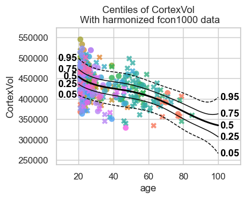
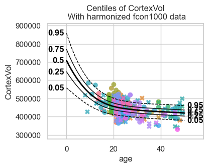
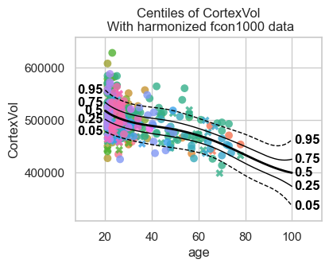
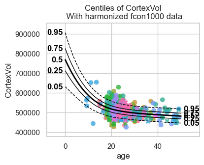
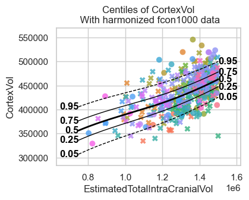
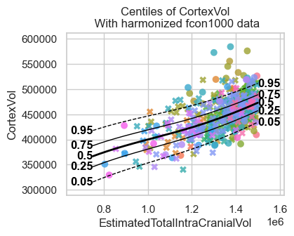
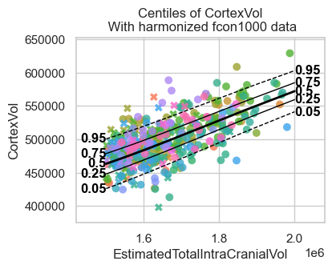
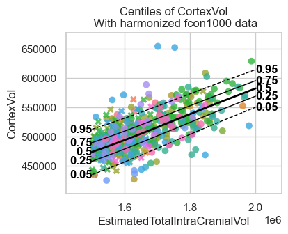

.. code:: ipython3

    import logging
    import os
    import warnings
    
    import pandas as pd
    import seaborn as sns
    
    import pcntoolkit.util.output
    from pcntoolkit import (
        HBR,
        BsplineBasisFunction,
        CompositeBasisFunction,
        NormalLikelihood,
        NormativeModel,
        NormData,
        make_prior,
        plot_centiles_advanced,
    )
    
    sns.set_style("darkgrid")
    
    # Suppress some annoying warnings and logs
    pymc_logger = logging.getLogger("pymc")
    
    pymc_logger.setLevel(logging.WARNING)
    
    pymc_logger.propagate = False
    
    warnings.simplefilter(action="ignore", category=FutureWarning)
    pd.options.mode.chained_assignment = None  # default='warn'
    pcntoolkit.util.output.Output.set_show_messages(False)
    

.. code:: ipython3

    save_path = os.path.join("pcntoolkit_resources", "data")
    os.makedirs(save_path, exist_ok=True)
    data_path = os.path.join(save_path, "fcon1000.csv")
    if not os.path.exists(data_path):
        data = pd.read_csv(
            "https://raw.githubusercontent.com/predictive-clinical-neuroscience/PCNtoolkit-demo/refs/heads/main/data/fcon1000.csv"
        )
        data.to_csv(data_path, index=False)
    else:
        data = pd.read_csv(data_path)
    
    # Define the variables
    sex_map = {0: "F", 1: "M"}
    data["sex"] = data["sex"].map(sex_map)
    subject_ids = "sub_id"
    covariates = ["age", "EstimatedTotalIntraCranialVol"]
    batch_effects = ["sex", "site"]
    response_vars = ["CortexVol"]
    
    data = NormData.from_dataframe("fcon1000", data, covariates, batch_effects, response_vars)
    train, test = data.train_test_split()

.. code:: ipython3

    CompositeBasisFunction(
            (BsplineBasisFunction(basis_column=0, degree=3, nknots=5), BsplineBasisFunction(basis_column=1, degree=3, nknots=5))
        ),
    

.. parsed-literal::

    (<pcntoolkit.math_functions.basis_function.CompositeBasisFunction at 0x319c05700>,)

.. code:: ipython3

    mu = make_prior(
        # Mu is linear because we want to allow the mean to vary as a function of the covariates.
        linear=True,
        # The slope coefficients are assumed to be normally distributed, with a mean of 0 and a standard deviation of 10.
        slope=make_prior(dist_name="Normal", dist_params=(0.0, 5.0)),
        # The intercept is random, because we expect the intercept to vary between sites and sexes.
    
        intercept=make_prior(
            random=True,
            # Mu is the mean of the intercept, which is normally distributed with a mean of 0 and a standard deviation of 1.
            mu=make_prior(dist_name="Normal", dist_params=(0.0, 1.0)),
            # Sigma is the scale at which the intercepts vary. It is a positive parameter, so we have to map it to the positive domain.
            sigma=make_prior(dist_name="Gamma", dist_params=(1.0, 1.0))
        ),
            # We use a B-spline basis function to allow for non-linearity in the mean.
        basis_function=CompositeBasisFunction(
            (BsplineBasisFunction(basis_column=0, degree=3, nknots=5), BsplineBasisFunction(basis_column=1, degree=3, nknots=5))
        ),
    )
    sigma = make_prior(
        # Sigma is also linear, because we want to allow the standard deviation to vary as a function of the covariates: heteroskedasticity.
        linear=True,
        # The slope coefficients are assumed to be normally distributed, with a mean of 0 and a standard deviation of 2.
        slope=make_prior(dist_name="Normal", dist_params=(0.0, 1.0)),
        # The intercept is not random, because we assume the intercept of the variance to be the same for all sites and sexes.
        intercept=make_prior(dist_name="Normal", dist_params=(1.0, 1.0)),
        # We use a B-spline basis function to allow for non-linearity in the standard deviation.
        basis_function=BsplineBasisFunction(basis_column=0, nknots=5, degree=3),
        # We use a softplus mapping to ensure that sigma is strictly positive.
        mapping="softplus",
        # We scale the softplus mapping by a factor of 3, to avoid spikes in the resulting density.
        # The parameters (a, b, c) provided to a mapping f are used as: f_abc(x) = f((x - a) / b) * b + c
        # This basically provides an affine transformation of the softplus function.
        # a -> horizontal shift
        # b -> scaling
        # c -> vertical shift
        # You can leave c out, and it will default to 0.
        mapping_params=(0.0, 2.0),
    )
    
    
    # Set the likelihood with the priors we just created.
    likelihood = NormalLikelihood(mu, sigma)
    
    template_hbr = HBR(
        name="template",
        # The number of cores to use for sampling.
        cores=16,
        # Whether to show a progress bar during the model fitting.
        progressbar=True,
        # The number of draws to sample from the posterior per chain.
        draws=1500,
        # The number of tuning steps to run.
        tune=500,
        # The number of MCMC chains to run.
        chains=4,
        # The sampler to use for the model.
        nuts_sampler="nutpie",
        # The likelihood function to use for the model.
        likelihood=likelihood,
    )

.. code:: ipython3

    model = NormativeModel(
        # The regression model to use for the normative model.
        template_regression_model=template_hbr,
        # Whether to save the model after fitting.
        savemodel=True,
        # Whether to evaluate the model after fitting.
        evaluate_model=True,
        # Whether to save the results after evaluation.
        saveresults=True,
        # Whether to save the plots after fitting.
        saveplots=True,
        # The directory to save the model, results, and plots.
        save_dir="resources/composite_basis/save_dir",
        # The scaler to use for the input data. Can be either one of "standardize", "minmax", "robminmax", "none"
        inscaler="standardize",
        # The scaler to use for the output data. Can be either one of "standardize", "minmax", "robminmax", "none"
        outscaler="standardize",
    )

.. code:: ipython3

    model.fit_predict(train, test)

.. raw:: html

    
    
    

.. raw:: html

    
    

        
<strong>Sampler Progress</strong>

        
Total Chains: 4

        
Active Chains: 0

        

            Finished Chains:
            4
        

        
Sampling for 18 seconds

        

            Estimated Time to Completion:
            now
        

    
        <progress
            id="total-progress-bar"
            max="8000"
            value="8000">
        </progress>
        <table>
            <thead>
                <tr>
                    <th>Progress</th>
                    <th>Draws</th>
                    <th>Divergences</th>
                    <th>Step Size</th>
                    <th>Gradients/Draw</th>
                </tr>
            </thead>
            <tbody id="chain-details">
    
                    <tr>
                        <td class="progress-cell">
                            <progress
                                max="2000"
                                value="2000">
                            </progress>
                        </td>
                        <td>2000</td>
                        <td>4</td>
                        <td>0.09</td>
                        <td>319</td>
                    </tr>
    
                    <tr>
                        <td class="progress-cell">
                            <progress
                                max="2000"
                                value="2000">
                            </progress>
                        </td>
                        <td>2000</td>
                        <td>28</td>
                        <td>0.11</td>
                        <td>31</td>
                    </tr>
    
                    <tr>
                        <td class="progress-cell">
                            <progress
                                max="2000"
                                value="2000">
                            </progress>
                        </td>
                        <td>2000</td>
                        <td>18</td>
                        <td>0.09</td>
                        <td>383</td>
                    </tr>
    
                    <tr>
                        <td class="progress-cell">
                            <progress
                                max="2000"
                                value="2000">
                            </progress>
                        </td>
                        <td>2000</td>
                        <td>15</td>
                        <td>0.08</td>
                        <td>255</td>
                    </tr>
    
                </tr>
            </tbody>
        </table>
    

    

.. raw:: html

    
<svg style="position: absolute; width: 0; height: 0; overflow: hidden">
    <defs>
    <symbol id="icon-database" viewBox="0 0 32 32">
    <path d="M16 0c-8.837 0-16 2.239-16 5v4c0 2.761 7.163 5 16 5s16-2.239 16-5v-4c0-2.761-7.163-5-16-5z"></path>
    <path d="M16 17c-8.837 0-16-2.239-16-5v6c0 2.761 7.163 5 16 5s16-2.239 16-5v-6c0 2.761-7.163 5-16 5z"></path>
    <path d="M16 26c-8.837 0-16-2.239-16-5v6c0 2.761 7.163 5 16 5s16-2.239 16-5v-6c0 2.761-7.163 5-16 5z"></path>
    </symbol>
    <symbol id="icon-file-text2" viewBox="0 0 32 32">
    <path d="M28.681 7.159c-0.694-0.947-1.662-2.053-2.724-3.116s-2.169-2.030-3.116-2.724c-1.612-1.182-2.393-1.319-2.841-1.319h-15.5c-1.378 0-2.5 1.121-2.5 2.5v27c0 1.378 1.122 2.5 2.5 2.5h23c1.378 0 2.5-1.122 2.5-2.5v-19.5c0-0.448-0.137-1.23-1.319-2.841zM24.543 5.457c0.959 0.959 1.712 1.825 2.268 2.543h-4.811v-4.811c0.718 0.556 1.584 1.309 2.543 2.268zM28 29.5c0 0.271-0.229 0.5-0.5 0.5h-23c-0.271 0-0.5-0.229-0.5-0.5v-27c0-0.271 0.229-0.5 0.5-0.5 0 0 15.499-0 15.5 0v7c0 0.552 0.448 1 1 1h7v19.5z"></path>
    <path d="M23 26h-14c-0.552 0-1-0.448-1-1s0.448-1 1-1h14c0.552 0 1 0.448 1 1s-0.448 1-1 1z"></path>
    <path d="M23 22h-14c-0.552 0-1-0.448-1-1s0.448-1 1-1h14c0.552 0 1 0.448 1 1s-0.448 1-1 1z"></path>
    <path d="M23 18h-14c-0.552 0-1-0.448-1-1s0.448-1 1-1h14c0.552 0 1 0.448 1 1s-0.448 1-1 1z"></path>
    </symbol>
    </defs>
    </svg>
    <pre class='xr-text-repr-fallback'>&lt;xarray.NormData&gt; Size: 53kB
    Dimensions:            (observations: 216, response_vars: 1, covariates: 2,
                            batch_effect_dims: 2, statistic: 11, centile: 5)
    Coordinates:
      * observations       (observations) int64 2kB 756 769 692 616 ... 751 470 1043
      * response_vars      (response_vars) &lt;U9 36B &#x27;CortexVol&#x27;
      * covariates         (covariates) &lt;U29 232B &#x27;age&#x27; &#x27;EstimatedTotalIntraCrani...
      * batch_effect_dims  (batch_effect_dims) &lt;U4 32B &#x27;sex&#x27; &#x27;site&#x27;
      * statistic          (statistic) &lt;U8 352B &#x27;EXPV&#x27; &#x27;MACE&#x27; ... &#x27;SMSE&#x27; &#x27;ShapiroW&#x27;
      * centile            (centile) float64 40B 0.05 0.25 0.5 0.75 0.95
    Data variables:
        subject_ids        (observations) int64 2kB 756 769 692 616 ... 751 470 1043
        Y                  (observations, response_vars) float64 2kB 4.579e+05 .....
        X                  (observations, covariates) float64 3kB 63.0 ... 1.603e+06
        batch_effects      (observations, batch_effect_dims) &lt;U17 29kB &#x27;F&#x27; ... &#x27;Q...
        Z                  (observations, response_vars) float64 2kB -0.1584 ... ...
        logp               (observations, response_vars) float64 2kB -0.05458 ......
        Yhat               (observations, response_vars) float64 2kB 4.611e+05 .....
        statistics         (response_vars, statistic) float64 88B 0.6692 ... 0.9799
        centiles           (centile, observations, response_vars) float64 9kB 4.2...
    Attributes:
        real_ids:                       False
        is_scaled:                      False
        name:                           fcon1000_test
        unique_batch_effects:           {np.str_(&#x27;sex&#x27;): [np.str_(&#x27;F&#x27;), np.str_(&#x27;...
        batch_effect_counts:            defaultdict(&lt;function NormData.register_b...
        covariate_ranges:               {np.str_(&#x27;age&#x27;): {&#x27;mean&#x27;: np.float64(28.2...
        batch_effect_covariate_ranges:  {np.str_(&#x27;sex&#x27;): {np.str_(&#x27;F&#x27;): {np.str_(...</pre>

xarray.NormData

<ul class='xr-sections'><li class='xr-section-item'><input id='section-1124e5dd-5be7-4936-8d46-d35d97be7d94' class='xr-section-summary-in' type='checkbox' disabled ><label for='section-1124e5dd-5be7-4936-8d46-d35d97be7d94' class='xr-section-summary'  title='Expand/collapse section'>Dimensions:</label>
<ul class='xr-dim-list'><li>observations: 216</li><li>response_vars: 1</li><li>covariates: 2</li><li>batch_effect_dims: 2</li><li>statistic: 11</li><li>centile: 5</li></ul>

</li><li class='xr-section-item'><input id='section-b8022830-e4bb-4ef4-8bde-8c7ee233946f' class='xr-section-summary-in' type='checkbox'  checked><label for='section-b8022830-e4bb-4ef4-8bde-8c7ee233946f' class='xr-section-summary' >Coordinates: (6)</label>

<ul class='xr-var-list'><li class='xr-var-item'>
observations

(observations)

int64

756 769 692 616 ... 751 470 1043
<input id='attrs-d77a8676-4ab5-4b72-8b74-a4c4d84074b5' class='xr-var-attrs-in' type='checkbox' disabled><label for='attrs-d77a8676-4ab5-4b72-8b74-a4c4d84074b5' title='Show/Hide attributes'><svg class='icon xr-icon-file-text2'><use xlink:href='#icon-file-text2'></use></svg></label><input id='data-419e5a8d-c3eb-496e-9feb-a248f07853a1' class='xr-var-data-in' type='checkbox'><label for='data-419e5a8d-c3eb-496e-9feb-a248f07853a1' title='Show/Hide data repr'><svg class='icon xr-icon-database'><use xlink:href='#icon-database'></use></svg></label>
<dl class='xr-attrs'></dl>

<pre>array([ 756,  769,  692, ...,  751,  470, 1043], shape=(216,))</pre>
</li><li class='xr-var-item'>
response_vars

(response_vars)

&lt;U9

&#x27;CortexVol&#x27;
<input id='attrs-49037f17-a00e-4dc7-934e-9faa72eeb171' class='xr-var-attrs-in' type='checkbox' disabled><label for='attrs-49037f17-a00e-4dc7-934e-9faa72eeb171' title='Show/Hide attributes'><svg class='icon xr-icon-file-text2'><use xlink:href='#icon-file-text2'></use></svg></label><input id='data-421a62c0-5f79-4cd4-845f-b84be2824f5e' class='xr-var-data-in' type='checkbox'><label for='data-421a62c0-5f79-4cd4-845f-b84be2824f5e' title='Show/Hide data repr'><svg class='icon xr-icon-database'><use xlink:href='#icon-database'></use></svg></label>
<dl class='xr-attrs'></dl>

<pre>array([&#x27;CortexVol&#x27;], dtype=&#x27;&lt;U9&#x27;)</pre>
</li><li class='xr-var-item'>
covariates

(covariates)

&lt;U29

&#x27;age&#x27; &#x27;EstimatedTotalIntraCrania...
<input id='attrs-10b98f3c-bf2b-43ae-8776-8273e6c6e5f7' class='xr-var-attrs-in' type='checkbox' disabled><label for='attrs-10b98f3c-bf2b-43ae-8776-8273e6c6e5f7' title='Show/Hide attributes'><svg class='icon xr-icon-file-text2'><use xlink:href='#icon-file-text2'></use></svg></label><input id='data-34e1e76d-a478-4347-867c-dc9625dae5c6' class='xr-var-data-in' type='checkbox'><label for='data-34e1e76d-a478-4347-867c-dc9625dae5c6' title='Show/Hide data repr'><svg class='icon xr-icon-database'><use xlink:href='#icon-database'></use></svg></label>
<dl class='xr-attrs'></dl>

<pre>array([&#x27;age&#x27;, &#x27;EstimatedTotalIntraCranialVol&#x27;], dtype=&#x27;&lt;U29&#x27;)</pre>
</li><li class='xr-var-item'>
batch_effect_dims

(batch_effect_dims)

&lt;U4

&#x27;sex&#x27; &#x27;site&#x27;
<input id='attrs-9d120b03-b408-42be-b75a-79b345d1379a' class='xr-var-attrs-in' type='checkbox' disabled><label for='attrs-9d120b03-b408-42be-b75a-79b345d1379a' title='Show/Hide attributes'><svg class='icon xr-icon-file-text2'><use xlink:href='#icon-file-text2'></use></svg></label><input id='data-6f6fa1ef-f1d7-42c7-bfd4-537376895579' class='xr-var-data-in' type='checkbox'><label for='data-6f6fa1ef-f1d7-42c7-bfd4-537376895579' title='Show/Hide data repr'><svg class='icon xr-icon-database'><use xlink:href='#icon-database'></use></svg></label>
<dl class='xr-attrs'></dl>

<pre>array([&#x27;sex&#x27;, &#x27;site&#x27;], dtype=&#x27;&lt;U4&#x27;)</pre>
</li><li class='xr-var-item'>
statistic

(statistic)

&lt;U8

&#x27;EXPV&#x27; &#x27;MACE&#x27; ... &#x27;SMSE&#x27; &#x27;ShapiroW&#x27;
<input id='attrs-c25632d0-684d-435d-9cb5-395ed6ac3b86' class='xr-var-attrs-in' type='checkbox' disabled><label for='attrs-c25632d0-684d-435d-9cb5-395ed6ac3b86' title='Show/Hide attributes'><svg class='icon xr-icon-file-text2'><use xlink:href='#icon-file-text2'></use></svg></label><input id='data-018d40d3-22d0-4723-8f3b-83e619a4ab32' class='xr-var-data-in' type='checkbox'><label for='data-018d40d3-22d0-4723-8f3b-83e619a4ab32' title='Show/Hide data repr'><svg class='icon xr-icon-database'><use xlink:href='#icon-database'></use></svg></label>
<dl class='xr-attrs'></dl>

<pre>array([&#x27;EXPV&#x27;, &#x27;MACE&#x27;, &#x27;MAPE&#x27;, &#x27;MSLL&#x27;, &#x27;NLL&#x27;, &#x27;R2&#x27;, &#x27;RMSE&#x27;, &#x27;Rho&#x27;, &#x27;Rho_p&#x27;,
           &#x27;SMSE&#x27;, &#x27;ShapiroW&#x27;], dtype=&#x27;&lt;U8&#x27;)</pre>
</li><li class='xr-var-item'>
centile

(centile)

float64

0.05 0.25 0.5 0.75 0.95
<input id='attrs-a5a4080e-de8c-4660-a3f8-8b8e8aef0a27' class='xr-var-attrs-in' type='checkbox' disabled><label for='attrs-a5a4080e-de8c-4660-a3f8-8b8e8aef0a27' title='Show/Hide attributes'><svg class='icon xr-icon-file-text2'><use xlink:href='#icon-file-text2'></use></svg></label><input id='data-399790ec-2684-41bf-b5c5-8cf5ff6b8f07' class='xr-var-data-in' type='checkbox'><label for='data-399790ec-2684-41bf-b5c5-8cf5ff6b8f07' title='Show/Hide data repr'><svg class='icon xr-icon-database'><use xlink:href='#icon-database'></use></svg></label>
<dl class='xr-attrs'></dl>

<pre>array([0.05, 0.25, 0.5 , 0.75, 0.95])</pre>
</li></ul>
</li><li class='xr-section-item'><input id='section-51854be7-77f8-47fe-b2c6-c87571b8b722' class='xr-section-summary-in' type='checkbox'  checked><label for='section-51854be7-77f8-47fe-b2c6-c87571b8b722' class='xr-section-summary' >Data variables: (9)</label>

<ul class='xr-var-list'><li class='xr-var-item'>
subject_ids

(observations)

int64

756 769 692 616 ... 751 470 1043
<input id='attrs-d31c9b3f-601e-4cde-aea6-e0468e455486' class='xr-var-attrs-in' type='checkbox' disabled><label for='attrs-d31c9b3f-601e-4cde-aea6-e0468e455486' title='Show/Hide attributes'><svg class='icon xr-icon-file-text2'><use xlink:href='#icon-file-text2'></use></svg></label><input id='data-bee3cad3-e574-4c13-9891-860b2e28f039' class='xr-var-data-in' type='checkbox'><label for='data-bee3cad3-e574-4c13-9891-860b2e28f039' title='Show/Hide data repr'><svg class='icon xr-icon-database'><use xlink:href='#icon-database'></use></svg></label>
<dl class='xr-attrs'></dl>

<pre>array([ 756,  769,  692,  616,   35,  164,  680,  331,  299,  727,  136,
             80,  209,  394,  653,  626,  935,  302,   61,  449,  984, 1036,
            518,  574,  593,  870,  828,  354,  947,  275,  874,  604,  948,
            670,  228,  294,  708,   90, 1020,  884,  856, 1023,  428,  635,
            221,  298, 1027,  324,  654,  844, 1003,  390,  259,  384,  205,
            881,   63,  681,   34,   16,  219,  214,  738,  501,  242, 1051,
            465,  553,  269,  757,  339,  826,  640,  925,  120,  717,  548,
            248,  726,  334,  556,  186,  822,  761,  411,  783,  109,  960,
            982,  424,  405,  800,  361,  938,  714,  993,  413,  279,  392,
            517,  357,  129,  277,  198,  608, 1033,   19,  660, 1060,  600,
            113,  539,  900,  823,  824,  436,   78,  462,  446, 1021,  435,
            973,  241,  955,  192,  519,  940,   23,  332,  378,  549,  515,
            137,  937,  936,  111,   18,  855,  853,  628,  201,  814,  698,
            366, 1063,   93,  134,  225,  423,  476,   71,  807,  142,  801,
              2,  220,  656,   98,  722,  603,  989,  754,  474,  545,  487,
            538,  646, 1000, 1053,   54,  678,  280,  582,  502,  804,  967,
             95,  185,  985,  141,  295,  437,  138,   96,  155,   51, 1064,
           1046,  562,  527,   79,  861,  469,  710,  564,  907, 1054,  421,
            968,  875,  669,  618,  504,  343,  777,  133,   27,  959,   29,
            346,  304,  264,  798,  751,  470, 1043])</pre>
</li><li class='xr-var-item'>
Y

(observations, response_vars)

float64

4.579e+05 5.268e+05 ... 5.035e+05
<input id='attrs-47032693-c76a-40ab-a301-ad9350310b34' class='xr-var-attrs-in' type='checkbox' disabled><label for='attrs-47032693-c76a-40ab-a301-ad9350310b34' title='Show/Hide attributes'><svg class='icon xr-icon-file-text2'><use xlink:href='#icon-file-text2'></use></svg></label><input id='data-186038ed-9251-410a-9604-b181d7792e46' class='xr-var-data-in' type='checkbox'><label for='data-186038ed-9251-410a-9604-b181d7792e46' title='Show/Hide data repr'><svg class='icon xr-icon-database'><use xlink:href='#icon-database'></use></svg></label>
<dl class='xr-attrs'></dl>

<pre>array([[457858.327875],
           [526780.362454],
           [495744.470654],
           [585303.839185],
           [333111.551539],
           [510794.940093],
           [550533.324588],
           [467673.976819],
           [460129.533137],
           [444494.81748 ],
           [559424.623684],
           [421551.233862],
           [519842.763049],
           [506679.262498],
           [535569.986908],
           [467607.554967],
           [530904.612455],
           [509371.867477],
           [460068.379043],
           [487269.373272],
    ...
           [453982.166201],
           [558453.1234  ],
           [473575.183228],
           [382788.490644],
           [502713.911273],
           [512490.347519],
           [437300.068601],
           [567331.907771],
           [512273.764245],
           [491973.561824],
           [478907.15396 ],
           [474077.083308],
           [454163.909225],
           [468067.037499],
           [509199.707778],
           [526635.257997],
           [520499.662889],
           [486680.791077],
           [610402.005701],
           [503535.771203]])</pre>
</li><li class='xr-var-item'>
X

(observations, covariates)

float64

63.0 1.533e+06 ... 23.0 1.603e+06
<input id='attrs-0ce0079c-38f7-4c22-a7d1-d8ed89026ac4' class='xr-var-attrs-in' type='checkbox' disabled><label for='attrs-0ce0079c-38f7-4c22-a7d1-d8ed89026ac4' title='Show/Hide attributes'><svg class='icon xr-icon-file-text2'><use xlink:href='#icon-file-text2'></use></svg></label><input id='data-707170c6-9170-455c-8c57-87fc31f09135' class='xr-var-data-in' type='checkbox'><label for='data-707170c6-9170-455c-8c57-87fc31f09135' title='Show/Hide data repr'><svg class='icon xr-icon-database'><use xlink:href='#icon-database'></use></svg></label>
<dl class='xr-attrs'></dl>

<pre>array([[6.30000000e+01, 1.53274143e+06],
           [2.32700000e+01, 1.40047223e+06],
           [2.20000000e+01, 1.48954279e+06],
           [4.20000000e+01, 1.86413298e+06],
           [6.30000000e+01, 1.09596196e+06],
           [2.30000000e+01, 1.68477930e+06],
           [2.10000000e+01, 1.86815080e+06],
           [2.60000000e+01, 1.44257370e+06],
           [2.10000000e+01, 1.29684168e+06],
           [4.90000000e+01, 1.35607954e+06],
           [2.00000000e+01, 1.70498340e+06],
           [2.30000000e+01, 1.15830591e+06],
           [2.00000000e+01, 1.57575448e+06],
           [2.60000000e+01, 1.67796587e+06],
           [3.50000000e+01, 1.87317033e+06],
           [2.10000000e+01, 1.53007303e+06],
           [2.20000000e+01, 1.48131494e+06],
           [1.90000000e+01, 1.60557346e+06],
           [3.40000000e+01, 1.43249051e+06],
           [1.80000000e+01, 1.58241871e+06],
    ...
           [2.10000000e+01, 1.41064754e+06],
           [2.00000000e+01, 1.91714030e+06],
           [2.20000000e+01, 1.30791128e+06],
           [2.50000000e+01, 8.93525339e+05],
           [2.50000000e+01, 1.74430270e+06],
           [7.30000000e+01, 1.65369057e+06],
           [2.20000000e+01, 1.48584426e+06],
           [2.80000000e+01, 1.79437919e+06],
           [2.90600000e+01, 1.84599685e+06],
           [1.90000000e+01, 1.57800703e+06],
           [2.00000000e+01, 1.46577039e+06],
           [2.20000000e+01, 1.30793200e+06],
           [1.90000000e+01, 1.33464236e+06],
           [2.40000000e+01, 1.31818656e+06],
           [2.10000000e+01, 1.64204629e+06],
           [2.40000000e+01, 1.54616694e+06],
           [2.27900000e+01, 1.45689873e+06],
           [7.20000000e+01, 1.57223354e+06],
           [2.30000000e+01, 1.98747750e+06],
           [2.30000000e+01, 1.60306371e+06]])</pre>
</li><li class='xr-var-item'>
batch_effects

(observations, batch_effect_dims)

&lt;U17

&#x27;F&#x27; &#x27;Munchen&#x27; ... &#x27;M&#x27; &#x27;Queensland&#x27;
<input id='attrs-f80dc4be-7247-419e-8622-c44f129a40a1' class='xr-var-attrs-in' type='checkbox' disabled><label for='attrs-f80dc4be-7247-419e-8622-c44f129a40a1' title='Show/Hide attributes'><svg class='icon xr-icon-file-text2'><use xlink:href='#icon-file-text2'></use></svg></label><input id='data-1421fa85-78eb-4c5c-8b04-6b55e335c1ec' class='xr-var-data-in' type='checkbox'><label for='data-1421fa85-78eb-4c5c-8b04-6b55e335c1ec' title='Show/Hide data repr'><svg class='icon xr-icon-database'><use xlink:href='#icon-database'></use></svg></label>
<dl class='xr-attrs'></dl>

<pre>array([[&#x27;F&#x27;, &#x27;Munchen&#x27;],
           [&#x27;M&#x27;, &#x27;NewYork_a&#x27;],
           [&#x27;F&#x27;, &#x27;Leiden_2200&#x27;],
           [&#x27;M&#x27;, &#x27;ICBM&#x27;],
           [&#x27;F&#x27;, &#x27;AnnArbor_b&#x27;],
           [&#x27;M&#x27;, &#x27;Beijing_Zang&#x27;],
           [&#x27;M&#x27;, &#x27;Leiden_2200&#x27;],
           [&#x27;F&#x27;, &#x27;Berlin_Margulies&#x27;],
           [&#x27;F&#x27;, &#x27;Beijing_Zang&#x27;],
           [&#x27;F&#x27;, &#x27;Milwaukee_b&#x27;],
           [&#x27;M&#x27;, &#x27;Beijing_Zang&#x27;],
           [&#x27;F&#x27;, &#x27;Atlanta&#x27;],
           [&#x27;F&#x27;, &#x27;Beijing_Zang&#x27;],
           [&#x27;F&#x27;, &#x27;Cambridge_Buckner&#x27;],
           [&#x27;M&#x27;, &#x27;ICBM&#x27;],
           [&#x27;F&#x27;, &#x27;ICBM&#x27;],
           [&#x27;M&#x27;, &#x27;Oulu&#x27;],
           [&#x27;F&#x27;, &#x27;Beijing_Zang&#x27;],
           [&#x27;M&#x27;, &#x27;Atlanta&#x27;],
           [&#x27;F&#x27;, &#x27;Cambridge_Buckner&#x27;],
    ...
           [&#x27;F&#x27;, &#x27;SaintLouis&#x27;],
           [&#x27;M&#x27;, &#x27;Cambridge_Buckner&#x27;],
           [&#x27;F&#x27;, &#x27;Oulu&#x27;],
           [&#x27;F&#x27;, &#x27;Newark&#x27;],
           [&#x27;M&#x27;, &#x27;Leiden_2180&#x27;],
           [&#x27;M&#x27;, &#x27;ICBM&#x27;],
           [&#x27;F&#x27;, &#x27;Cambridge_Buckner&#x27;],
           [&#x27;M&#x27;, &#x27;Berlin_Margulies&#x27;],
           [&#x27;M&#x27;, &#x27;NewYork_a&#x27;],
           [&#x27;F&#x27;, &#x27;Beijing_Zang&#x27;],
           [&#x27;M&#x27;, &#x27;AnnArbor_b&#x27;],
           [&#x27;F&#x27;, &#x27;Oulu&#x27;],
           [&#x27;F&#x27;, &#x27;AnnArbor_b&#x27;],
           [&#x27;F&#x27;, &#x27;Berlin_Margulies&#x27;],
           [&#x27;M&#x27;, &#x27;Beijing_Zang&#x27;],
           [&#x27;F&#x27;, &#x27;Beijing_Zang&#x27;],
           [&#x27;M&#x27;, &#x27;NewYork_a&#x27;],
           [&#x27;M&#x27;, &#x27;Munchen&#x27;],
           [&#x27;M&#x27;, &#x27;Cambridge_Buckner&#x27;],
           [&#x27;M&#x27;, &#x27;Queensland&#x27;]], dtype=&#x27;&lt;U17&#x27;)</pre>
</li><li class='xr-var-item'>
Z

(observations, response_vars)

float64

-0.1584 1.034 ... 2.331 -0.8391
<input id='attrs-e0cd1fc2-e4c1-4c96-935b-feb4517e4688' class='xr-var-attrs-in' type='checkbox' disabled><label for='attrs-e0cd1fc2-e4c1-4c96-935b-feb4517e4688' title='Show/Hide attributes'><svg class='icon xr-icon-file-text2'><use xlink:href='#icon-file-text2'></use></svg></label><input id='data-fef0c846-1403-4340-916f-c05bd78cfea1' class='xr-var-data-in' type='checkbox'><label for='data-fef0c846-1403-4340-916f-c05bd78cfea1' title='Show/Hide data repr'><svg class='icon xr-icon-database'><use xlink:href='#icon-database'></use></svg></label>
<dl class='xr-attrs'></dl>

<pre>array([[-0.15843558],
           [ 1.03406933],
           [ 0.62395667],
           [ 1.51765449],
           [-1.49298346],
           [-1.32262435],
           [-1.26400417],
           [-0.98038479],
           [ 0.04105104],
           [-0.11732897],
           [ 0.24980313],
           [-0.69146423],
           [ 0.28771194],
           [ 1.38090055],
           [-1.31944305],
           [-1.13455946],
           [-0.0536361 ],
           [-0.52907458],
           [-0.80803942],
           [ 0.34024062],
    ...
           [-1.14422573],
           [ 0.05822544],
           [-0.61546454],
           [-0.50939253],
           [-1.54558679],
           [ 2.10525405],
           [-0.31096472],
           [-0.36577776],
           [-3.64164222],
           [-0.97691356],
           [-0.38381463],
           [-0.59649936],
           [-0.10947164],
           [-0.21505878],
           [-1.14272939],
           [ 1.31881019],
           [ 0.33470987],
           [ 0.97245795],
           [ 2.33115602],
           [-0.83910634]])</pre>
</li><li class='xr-var-item'>
logp

(observations, response_vars)

float64

-0.05458 -0.7262 ... -2.751 -0.4893
<input id='attrs-9b53ea5a-11c8-4dc3-9287-c292a7f149d4' class='xr-var-attrs-in' type='checkbox' disabled><label for='attrs-9b53ea5a-11c8-4dc3-9287-c292a7f149d4' title='Show/Hide attributes'><svg class='icon xr-icon-file-text2'><use xlink:href='#icon-file-text2'></use></svg></label><input id='data-b4ea882c-d9c7-43fb-bfc3-5c6e7357902c' class='xr-var-data-in' type='checkbox'><label for='data-b4ea882c-d9c7-43fb-bfc3-5c6e7357902c' title='Show/Hide data repr'><svg class='icon xr-icon-database'><use xlink:href='#icon-database'></use></svg></label>
<dl class='xr-attrs'></dl>

<pre>array([[-0.05457784],
           [-0.72622314],
           [-0.39282836],
           [-1.1517135 ],
           [-1.32863231],
           [-0.9586701 ],
           [-0.88860811],
           [-0.63325714],
           [-0.26506221],
           [-0.1755645 ],
           [-0.16749292],
           [-0.53353421],
           [-0.22534827],
           [-1.00639685],
           [-0.84415085],
           [-0.82958116],
           [-0.18049525],
           [-0.3394335 ],
           [-0.46785797],
           [-0.29431431],
    ...
           [-0.89100684],
           [-0.0694618 ],
           [-0.43152832],
           [-0.6741236 ],
           [-1.27335645],
           [-2.33667274],
           [-0.22140177],
           [-0.08313849],
           [-6.63896596],
           [-0.68706111],
           [-0.31650806],
           [-0.42001384],
           [-0.31966119],
           [-0.2438348 ],
           [-0.7895498 ],
           [-0.99108111],
           [-0.23359154],
           [-0.57043571],
           [-2.75140787],
           [-0.48928412]])</pre>
</li><li class='xr-var-item'>
Yhat

(observations, response_vars)

float64

4.611e+05 5.011e+05 ... 5.23e+05
<input id='attrs-6a857a90-1ffe-4c92-bbfe-982ad6393b3d' class='xr-var-attrs-in' type='checkbox' disabled><label for='attrs-6a857a90-1ffe-4c92-bbfe-982ad6393b3d' title='Show/Hide attributes'><svg class='icon xr-icon-file-text2'><use xlink:href='#icon-file-text2'></use></svg></label><input id='data-ccee7b22-fab4-4c66-a88c-eb0a14b9f971' class='xr-var-data-in' type='checkbox'><label for='data-ccee7b22-fab4-4c66-a88c-eb0a14b9f971' title='Show/Hide data repr'><svg class='icon xr-icon-database'><use xlink:href='#icon-database'></use></svg></label>
<dl class='xr-attrs'></dl>

<pre>array([[461086.70978118],
           [501069.03961002],
           [480412.36335045],
           [554660.27025674],
           [369182.93953969],
           [540487.36028852],
           [578036.62414939],
           [490856.31387026],
           [459016.67925967],
           [447341.36035917],
           [553511.35920921],
           [440402.22974839],
           [512692.55070883],
           [476786.72751297],
           [561539.62566888],
           [495640.9104755 ],
           [532225.91743821],
           [522721.05711038],
           [478815.66445488],
           [478360.86627047],
    ...
           [483533.67657613],
           [557173.34180494],
           [489756.27023517],
           [397639.33285938],
           [535716.24014923],
           [467796.12871724],
           [444957.26502473],
           [574788.14219517],
           [584724.00715801],
           [516874.0104401 ],
           [488850.88635382],
           [489759.47832699],
           [457229.04412552],
           [473509.54427948],
           [536284.65806047],
           [495922.38633205],
           [512284.20908427],
           [465612.55710138],
           [563789.16239206],
           [522960.20297698]])</pre>
</li><li class='xr-var-item'>
statistics

(response_vars, statistic)

float64

0.6692 0.04296 ... 0.3353 0.9799
<input id='attrs-33ed74d6-e194-4e23-a3c5-a12c077c7eab' class='xr-var-attrs-in' type='checkbox' disabled><label for='attrs-33ed74d6-e194-4e23-a3c5-a12c077c7eab' title='Show/Hide attributes'><svg class='icon xr-icon-file-text2'><use xlink:href='#icon-file-text2'></use></svg></label><input id='data-19811076-7fad-4947-ab96-cb57a579742c' class='xr-var-data-in' type='checkbox'><label for='data-19811076-7fad-4947-ab96-cb57a579742c' title='Show/Hide data repr'><svg class='icon xr-icon-database'><use xlink:href='#icon-database'></use></svg></label>
<dl class='xr-attrs'></dl>

<pre>array([[ 6.69202411e-01,  4.29629630e-02,  4.44555708e-02,
            -1.13568359e+01,  8.60724193e-01,  6.64717218e-01,
             2.83457137e+04,  8.06318246e-01,  1.05711593e-50,
             3.35282782e-01,  9.79895201e-01]])</pre>
</li><li class='xr-var-item'>
centiles

(centile, observations, response_vars)

float64

4.27e+05 4.601e+05 ... 5.611e+05
<input id='attrs-ea6321b9-da9a-4b19-9987-85bd31a9c386' class='xr-var-attrs-in' type='checkbox' disabled><label for='attrs-ea6321b9-da9a-4b19-9987-85bd31a9c386' title='Show/Hide attributes'><svg class='icon xr-icon-file-text2'><use xlink:href='#icon-file-text2'></use></svg></label><input id='data-51ac9ead-2fee-4def-aa42-7aa4d02b4df8' class='xr-var-data-in' type='checkbox'><label for='data-51ac9ead-2fee-4def-aa42-7aa4d02b4df8' title='Show/Hide data repr'><svg class='icon xr-icon-database'><use xlink:href='#icon-database'></use></svg></label>
<dl class='xr-attrs'></dl>

<pre>array([[[427041.0636518 ],
            [460137.46842729],
            [439939.23803439],
            ...,
            [429547.30664143],
            [530759.91619626],
            [484840.35119778]],
    
           [[447125.92994229],
            [484284.61285629],
            [463815.92720757],
            ...,
            [450823.61699455],
            [550245.16817231],
            [507328.75171422]],
    
           [[461086.70978118],
            [501069.03961002],
            [480412.36335045],
            ...,
            [465612.55710138],
            [563789.16239206],
            [522960.20297698]],
    
           [[475047.48962007],
            [517853.46636375],
            [497008.79949333],
            ...,
            [480401.4972082 ],
            [577333.15661181],
            [538591.65423974]],
    
           [[495132.35591055],
            [542000.61079276],
            [520885.48866651],
            ...,
            [501677.80756132],
            [596818.40858785],
            [561080.05475618]]], shape=(5, 216, 1))</pre>
</li></ul>
</li><li class='xr-section-item'><input id='section-8d0a290d-783a-4ffb-a0e3-137fb83259d0' class='xr-section-summary-in' type='checkbox'  checked><label for='section-8d0a290d-783a-4ffb-a0e3-137fb83259d0' class='xr-section-summary' >Attributes: (7)</label>

<dl class='xr-attrs'><dt>real_ids :</dt><dd>False</dd><dt>is_scaled :</dt><dd>False</dd><dt>name :</dt><dd>fcon1000_test</dd><dt>unique_batch_effects :</dt><dd>{np.str_(&#x27;sex&#x27;): [np.str_(&#x27;F&#x27;), np.str_(&#x27;M&#x27;)], np.str_(&#x27;site&#x27;): [np.str_(&#x27;AnnArbor_a&#x27;), np.str_(&#x27;AnnArbor_b&#x27;), np.str_(&#x27;Atlanta&#x27;), np.str_(&#x27;Baltimore&#x27;), np.str_(&#x27;Bangor&#x27;), np.str_(&#x27;Beijing_Zang&#x27;), np.str_(&#x27;Berlin_Margulies&#x27;), np.str_(&#x27;Cambridge_Buckner&#x27;), np.str_(&#x27;Cleveland&#x27;), np.str_(&#x27;ICBM&#x27;), np.str_(&#x27;Leiden_2180&#x27;), np.str_(&#x27;Leiden_2200&#x27;), np.str_(&#x27;Milwaukee_b&#x27;), np.str_(&#x27;Munchen&#x27;), np.str_(&#x27;NewYork_a&#x27;), np.str_(&#x27;NewYork_a_ADHD&#x27;), np.str_(&#x27;Newark&#x27;), np.str_(&#x27;Oulu&#x27;), np.str_(&#x27;Oxford&#x27;), np.str_(&#x27;PaloAlto&#x27;), np.str_(&#x27;Pittsburgh&#x27;), np.str_(&#x27;Queensland&#x27;), np.str_(&#x27;SaintLouis&#x27;)]}</dd><dt>batch_effect_counts :</dt><dd>defaultdict(&lt;function NormData.register_batch_effects.&lt;locals&gt;.&lt;lambda&gt; at 0x319926160&gt;, {np.str_(&#x27;sex&#x27;): {np.str_(&#x27;F&#x27;): 589, np.str_(&#x27;M&#x27;): 489}, np.str_(&#x27;site&#x27;): {np.str_(&#x27;AnnArbor_a&#x27;): 24, np.str_(&#x27;AnnArbor_b&#x27;): 32, np.str_(&#x27;Atlanta&#x27;): 28, np.str_(&#x27;Baltimore&#x27;): 23, np.str_(&#x27;Bangor&#x27;): 20, np.str_(&#x27;Beijing_Zang&#x27;): 198, np.str_(&#x27;Berlin_Margulies&#x27;): 26, np.str_(&#x27;Cambridge_Buckner&#x27;): 198, np.str_(&#x27;Cleveland&#x27;): 31, np.str_(&#x27;ICBM&#x27;): 85, np.str_(&#x27;Leiden_2180&#x27;): 12, np.str_(&#x27;Leiden_2200&#x27;): 19, np.str_(&#x27;Milwaukee_b&#x27;): 46, np.str_(&#x27;Munchen&#x27;): 15, np.str_(&#x27;NewYork_a&#x27;): 83, np.str_(&#x27;NewYork_a_ADHD&#x27;): 25, np.str_(&#x27;Newark&#x27;): 19, np.str_(&#x27;Oulu&#x27;): 102, np.str_(&#x27;Oxford&#x27;): 22, np.str_(&#x27;PaloAlto&#x27;): 17, np.str_(&#x27;Pittsburgh&#x27;): 3, np.str_(&#x27;Queensland&#x27;): 19, np.str_(&#x27;SaintLouis&#x27;): 31}})</dd><dt>covariate_ranges :</dt><dd>{np.str_(&#x27;age&#x27;): {&#x27;mean&#x27;: np.float64(28.251224489795916), &#x27;min&#x27;: np.float64(7.88), &#x27;max&#x27;: np.float64(85.0)}, np.str_(&#x27;EstimatedTotalIntraCranialVol&#x27;): {&#x27;mean&#x27;: np.float64(1498034.642845322), &#x27;min&#x27;: np.float64(803895.003258), &#x27;max&#x27;: np.float64(2213930.77819)}}</dd><dt>batch_effect_covariate_ranges :</dt><dd>{np.str_(&#x27;sex&#x27;): {np.str_(&#x27;F&#x27;): {np.str_(&#x27;age&#x27;): {&#x27;mean&#x27;: 28.05332767402377, &#x27;min&#x27;: 7.88, &#x27;max&#x27;: 85.0}, np.str_(&#x27;EstimatedTotalIntraCranialVol&#x27;): {&#x27;mean&#x27;: 1410237.451000635, &#x27;min&#x27;: 854269.795819, &#x27;max&#x27;: 1839480.7792}}, np.str_(&#x27;M&#x27;): {np.str_(&#x27;age&#x27;): {&#x27;mean&#x27;: 28.48959100204499, &#x27;min&#x27;: 9.21, &#x27;max&#x27;: 78.0}, np.str_(&#x27;EstimatedTotalIntraCranialVol&#x27;): {&#x27;mean&#x27;: 1603786.2706500674, &#x27;min&#x27;: 803895.003258, &#x27;max&#x27;: 2213930.77819}}}, np.str_(&#x27;site&#x27;): {np.str_(&#x27;AnnArbor_a&#x27;): {np.str_(&#x27;age&#x27;): {&#x27;mean&#x27;: 21.28333333333333, &#x27;min&#x27;: 13.41, &#x27;max&#x27;: 40.98}, np.str_(&#x27;EstimatedTotalIntraCranialVol&#x27;): {&#x27;mean&#x27;: 1529935.1836445834, &#x27;min&#x27;: 1239237.74772, &#x27;max&#x27;: 1797270.09178}}, np.str_(&#x27;AnnArbor_b&#x27;): {np.str_(&#x27;age&#x27;): {&#x27;mean&#x27;: 44.40625, &#x27;min&#x27;: 19.0, &#x27;max&#x27;: 79.0}, np.str_(&#x27;EstimatedTotalIntraCranialVol&#x27;): {&#x27;mean&#x27;: 1385848.9693675, &#x27;min&#x27;: 1095961.96155, &#x27;max&#x27;: 1785422.9362}}, np.str_(&#x27;Atlanta&#x27;): {np.str_(&#x27;age&#x27;): {&#x27;mean&#x27;: 30.892857142857142, &#x27;min&#x27;: 22.0, &#x27;max&#x27;: 57.0}, np.str_(&#x27;EstimatedTotalIntraCranialVol&#x27;): {&#x27;mean&#x27;: 1373464.0094731073, &#x27;min&#x27;: 991144.994738, &#x27;max&#x27;: 1961041.2011400005}}, np.str_(&#x27;Baltimore&#x27;): {np.str_(&#x27;age&#x27;): {&#x27;mean&#x27;: 29.26086956521739, &#x27;min&#x27;: 20.0, &#x27;max&#x27;: 40.0}, np.str_(&#x27;EstimatedTotalIntraCranialVol&#x27;): {&#x27;mean&#x27;: 1507849.0484656524, &#x27;min&#x27;: 1277794.4776, &#x27;max&#x27;: 1858687.83646}}, np.str_(&#x27;Bangor&#x27;): {np.str_(&#x27;age&#x27;): {&#x27;mean&#x27;: 23.4, &#x27;min&#x27;: 19.0, &#x27;max&#x27;: 38.0}, np.str_(&#x27;EstimatedTotalIntraCranialVol&#x27;): {&#x27;mean&#x27;: 1539685.1818255, &#x27;min&#x27;: 1209177.6117399998, &#x27;max&#x27;: 1839143.13269}}, np.str_(&#x27;Beijing_Zang&#x27;): {np.str_(&#x27;age&#x27;): {&#x27;mean&#x27;: 21.161616161616163, &#x27;min&#x27;: 18.0, &#x27;max&#x27;: 26.0}, np.str_(&#x27;EstimatedTotalIntraCranialVol&#x27;): {&#x27;mean&#x27;: 1508829.1492384346, &#x27;min&#x27;: 1002619.98087, &#x27;max&#x27;: 1869137.32932}}, np.str_(&#x27;Berlin_Margulies&#x27;): {np.str_(&#x27;age&#x27;): {&#x27;mean&#x27;: 29.76923076923077, &#x27;min&#x27;: 23.0, &#x27;max&#x27;: 44.0}, np.str_(&#x27;EstimatedTotalIntraCranialVol&#x27;): {&#x27;mean&#x27;: 1550889.9308749998, &#x27;min&#x27;: 1283953.04581, &#x27;max&#x27;: 2034930.18739}}, np.str_(&#x27;Cambridge_Buckner&#x27;): {np.str_(&#x27;age&#x27;): {&#x27;mean&#x27;: 21.03030303030303, &#x27;min&#x27;: 18.0, &#x27;max&#x27;: 30.0}, np.str_(&#x27;EstimatedTotalIntraCranialVol&#x27;): {&#x27;mean&#x27;: 1584579.6053256062, &#x27;min&#x27;: 1226746.2365, &#x27;max&#x27;: 1987477.49695}}, np.str_(&#x27;Cleveland&#x27;): {np.str_(&#x27;age&#x27;): {&#x27;mean&#x27;: 43.54838709677419, &#x27;min&#x27;: 24.0, &#x27;max&#x27;: 60.0}, np.str_(&#x27;EstimatedTotalIntraCranialVol&#x27;): {&#x27;mean&#x27;: 1412274.436693549, &#x27;min&#x27;: 1195065.98729, &#x27;max&#x27;: 1727397.1725}}, np.str_(&#x27;ICBM&#x27;): {np.str_(&#x27;age&#x27;): {&#x27;mean&#x27;: 44.04705882352941, &#x27;min&#x27;: 19.0, &#x27;max&#x27;: 85.0}, np.str_(&#x27;EstimatedTotalIntraCranialVol&#x27;): {&#x27;mean&#x27;: 1649831.0184531761, &#x27;min&#x27;: 1315469.72766, &#x27;max&#x27;: 2156696.50099}}, np.str_(&#x27;Leiden_2180&#x27;): {np.str_(&#x27;age&#x27;): {&#x27;mean&#x27;: 23.0, &#x27;min&#x27;: 20.0, &#x27;max&#x27;: 27.0}, np.str_(&#x27;EstimatedTotalIntraCranialVol&#x27;): {&#x27;mean&#x27;: 1702394.1432608336, &#x27;min&#x27;: 1508119.55881, &#x27;max&#x27;: 1968074.24155}}, np.str_(&#x27;Leiden_2200&#x27;): {np.str_(&#x27;age&#x27;): {&#x27;mean&#x27;: 21.68421052631579, &#x27;min&#x27;: 18.0, &#x27;max&#x27;: 28.0}, np.str_(&#x27;EstimatedTotalIntraCranialVol&#x27;): {&#x27;mean&#x27;: 1616999.802426316, &#x27;min&#x27;: 1309818.45623, &#x27;max&#x27;: 1868150.79879}}, np.str_(&#x27;Milwaukee_b&#x27;): {np.str_(&#x27;age&#x27;): {&#x27;mean&#x27;: 53.58695652173913, &#x27;min&#x27;: 44.0, &#x27;max&#x27;: 65.0}, np.str_(&#x27;EstimatedTotalIntraCranialVol&#x27;): {&#x27;mean&#x27;: 1369645.7486636525, &#x27;min&#x27;: 961761.166078, &#x27;max&#x27;: 1749317.40938}}, np.str_(&#x27;Munchen&#x27;): {np.str_(&#x27;age&#x27;): {&#x27;mean&#x27;: 68.13333333333334, &#x27;min&#x27;: 63.0, &#x27;max&#x27;: 74.0}, np.str_(&#x27;EstimatedTotalIntraCranialVol&#x27;): {&#x27;mean&#x27;: 1537356.0826673328, &#x27;min&#x27;: 1205099.3215, &#x27;max&#x27;: 1807706.83688}}, np.str_(&#x27;NewYork_a&#x27;): {np.str_(&#x27;age&#x27;): {&#x27;mean&#x27;: 24.507710843373495, &#x27;min&#x27;: 7.88, &#x27;max&#x27;: 49.16}, np.str_(&#x27;EstimatedTotalIntraCranialVol&#x27;): {&#x27;mean&#x27;: 1440279.9642492773, &#x27;min&#x27;: 945590.839808, &#x27;max&#x27;: 1980091.79537}}, np.str_(&#x27;NewYork_a_ADHD&#x27;): {np.str_(&#x27;age&#x27;): {&#x27;mean&#x27;: 34.9952, &#x27;min&#x27;: 20.69, &#x27;max&#x27;: 50.9}, np.str_(&#x27;EstimatedTotalIntraCranialVol&#x27;): {&#x27;mean&#x27;: 1527581.8738736, &#x27;min&#x27;: 1182852.33915, &#x27;max&#x27;: 1836931.72887}}, np.str_(&#x27;Newark&#x27;): {np.str_(&#x27;age&#x27;): {&#x27;mean&#x27;: 24.105263157894736, &#x27;min&#x27;: 21.0, &#x27;max&#x27;: 39.0}, np.str_(&#x27;EstimatedTotalIntraCranialVol&#x27;): {&#x27;mean&#x27;: 1164009.9596495263, &#x27;min&#x27;: 803895.003258, &#x27;max&#x27;: 1483045.87846}}, np.str_(&#x27;Oulu&#x27;): {np.str_(&#x27;age&#x27;): {&#x27;mean&#x27;: 21.519607843137255, &#x27;min&#x27;: 20.0, &#x27;max&#x27;: 23.0}, np.str_(&#x27;EstimatedTotalIntraCranialVol&#x27;): {&#x27;mean&#x27;: 1417309.5603448038, &#x27;min&#x27;: 1038404.46752, &#x27;max&#x27;: 1807616.45732}}, np.str_(&#x27;Oxford&#x27;): {np.str_(&#x27;age&#x27;): {&#x27;mean&#x27;: 29.0, &#x27;min&#x27;: 20.0, &#x27;max&#x27;: 35.0}, np.str_(&#x27;EstimatedTotalIntraCranialVol&#x27;): {&#x27;mean&#x27;: 1270682.5026410455, &#x27;min&#x27;: 989444.241903, &#x27;max&#x27;: 1689557.92241}}, np.str_(&#x27;PaloAlto&#x27;): {np.str_(&#x27;age&#x27;): {&#x27;mean&#x27;: 32.470588235294116, &#x27;min&#x27;: 22.0, &#x27;max&#x27;: 46.0}, np.str_(&#x27;EstimatedTotalIntraCranialVol&#x27;): {&#x27;mean&#x27;: 1208346.6311481765, &#x27;min&#x27;: 854269.795819, &#x27;max&#x27;: 1673520.84453}}, np.str_(&#x27;Pittsburgh&#x27;): {np.str_(&#x27;age&#x27;): {&#x27;mean&#x27;: 32.333333333333336, &#x27;min&#x27;: 25.0, &#x27;max&#x27;: 47.0}, np.str_(&#x27;EstimatedTotalIntraCranialVol&#x27;): {&#x27;mean&#x27;: 914181.3981296666, &#x27;min&#x27;: 823904.532171, &#x27;max&#x27;: 1026186.09328}}, np.str_(&#x27;Queensland&#x27;): {np.str_(&#x27;age&#x27;): {&#x27;mean&#x27;: 25.94736842105263, &#x27;min&#x27;: 20.0, &#x27;max&#x27;: 34.0}, np.str_(&#x27;EstimatedTotalIntraCranialVol&#x27;): {&#x27;mean&#x27;: 1607191.5740326315, &#x27;min&#x27;: 1335132.49541, &#x27;max&#x27;: 1845048.33956}}, np.str_(&#x27;SaintLouis&#x27;): {np.str_(&#x27;age&#x27;): {&#x27;mean&#x27;: 25.096774193548388, &#x27;min&#x27;: 21.0, &#x27;max&#x27;: 29.0}, np.str_(&#x27;EstimatedTotalIntraCranialVol&#x27;): {&#x27;mean&#x27;: 1601415.5493764514, &#x27;min&#x27;: 1374160.52253, &#x27;max&#x27;: 2213930.77819}}}}</dd></dl>
</li></ul>

.. code:: ipython3

    model.covariates

.. parsed-literal::

    ['age', 'EstimatedTotalIntraCranialVol']

.. code:: ipython3

    plot_centiles_advanced(
        model,
        covariate="age",
        response_vars=["CortexVol"],
        scatter_data=data,
        covariate_ranges={"age": [20, 100], "EstimatedTotalIntraCranialVol": [0.75e6, 1.5e6]},
        batch_effects="all",
        show_legend=False,
        plt_kwargs={"figsize": (4, 3)},
    )
    plot_centiles_advanced(
        model,
        covariate="age",
        response_vars=["CortexVol"],
        scatter_data=data,
        covariate_ranges={"age": [0, 50], "EstimatedTotalIntraCranialVol": [0.75e6, 1.5e6]},
        batch_effects="all",
        show_legend=False,
        plt_kwargs={"figsize": (4, 3)},
    )
    plot_centiles_advanced(
        model,
        covariate="age",
        response_vars=["CortexVol"],
        scatter_data=data,
        covariate_ranges={"age": [20, 100], "EstimatedTotalIntraCranialVol": [1.5e6, 2.0e6]},
        batch_effects="all",
        show_legend=False,
        plt_kwargs={"figsize": (4, 3)},
    )
    plot_centiles_advanced(
        model,
        covariate="age",
        response_vars=["CortexVol"],
        scatter_data=data,
        covariate_ranges={"age": [0, 50], "EstimatedTotalIntraCranialVol": [1.5e6, 2.0e6]},
        batch_effects="all",
        show_legend=False,
        plt_kwargs={"figsize": (4, 3)},
    )
    

.. code:: ipython3

    plot_centiles_advanced(
        model,
        covariate="EstimatedTotalIntraCranialVol",
        response_vars=["CortexVol"],
        scatter_data=data,
        covariate_ranges={"age": [20, 100], "EstimatedTotalIntraCranialVol": [0.75e6, 1.5e6]},
        batch_effects="all",
        show_legend=False,
        plt_kwargs={"figsize": (4, 3)},
    )
    plot_centiles_advanced(
        model,
        covariate="EstimatedTotalIntraCranialVol",
        response_vars=["CortexVol"],
        scatter_data=data,
        covariate_ranges={"age": [0, 50], "EstimatedTotalIntraCranialVol": [0.75e6, 1.5e6]},
        batch_effects="all",
        show_legend=False,
        plt_kwargs={"figsize": (4, 3)},
    )
    plot_centiles_advanced(
        model,
        covariate="EstimatedTotalIntraCranialVol",
        response_vars=["CortexVol"],
        scatter_data=data,
        covariate_ranges={"age": [20, 100], "EstimatedTotalIntraCranialVol": [1.5e6, 2.0e6]},
        batch_effects="all",
        show_legend=False,
        plt_kwargs={"figsize": (4, 3)},
    )
    plot_centiles_advanced(
        model,
        covariate="EstimatedTotalIntraCranialVol",
        response_vars=["CortexVol"],
        scatter_data=data,
        covariate_ranges={"age": [0, 50], "EstimatedTotalIntraCranialVol": [1.5e6, 2.0e6]},
        batch_effects="all",
        show_legend=False,
        plt_kwargs={"figsize": (4, 3)},
    )

