Federated normative modeling
============================

In multi-site neuroimaging studies, data often cannot leave the hospital
or institution where it was collected, due to privacy regulations such
as GDPR. **Federated learning (FL)** addresses this constraint: each
site trains a model locally and shares only the trained model; never the
raw data.

This tutorial demonstrates a FL workflow for normative modeling using
the PCNtoolkit. For more details you can read the paper below:

   | Kia SM, Huijsdens H, Rutherford S, de Boer A, Dinga R, Wolfers T,
     et al. (2022)
   | *Closing the life-cycle of normative modeling using federated
     hierarchical Bayesian regression.*
   | PLoS ONE 17(12): e0278776.
     https://doi.org/10.1371/journal.pone.0278776

What we will do
~~~~~~~~~~~~~~~

**Classic normative modelling workflow**

1. *Fit a model* on all data together (let’s call it *baseline model* as
   later we will compare it with the aggregated model produced from the
   FL workflow)

**Prepare the data for FL**

2. *Split* the data into a large central dataset and two smaller ones
3. *Fit a central model* on the central dataset only

**FL with ``extend()``**

4. *Extend* the central model to each of the two smaller datasets
5. *Merge (= aggregate)* the central model and the two extended models
   into a single global model
6. *Evaluate* final aggregated model

**FL with ``transfer()``**

7. *Transfer* the central model to each of the two smaller datasets
8. *Merge* the central model and the two transferred models into a
   single global model
9. *Evaluate* final aggregated model

**Evaluation**

10. *Compare* the aggregated models to the baseline model

The functions that we will use
~~~~~~~~~~~~~~~~~~~~~~~~~~~~~~

+-----------------------------------+-----------------------------------+
| Function                          | Role                              |
+===================================+===================================+
| ``NormativeModel.fit()``          | Fit the central model             |
+-----------------------------------+-----------------------------------+
| ``NormativeModel.extend()``       | Refit the central model with data |
|                                   | from the smaller model +          |
|                                   | synthetic data (generated from    |
|                                   | the central model)                |
+-----------------------------------+-----------------------------------+
| ``NormativeModel.transfer()``     | Transfer the central model’s      |
|                                   | priors to the smaller dataset     |
+-----------------------------------+-----------------------------------+
| ``NormativeModel.merge()``        | Merge (= aggregate) central +     |
|                                   | extended/transferred models       |
+-----------------------------------+-----------------------------------+
| ``NormativeModel.predict()``      | Evaluate the final aggregated     |
|                                   | model                             |
+-----------------------------------+-----------------------------------+

Imports
~~~~~~~

.. code:: ipython3

    import logging
    import warnings
    
    import matplotlib.pyplot as plt
    import numpy as np
    import pandas as pd
    import seaborn as sns
    
    import pcntoolkit.util.output
    from pcntoolkit import (
        HBR,
        BsplineBasisFunction,
        NormalLikelihood,
        NormativeModel,
        NormData,
        load_fcon1000,
        make_prior,
        plot_centiles_advanced,
        plot_qq,
    )
    
    sns.set_style("darkgrid")
    
    # Suppress some annoying warnings and logs
    pymc_logger = logging.getLogger("pymc")
    pymc_logger.setLevel(logging.WARNING)
    pymc_logger.propagate = False
    
    warnings.simplefilter(
        action="ignore", category=FutureWarning
    )
    pd.options.mode.chained_assignment = None
    pcntoolkit.util.output.Output.set_show_messages(
        False
    )

Load data
---------

We use the
`fcon1000 <https://fcon_1000.projects.nitrc.org/fcpClassic/FcpTable.html>`__
dataset that is included in PCNtoolkit, which contains resting state
fMRI from 1078 subjects across 23 sites. We select a single response
variable (``WM-hypointensities``) to keep the tutorial fast.

.. code:: ipython3

    # Download the dataset
    norm_data: NormData = load_fcon1000()
    
    # Select only the white matter hypointensities feature
    features_to_model = ["WM-hypointensities"]
    norm_data = norm_data.sel(
        {"response_vars": features_to_model}
    )
    
    # Show all available sites
    all_sites = np.unique(
        norm_data.batch_effects.sel(
            batch_effect_dims="site"
        ).values
    )
    print(
        f"Total sites: {len(all_sites)}"
    )
    print(f"Sites: {all_sites}")

.. parsed-literal::

    Total sites: 23
    Sites: ['AnnArbor_a' 'AnnArbor_b' 'Atlanta' 'Baltimore' 'Bangor' 'Beijing_Zang'
     'Berlin_Margulies' 'Cambridge_Buckner' 'Cleveland' 'ICBM' 'Leiden_2180'
     'Leiden_2200' 'Milwaukee_b' 'Munchen' 'NewYork_a' 'NewYork_a_ADHD'
     'Newark' 'Oulu' 'Oxford' 'PaloAlto' 'Pittsburgh' 'Queensland'
     'SaintLouis']
    

Split data
----------

We split the data into: - A large central dataset (19 sites) - Two
smaller datasets (each dataset has 2 sites)

In a FL scenario the large model would be owned by a central location
(e.g., a hospital in the Netherlands) and the smaller ones by remote
locations 1 and 2 (e.g, a hospital in France and in the USA). All these
locations don’t want to share their data due to privacy. For this
reason, they use the FL workflow.

.. code:: ipython3

    # Pick 2 sites for each remote location
    location1_sites = list(all_sites[:2])
    location2_sites = list(all_sites[2:4])
    print(
        f"Location 1 sites: {location1_sites}"
    )
    print(
        f"Location 2 sites: {location2_sites}"
    )
    
    # Split off location 1
    location1_data, remaining = (
        norm_data.batch_effects_split(
            {"site": location1_sites},
            names=("location1", "remaining"),
        )
    )
    
    # Split off location 2 
    location2_data, central_data = (
        remaining.batch_effects_split(
            {"site": location2_sites},
            names=("location2", "central"),
        )
    )
    
    # Create train/test splits for each location
    train_central, test_central = (
        central_data.train_test_split()
    )
    train_location1, test_location1 = (
        location1_data.train_test_split()
    )
    train_location2, test_location2 = (
        location2_data.train_test_split()
    )
    
    # Global train/test for the baseline model
    train_all, test_all = (
        norm_data.train_test_split()
    )
    
    print(
        f"\nCentral: "
        f"{train_central.X.shape[0]} train, "
        f"{test_central.X.shape[0]} test"
    )
    print(
        f"Location 1: "
        f"{train_location1.X.shape[0]} train, "
        f"{test_location1.X.shape[0]} test"
    )
    print(
        f"Location 2: "
        f"{train_location2.X.shape[0]} train, "
        f"{test_location2.X.shape[0]} test"
    )
    print(
        f"All data: "
        f"{train_all.X.shape[0]} train, "
        f"{test_all.X.shape[0]} test"
    )

.. parsed-literal::

    Location 1 sites: [np.str_('AnnArbor_a'), np.str_('AnnArbor_b')]
    Location 2 sites: [np.str_('Atlanta'), np.str_('Baltimore')]
    
    Central: 776 train, 195 test
    Location 1: 44 train, 12 test
    Location 2: 40 train, 11 test
    All data: 862 train, 216 test
    

Visualize the data
------------------

.. code:: ipython3

    feature = features_to_model[0]
    datasets = {
        "Central location": train_central,
        "Location 1": train_location1,
        "Location 2": train_location2,
    }
    
    fig, axes = plt.subplots(
        3, 2, figsize=(15, 12)
    )
    
    # for every dataset
    for i, (name, data) in enumerate(
        datasets.items()
    ):
        df = data.to_dataframe()
        # Count plot
        sns.countplot(
            data=df,
            y=("batch_effects", "site"),
            hue=("batch_effects", "sex"),
            ax=axes[i, 0],
            orient="h",
        )
        axes[i, 0].legend(title="Sex")
        axes[i, 0].set_title(
            f"{name}"
        )
        axes[i, 0].set_xlabel("Count")
        axes[i, 0].set_ylabel("Site")
    
        # Scatter plot
        sns.scatterplot(
            data=df,
            x=("X", "age"),
            y=("Y", feature),
            hue=("batch_effects", "site"),
            style=("batch_effects", "sex"),
            ax=axes[i, 1],
        )
        axes[i, 1].legend([], [])
        axes[i, 1].set_title(
            f"{name}"
        )
        axes[i, 1].set_xlabel("Age")
        axes[i, 1].set_ylabel(feature)
    
    plt.tight_layout()
    plt.show()

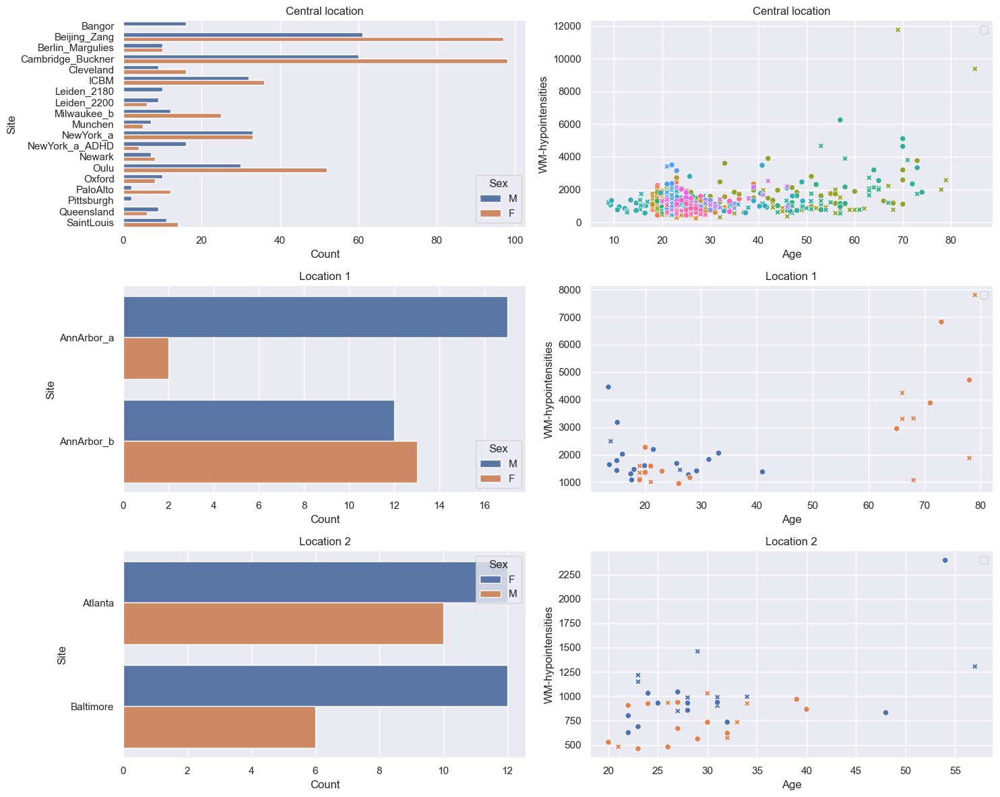

Configure the HBR model
-----------------------

We define a shared model configuration that will be used for **all**
models (baseline, central, transferred, and aggregated). This ensures a
fair comparison. We use a Normal likelihood HBR with B-spline basis
functions.

For a detailed explanation of this configuration, see *Tutorial 03 - HBR
with Normal Likelihood*.

.. code:: ipython3

    # Prior for the mean function (mu)
    mu = make_prior(
        linear=True,
        slope=make_prior(dist_name="Normal", dist_params=(0.0, 5.0)),
        intercept=make_prior(
            random=True,
            mu=make_prior(dist_name="Normal", dist_params=(0.0, 1.0)),
            sigma=make_prior(dist_name="Gamma", dist_params=(1.0, 1.0)
        ),
        basis_function=BsplineBasisFunction(basis_column=0, nknots=5, degree=3),
    ))
    
    # Prior for the noise function (sigma)
    sigma = make_prior(
        linear=True,
        slope=make_prior(dist_name="Normal", dist_params=(0.0, 1.0)),
        intercept=make_prior(dist_name="Normal", dist_params=(1.0, 1.0)),
        basis_function=BsplineBasisFunction(basis_column=0, nknots=5, degree=3),
        mapping="softplus",
        mapping_params=(0.0, 2.0),
    )
    
    
    likelihood = NormalLikelihood(mu, sigma)
    
    template_hbr = HBR(
        name="template",
        cores=16,
        progressbar=True,
        draws=1500,
        tune=500,
        chains=4,
        nuts_sampler="nutpie",
        likelihood=likelihood,
    )

--------------

Part 1: Baseline model
----------------------

In a non-FL scenario, we would pool all the data from every site into a
single dataset and train one model.

.. code:: ipython3

    baseline_model = NormativeModel(
        template_regression_model=template_hbr,
        savemodel=True,
        evaluate_model=True,
        saveresults=True,
        saveplots=False,
        save_dir=(
            "resources/federated/baseline"
        ),
        inscaler="standardize",
        outscaler="standardize",
    );
    
    baseline_model.fit_predict(
        train_all, test_all);

.. parsed-literal::

    c:\Users\kontsi\AppData\Local\anaconda3\envs\.ptk-dev\Lib\site-packages\pytensor\link\c\cmodule.py:2986: UserWarning: PyTensor could not link to a BLAS installation. Operations that might benefit from BLAS will be severely degraded.
    This usually happens when PyTensor is installed via pip. We recommend it be installed via conda/mamba/pixi instead.
    Alternatively, you can use an experimental backend such as Numba or JAX that perform their own BLAS optimizations, by setting `pytensor.config.mode == 'NUMBA'` or passing `mode='NUMBA'` when compiling a PyTensor function.
    For more options and details see https://pytensor.readthedocs.io/en/latest/troubleshooting.html#how-do-i-configure-test-my-blas-library
      warnings.warn(
    

.. raw:: html

    
    
    

.. raw:: html

    
    

        
<strong>Sampler Progress</strong>

        
Total Chains: 4

        
Active Chains: 0

        

            Finished Chains:
            4
        

        
Sampling for now

        

            Estimated Time to Completion:
            now
        

    
        <progress
            id="total-progress-bar"
            max="8000"
            value="8000">
        </progress>
        <table>
            <thead>
                <tr>
                    <th>Progress</th>
                    <th>Draws</th>
                    <th>Divergences</th>
                    <th>Step Size</th>
                    <th>Gradients/Draw</th>
                </tr>
            </thead>
            <tbody id="chain-details">
    
                    <tr>
                        <td class="progress-cell">
                            <progress
                                max="2000"
                                value="2000">
                            </progress>
                        </td>
                        <td>2000</td>
                        <td>63</td>
                        <td>0.28</td>
                        <td>31</td>
                    </tr>
    
                    <tr>
                        <td class="progress-cell">
                            <progress
                                max="2000"
                                value="2000">
                            </progress>
                        </td>
                        <td>2000</td>
                        <td>69</td>
                        <td>0.25</td>
                        <td>15</td>
                    </tr>
    
                    <tr>
                        <td class="progress-cell">
                            <progress
                                max="2000"
                                value="2000">
                            </progress>
                        </td>
                        <td>2000</td>
                        <td>35</td>
                        <td>0.25</td>
                        <td>15</td>
                    </tr>
    
                    <tr>
                        <td class="progress-cell">
                            <progress
                                max="2000"
                                value="2000">
                            </progress>
                        </td>
                        <td>2000</td>
                        <td>48</td>
                        <td>0.28</td>
                        <td>15</td>
                    </tr>
    
                </tr>
            </tbody>
        </table>
    

    

--------------

Part 2: FL with ``extend()``
----------------------------

Now we simulate the FL scenario. The central location **does not have
access** to the data at Location 1 and Location 2. Only model parameters
are exchanged.

Step 1: Train the central model
~~~~~~~~~~~~~~~~~~~~~~~~~~~~~~~

The central location trains an HBR model using only its own 19 sites.

.. code:: ipython3

    central_model = NormativeModel(
        template_regression_model=template_hbr,
        savemodel=False,
        evaluate_model=True,
        saveresults=False,
        saveplots=False,
        save_dir=(
            "resources/federated/central"
        ),
        inscaler="standardize",
        outscaler="standardize",
    )
    
    central_model.fit(train_central)

.. raw:: html

    
    
    

.. raw:: html

    
    

        
<strong>Sampler Progress</strong>

        
Total Chains: 4

        
Active Chains: 0

        

            Finished Chains:
            4
        

        
Sampling for now

        

            Estimated Time to Completion:
            now
        

    
        <progress
            id="total-progress-bar"
            max="8000"
            value="8000">
        </progress>
        <table>
            <thead>
                <tr>
                    <th>Progress</th>
                    <th>Draws</th>
                    <th>Divergences</th>
                    <th>Step Size</th>
                    <th>Gradients/Draw</th>
                </tr>
            </thead>
            <tbody id="chain-details">
    
                    <tr>
                        <td class="progress-cell">
                            <progress
                                max="2000"
                                value="2000">
                            </progress>
                        </td>
                        <td>2000</td>
                        <td>83</td>
                        <td>0.26</td>
                        <td>15</td>
                    </tr>
    
                    <tr>
                        <td class="progress-cell">
                            <progress
                                max="2000"
                                value="2000">
                            </progress>
                        </td>
                        <td>2000</td>
                        <td>78</td>
                        <td>0.27</td>
                        <td>15</td>
                    </tr>
    
                    <tr>
                        <td class="progress-cell">
                            <progress
                                max="2000"
                                value="2000">
                            </progress>
                        </td>
                        <td>2000</td>
                        <td>60</td>
                        <td>0.26</td>
                        <td>15</td>
                    </tr>
    
                    <tr>
                        <td class="progress-cell">
                            <progress
                                max="2000"
                                value="2000">
                            </progress>
                        </td>
                        <td>2000</td>
                        <td>32</td>
                        <td>0.26</td>
                        <td>15</td>
                    </tr>
    
                </tr>
            </tbody>
        </table>
    

    

.. code:: ipython3

    # Centile curves for the central model
    plot_centiles_advanced(
        central_model,
        scatter_data=train_central,
        batch_effects="all",
    )

.. image:: 12_federated_learning_files/12_federated_learning_15_0.png

Step 2: Extend the central model to remote locations
~~~~~~~~~~~~~~~~~~~~~~~~~~~~~~~~~~~~~~~~~~~~~~~~~~~~

Each remote location receives the central model file and calls
``extend()`` locally using its own private data.

``extend()`` synthesizes data from the central model’s learned
distribution, merges it with the real local data, and refits a full
model.

**No real data is exchanged only model parameters.**

.. code:: ipython3

    # Location 1 extends the central model
    # with their private data.
    extended_1 = central_model.extend(
        train_location1,
        save_dir=(
            "resources/federated/extended_1"
        ),
    )

.. raw:: html

    
    
    

.. raw:: html

    
    

        
<strong>Sampler Progress</strong>

        
Total Chains: 4

        
Active Chains: 0

        

            Finished Chains:
            4
        

        
Sampling for now

        

            Estimated Time to Completion:
            now
        

    
        <progress
            id="total-progress-bar"
            max="8000"
            value="8000">
        </progress>
        <table>
            <thead>
                <tr>
                    <th>Progress</th>
                    <th>Draws</th>
                    <th>Divergences</th>
                    <th>Step Size</th>
                    <th>Gradients/Draw</th>
                </tr>
            </thead>
            <tbody id="chain-details">
    
                    <tr>
                        <td class="progress-cell">
                            <progress
                                max="2000"
                                value="2000">
                            </progress>
                        </td>
                        <td>2000</td>
                        <td>71</td>
                        <td>0.27</td>
                        <td>15</td>
                    </tr>
    
                    <tr>
                        <td class="progress-cell">
                            <progress
                                max="2000"
                                value="2000">
                            </progress>
                        </td>
                        <td>2000</td>
                        <td>166</td>
                        <td>0.30</td>
                        <td>3</td>
                    </tr>
    
                    <tr>
                        <td class="progress-cell">
                            <progress
                                max="2000"
                                value="2000">
                            </progress>
                        </td>
                        <td>2000</td>
                        <td>130</td>
                        <td>0.24</td>
                        <td>31</td>
                    </tr>
    
                    <tr>
                        <td class="progress-cell">
                            <progress
                                max="2000"
                                value="2000">
                            </progress>
                        </td>
                        <td>2000</td>
                        <td>115</td>
                        <td>0.23</td>
                        <td>63</td>
                    </tr>
    
                </tr>
            </tbody>
        </table>
    

    

.. code:: ipython3

    # Location 2 extends the central model
    # with their private data.
    extended_2 = central_model.extend(
        train_location2,
        save_dir=(
            "resources/federated/extended_2"
        ),
    )

.. raw:: html

    
    
    

.. raw:: html

    
    

        
<strong>Sampler Progress</strong>

        
Total Chains: 4

        
Active Chains: 0

        

            Finished Chains:
            4
        

        
Sampling for now

        

            Estimated Time to Completion:
            now
        

    
        <progress
            id="total-progress-bar"
            max="8000"
            value="8000">
        </progress>
        <table>
            <thead>
                <tr>
                    <th>Progress</th>
                    <th>Draws</th>
                    <th>Divergences</th>
                    <th>Step Size</th>
                    <th>Gradients/Draw</th>
                </tr>
            </thead>
            <tbody id="chain-details">
    
                    <tr>
                        <td class="progress-cell">
                            <progress
                                max="2000"
                                value="2000">
                            </progress>
                        </td>
                        <td>2000</td>
                        <td>88</td>
                        <td>0.23</td>
                        <td>15</td>
                    </tr>
    
                    <tr>
                        <td class="progress-cell">
                            <progress
                                max="2000"
                                value="2000">
                            </progress>
                        </td>
                        <td>2000</td>
                        <td>34</td>
                        <td>0.26</td>
                        <td>15</td>
                    </tr>
    
                    <tr>
                        <td class="progress-cell">
                            <progress
                                max="2000"
                                value="2000">
                            </progress>
                        </td>
                        <td>2000</td>
                        <td>83</td>
                        <td>0.27</td>
                        <td>15</td>
                    </tr>
    
                    <tr>
                        <td class="progress-cell">
                            <progress
                                max="2000"
                                value="2000">
                            </progress>
                        </td>
                        <td>2000</td>
                        <td>124</td>
                        <td>0.27</td>
                        <td>2</td>
                    </tr>
    
                </tr>
            </tbody>
        </table>
    

    

.. code:: ipython3

    # Visualize the extended models
    plot_centiles_advanced(
        extended_1,
        scatter_data=train_location1,
        batch_effects="all",
    )
    
    plot_centiles_advanced(
        extended_2,
        scatter_data=train_location2,
        batch_effects="all",
    )

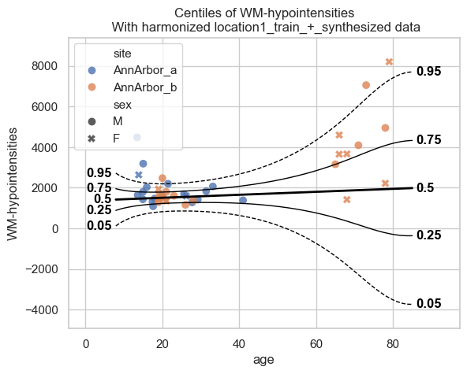

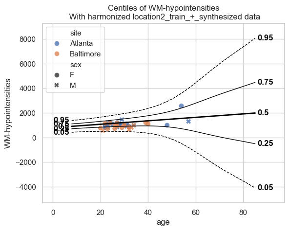

Each extended model knows about both the central sites (via synthetic
data) and its own local sites.

Step 3: Merge extended models
~~~~~~~~~~~~~~~~~~~~~~~~~~~~~

Merge the central model with both extended models using
``NormativeModel.merge()``.

Under the hood, ``merge()`` does the following: 1. Calls
``synthesize()`` on each model to generate synthetic data from its
learned distribution 2. Pools all synthetic datasets together 3. Refits
a single global model on the combined synthetic data

**No real data is exchanged only model parameters.**

.. code:: ipython3

    # Merge central + both extended models
    aggregated_model_with_extend = NormativeModel.merge(
        save_dir=(
            "resources/federated/merged_extend"
        ),
        models=[
            central_model,
            extended_1,
            extended_2,
        ],
    )

.. raw:: html

    
    
    

.. raw:: html

    
    

        
<strong>Sampler Progress</strong>

        
Total Chains: 4

        
Active Chains: 0

        

            Finished Chains:
            4
        

        
Sampling for 12 seconds

        

            Estimated Time to Completion:
            now
        

    
        <progress
            id="total-progress-bar"
            max="8000"
            value="8000">
        </progress>
        <table>
            <thead>
                <tr>
                    <th>Progress</th>
                    <th>Draws</th>
                    <th>Divergences</th>
                    <th>Step Size</th>
                    <th>Gradients/Draw</th>
                </tr>
            </thead>
            <tbody id="chain-details">
    
                    <tr>
                        <td class="progress-cell">
                            <progress
                                max="2000"
                                value="2000">
                            </progress>
                        </td>
                        <td>2000</td>
                        <td>104</td>
                        <td>0.25</td>
                        <td>15</td>
                    </tr>
    
                    <tr>
                        <td class="progress-cell">
                            <progress
                                max="2000"
                                value="2000">
                            </progress>
                        </td>
                        <td>2000</td>
                        <td>49</td>
                        <td>0.23</td>
                        <td>31</td>
                    </tr>
    
                    <tr>
                        <td class="progress-cell">
                            <progress
                                max="2000"
                                value="2000">
                            </progress>
                        </td>
                        <td>2000</td>
                        <td>92</td>
                        <td>0.27</td>
                        <td>15</td>
                    </tr>
    
                    <tr>
                        <td class="progress-cell">
                            <progress
                                max="2000"
                                value="2000">
                            </progress>
                        </td>
                        <td>2000</td>
                        <td>68</td>
                        <td>0.20</td>
                        <td>63</td>
                    </tr>
    
                </tr>
            </tbody>
        </table>
    

    

Step 4: Predict with the aggregated model
~~~~~~~~~~~~~~~~~~~~~~~~~~~~~~~~~~~~~~~~~

The aggregated model now covers all 23 sites. We can predict on the full
test set.

.. code:: ipython3

    # make a copy that holds all the test data
    test_all_extended = test_all.copy(deep=True)
    # Predict the test data based on the aggegated model
    aggregated_model_with_extend.predict(
        test_all_extended
    );

--------------

Part 3: FL with ``transfer()``
------------------------------

We now repeat the federated workflow, but using ``transfer()`` instead
of ``extend()``.

Step 1: Transfer to both locations
~~~~~~~~~~~~~~~~~~~~~~~~~~~~~~~~~~

.. code:: ipython3

    # Location 1 transfers the central model
    transferred_1 = central_model.transfer(
        train_location1,
        save_dir=(
            "resources/federated/transferred_1"
        ),
    )
    
    # Location 2 transfers the central model
    transferred_2 = central_model.transfer(
        train_location2,
        save_dir=(
            "resources/federated/transferred_2"
        ),
    )

.. raw:: html

    
    
    

.. raw:: html

    
    

        
<strong>Sampler Progress</strong>

        
Total Chains: 4

        
Active Chains: 0

        

            Finished Chains:
            4
        

        
Sampling for now

        

            Estimated Time to Completion:
            now
        

    
        <progress
            id="total-progress-bar"
            max="8000"
            value="8000">
        </progress>
        <table>
            <thead>
                <tr>
                    <th>Progress</th>
                    <th>Draws</th>
                    <th>Divergences</th>
                    <th>Step Size</th>
                    <th>Gradients/Draw</th>
                </tr>
            </thead>
            <tbody id="chain-details">
    
                    <tr>
                        <td class="progress-cell">
                            <progress
                                max="2000"
                                value="2000">
                            </progress>
                        </td>
                        <td>2000</td>
                        <td>0</td>
                        <td>0.51</td>
                        <td>7</td>
                    </tr>
    
                    <tr>
                        <td class="progress-cell">
                            <progress
                                max="2000"
                                value="2000">
                            </progress>
                        </td>
                        <td>2000</td>
                        <td>0</td>
                        <td>0.41</td>
                        <td>7</td>
                    </tr>
    
                    <tr>
                        <td class="progress-cell">
                            <progress
                                max="2000"
                                value="2000">
                            </progress>
                        </td>
                        <td>2000</td>
                        <td>0</td>
                        <td>0.48</td>
                        <td>7</td>
                    </tr>
    
                    <tr>
                        <td class="progress-cell">
                            <progress
                                max="2000"
                                value="2000">
                            </progress>
                        </td>
                        <td>2000</td>
                        <td>1</td>
                        <td>0.46</td>
                        <td>7</td>
                    </tr>
    
                </tr>
            </tbody>
        </table>
    

    

.. raw:: html

    
    
    

.. raw:: html

    
    

        
<strong>Sampler Progress</strong>

        
Total Chains: 4

        
Active Chains: 0

        

            Finished Chains:
            4
        

        
Sampling for now

        

            Estimated Time to Completion:
            now
        

    
        <progress
            id="total-progress-bar"
            max="8000"
            value="8000">
        </progress>
        <table>
            <thead>
                <tr>
                    <th>Progress</th>
                    <th>Draws</th>
                    <th>Divergences</th>
                    <th>Step Size</th>
                    <th>Gradients/Draw</th>
                </tr>
            </thead>
            <tbody id="chain-details">
    
                    <tr>
                        <td class="progress-cell">
                            <progress
                                max="2000"
                                value="2000">
                            </progress>
                        </td>
                        <td>2000</td>
                        <td>8</td>
                        <td>0.37</td>
                        <td>7</td>
                    </tr>
    
                    <tr>
                        <td class="progress-cell">
                            <progress
                                max="2000"
                                value="2000">
                            </progress>
                        </td>
                        <td>2000</td>
                        <td>2</td>
                        <td>0.39</td>
                        <td>15</td>
                    </tr>
    
                    <tr>
                        <td class="progress-cell">
                            <progress
                                max="2000"
                                value="2000">
                            </progress>
                        </td>
                        <td>2000</td>
                        <td>9</td>
                        <td>0.36</td>
                        <td>15</td>
                    </tr>
    
                    <tr>
                        <td class="progress-cell">
                            <progress
                                max="2000"
                                value="2000">
                            </progress>
                        </td>
                        <td>2000</td>
                        <td>8</td>
                        <td>0.35</td>
                        <td>15</td>
                    </tr>
    
                </tr>
            </tbody>
        </table>
    

    

.. code:: ipython3

    # Visualize the transferred models
    plot_centiles_advanced(
        transferred_1,
        scatter_data=train_location1,
        batch_effects="all",
    )
    
    plot_centiles_advanced(
        transferred_2,
        scatter_data=train_location2,
        batch_effects="all",
    )

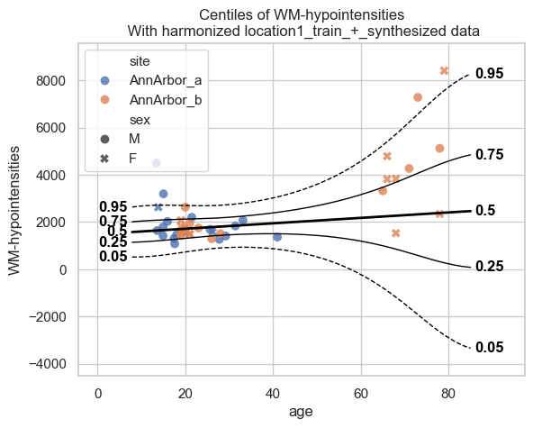

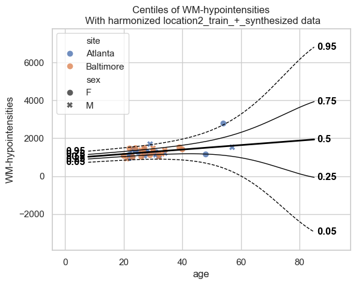

Step 2: Merge transferred models and predict
~~~~~~~~~~~~~~~~~~~~~~~~~~~~~~~~~~~~~~~~~~~~

.. code:: ipython3

    # Merge central + both transferred models
    aggregated_model_with_transfer = NormativeModel.merge(
        save_dir="resources/federated/merged_transfer",
        models=[
            central_model,
            transferred_1,
            transferred_2,
        ],
    )
    
    # Predict on the full test set
    test_all_transferred = test_all.copy(deep=True)
    aggregated_model_with_transfer.predict(test_all_transferred);

.. raw:: html

    
    
    

.. raw:: html

    
    

        
<strong>Sampler Progress</strong>

        
Total Chains: 4

        
Active Chains: 0

        

            Finished Chains:
            4
        

        
Sampling for now

        

            Estimated Time to Completion:
            now
        

    
        <progress
            id="total-progress-bar"
            max="8000"
            value="8000">
        </progress>
        <table>
            <thead>
                <tr>
                    <th>Progress</th>
                    <th>Draws</th>
                    <th>Divergences</th>
                    <th>Step Size</th>
                    <th>Gradients/Draw</th>
                </tr>
            </thead>
            <tbody id="chain-details">
    
                    <tr>
                        <td class="progress-cell">
                            <progress
                                max="2000"
                                value="2000">
                            </progress>
                        </td>
                        <td>2000</td>
                        <td>45</td>
                        <td>0.23</td>
                        <td>15</td>
                    </tr>
    
                    <tr>
                        <td class="progress-cell">
                            <progress
                                max="2000"
                                value="2000">
                            </progress>
                        </td>
                        <td>2000</td>
                        <td>33</td>
                        <td>0.23</td>
                        <td>31</td>
                    </tr>
    
                    <tr>
                        <td class="progress-cell">
                            <progress
                                max="2000"
                                value="2000">
                            </progress>
                        </td>
                        <td>2000</td>
                        <td>52</td>
                        <td>0.24</td>
                        <td>15</td>
                    </tr>
    
                    <tr>
                        <td class="progress-cell">
                            <progress
                                max="2000"
                                value="2000">
                            </progress>
                        </td>
                        <td>2000</td>
                        <td>203</td>
                        <td>0.25</td>
                        <td>31</td>
                    </tr>
    
                </tr>
            </tbody>
        </table>
    

    

--------------

Final comparison: aggregated (extend) vs aggregated (transfer) vs. baseline
---------------------------------------------------------------------------

We now compare all three models: - **baseline**: all data pooled -
**Aggregated (extend)**: remote sites used ``extend()`` - **Aggregated
(transfer)**: remote sites used ``transfer()``

Centile curves
~~~~~~~~~~~~~~

.. code:: ipython3

    # baseline model centiles
    print("=== baseline model ===")
    plot_centiles_advanced(
        baseline_model,
        scatter_data=test_all,
        batch_effects="all",
    )
    
    # Aggregated model centiles (extend)
    print("\n=== Aggregated (extend) ===")
    plot_centiles_advanced(
        aggregated_model_with_extend,
        scatter_data=test_all,
        batch_effects="all",
    )
    
    # Aggregated model centiles (transfer)
    print("\n=== Aggregated (transfer) ===")
    plot_centiles_advanced(
        aggregated_model_with_transfer,
        scatter_data=test_all,
        batch_effects="all",
    )

.. parsed-literal::

    === baseline model ===
    

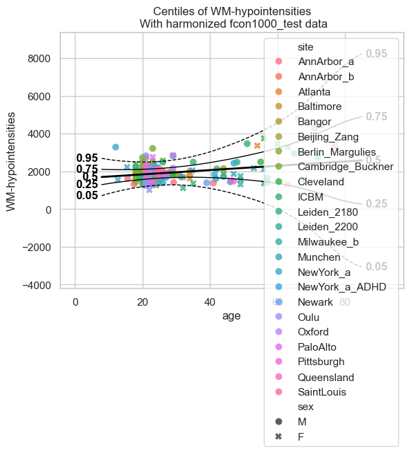

.. parsed-literal::

    
    === Aggregated (extend) ===
    

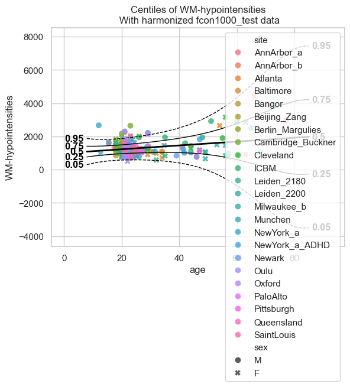

.. parsed-literal::

    
    === Aggregated (transfer) ===
    

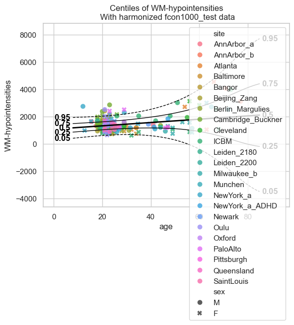

QQ plots and evaluation metrics
~~~~~~~~~~~~~~~~~~~~~~~~~~~~~~~

.. code:: ipython3

    # QQ plots for all three models
    plt.title("Baseline")
    plot_qq(test_all, plot_id_line=True)
    
    plt.title("Aggregated (extend)")
    plot_qq(
        test_all_extended, plot_id_line=True
    )
    
    plt.title("Aggregated (transfer)")
    plot_qq(
        test_all_transferred, plot_id_line=True
    )
    
    # Evaluation metrics for all three
    baseline_stats = (
        test_all.get_statistics_df()
    )
    extend_stats = (
        test_all_extended.get_statistics_df()
    )
    transfer_stats = (
        test_all_transferred.get_statistics_df()
    )
    
    comparison = pd.concat(
        [
            baseline_stats,
            extend_stats,
            transfer_stats,
        ]
        , keys=[
            "baseline",
            "Aggregated (extend)",
            "Aggregated (transfer)",
        ]
    )
    comparison

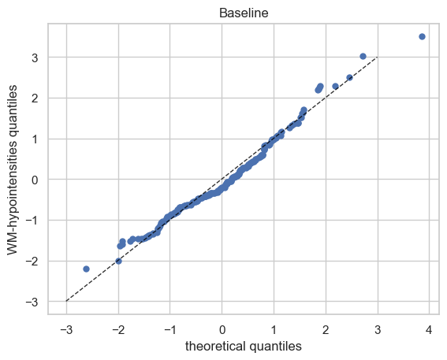

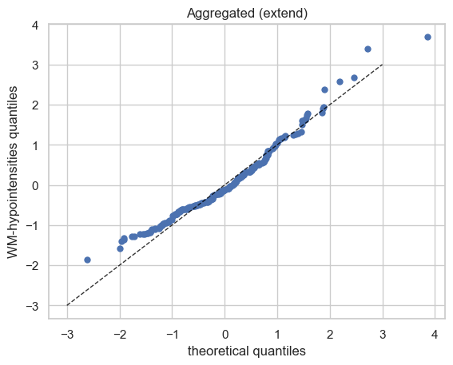

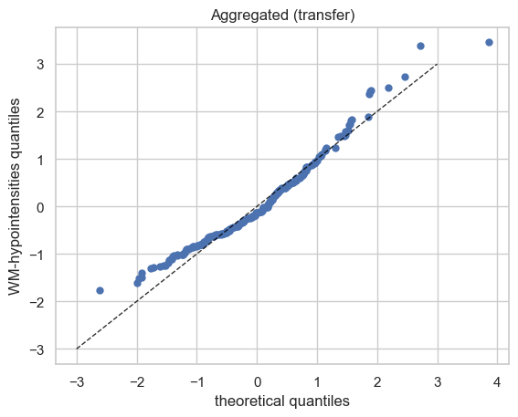

.. raw:: html

    

    
    <table border="1" class="dataframe">
      <thead>
        <tr style="text-align: right;">
          <th></th>
          <th>statistic</th>
          <th>EXPV</th>
          <th>MACE</th>
          <th>MAPE</th>
          <th>MSLL</th>
          <th>NLL</th>
          <th>R2</th>
          <th>RMSE</th>
          <th>Rho</th>
          <th>Rho_p</th>
          <th>SMSE</th>
          <th>ShapiroW</th>
        </tr>
        <tr>
          <th></th>
          <th>response_vars</th>
          <th></th>
          <th></th>
          <th></th>
          <th></th>
          <th></th>
          <th></th>
          <th></th>
          <th></th>
          <th></th>
          <th></th>
          <th></th>
        </tr>
      </thead>
      <tbody>
        <tr>
          <th>baseline</th>
          <th>WM-hypointensities</th>
          <td>0.283357</td>
          <td>0.037593</td>
          <td>0.343657</td>
          <td>-0.309733</td>
          <td>0.809536</td>
          <td>0.283257</td>
          <td>512.393429</td>
          <td>0.457326</td>
          <td>1.461914e-12</td>
          <td>0.716743</td>
          <td>0.968612</td>
        </tr>
        <tr>
          <th>Aggregated (extend)</th>
          <th>WM-hypointensities</th>
          <td>0.254675</td>
          <td>0.038889</td>
          <td>0.342497</td>
          <td>-0.299144</td>
          <td>0.885658</td>
          <td>0.250139</td>
          <td>524.097735</td>
          <td>0.431402</td>
          <td>3.339060e-11</td>
          <td>0.749861</td>
          <td>0.952947</td>
        </tr>
        <tr>
          <th>Aggregated (transfer)</th>
          <th>WM-hypointensities</th>
          <td>0.209173</td>
          <td>0.035185</td>
          <td>0.366371</td>
          <td>-0.257403</td>
          <td>0.927399</td>
          <td>0.203533</td>
          <td>540.139196</td>
          <td>0.325028</td>
          <td>1.047982e-06</td>
          <td>0.796467</td>
          <td>0.952010</td>
        </tr>
      </tbody>
    </table>
    

Conclusions
-----------

Centile plots
~~~~~~~~~~~~~

Looking at the centile plots, both aggregated models fit the test data
well across most of the age range.

The **aggregated (extend)** model shows an abrupt divergence at old ages
(> 70 years). This happens because ``extend()`` fits a model on
synthetic data from the central model and real local data. The synthetic
and the real local data have almost no datapoints beyond age ~70 . As a
result the model does not fit well for these ages.

QQ plots
~~~~~~~~

Both aggregated models show a systematic deviation from the identity
line at the **lower tail** of the QQ plot. That means the model
“expects” the lowest-percentile subjects to have smaller observed values
than they actually do.
