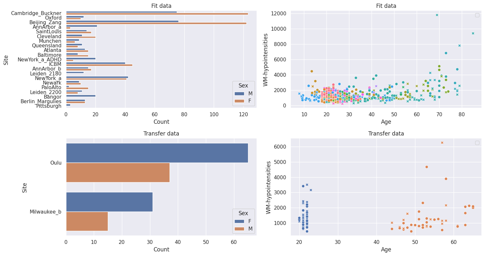
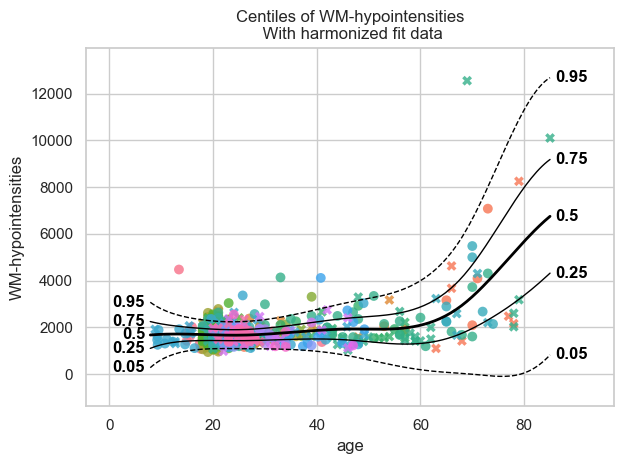
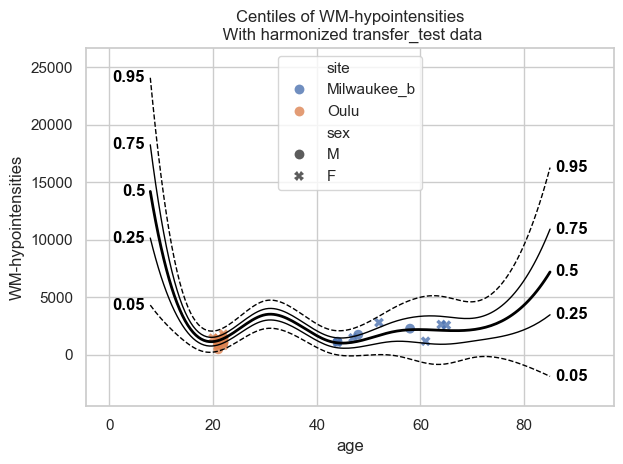
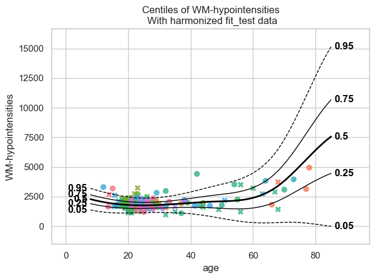
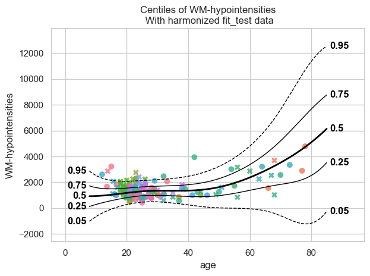

Transfer and extend normative models
====================================

Welcome to this tutorial notebook that will go through the transfering
and extending of existing models on new data.

Transfer and extend are both useful for when you have only a small
dataset to your disposal, but you still want to derive a well-calibrated
model from that. To get this well-calibrated model we use a large
reference model (that was already trained before) and transfer it or
extend it to our small dataset. As a result, we derive a new model that
is better than a model that would be trained solely on our small
dataset.

**For transfer**, the new model will only be able to handle data from
the batches in the small dataset; a small model is derived from a large
reference model.

**For extend**, the new model will be able to handle data from batches
in the reference training set, as well as the batches in the new small
dataset; a larger reference model is derived from a large reference
model.

Imports
-------

.. code:: ipython3

    import warnings
    import logging
    
    
    import pandas as pd
    import matplotlib.pyplot as plt
    from pcntoolkit import (
        HBR,
        BsplineBasisFunction,
        NormativeModel,
        NormData,
        load_fcon1000,
        NormalLikelihood,
        make_prior,
        plot_centiles_advanced,
    )
    
    import pcntoolkit.util.output
    import seaborn as sns
    
    sns.set_style("darkgrid")
    
    # Suppress some annoying warnings and logs
    pymc_logger = logging.getLogger("pymc")
    
    pymc_logger.setLevel(logging.WARNING)
    pymc_logger.propagate = False
    
    warnings.simplefilter(action="ignore", category=FutureWarning)
    pd.options.mode.chained_assignment = None  # default='warn'
    pcntoolkit.util.output.Output.set_show_messages(False)

Load data
---------

First we download a small example dataset from github.

.. code:: ipython3

    # Download the dataset
    norm_data: NormData = load_fcon1000()
    
    # Select the white matter hypointensities feature
    features_to_model = [
        "WM-hypointensities"
    ]
    norm_data = norm_data.sel({"response_vars": features_to_model})
    
    # Leave two sites out for doing transfer and extend later
    transfer_sites = ["Milwaukee_b", "Oulu"]
    transfer_data, fit_data = norm_data.batch_effects_split({"site": transfer_sites}, names=("transfer", "fit"))
    
    # Split into train and test sets
    train, test = fit_data.train_test_split()
    transfer_train, transfer_test = transfer_data.train_test_split()

.. code:: ipython3

    feature_to_plot = features_to_model[0]
    datasets = {
        "Fit data": train.merge(test, name="fit"),
        "Transfer data": transfer_train.merge(
            transfer_test, name="transfer"
        ),
    }
    
    fig, axes = plt.subplots(
        2, 2, figsize=(15, 8)
    )
    
    for i, (name, data) in enumerate(
        datasets.items()
    ):
        df = data.to_dataframe()
        # Count plot
        sns.countplot(
            data=df,
            y=("batch_effects", "site"),
            hue=("batch_effects", "sex"),
            ax=axes[i, 0],
            orient="h",
        )
        axes[i, 0].legend(title="Sex")
        axes[i, 0].set_title(f"{name}")
        axes[i, 0].set_xlabel("Count")
        axes[i, 0].set_ylabel("Site")
    
        # Scatter plot
        sns.scatterplot(
            data=df,
            x=("X", "age"),
            y=("Y", feature_to_plot),
            hue=("batch_effects", "site"),
            style=("batch_effects", "sex"),
            ax=axes[i, 1],
        )
        axes[i, 1].legend([], [])
        axes[i, 1].set_title(f"{name}")
        axes[i, 1].set_xlabel("Age")
        axes[i, 1].set_ylabel(feature_to_plot)
    
    plt.tight_layout()
    plt.show()

Normative model
---------------

Create HBR model
~~~~~~~~~~~~~~~~

.. code:: ipython3

    mu = make_prior(
        linear=True,
        slope=make_prior(dist_name="Normal", dist_params=(0.0, 10.0)),
        intercept=make_prior(
            random=True,
            mu=make_prior(dist_name="Normal", dist_params=(0.0, 1.0)),
            sigma=make_prior(dist_name="Normal", dist_params=(0.0, 1.0), mapping="softplus", mapping_params=(0.0, 3.0)),
        ),
        basis_function=BsplineBasisFunction(basis_column=0, nknots=5, degree=3),
    )
    sigma = make_prior(
        linear=True,
        slope=make_prior(dist_name="Normal", dist_params=(0.0, 2.0)),
        intercept=make_prior(dist_name="Normal", dist_params=(1.0, 1.0)),
        basis_function=BsplineBasisFunction(basis_column=0, nknots=5, degree=3),
        mapping="softplus",
        mapping_params=(0.0, 3.0),
    )
    
    likelihood = NormalLikelihood(mu, sigma)
    
    template_hbr = HBR(
        name="template",
        cores=16,
        progressbar=False,
        draws=1500,
        tune=500,
        chains=4,
        nuts_sampler="nutpie",
        likelihood=likelihood,
    )
    

Create normative model
~~~~~~~~~~~~~~~~~~~~~~

.. code:: ipython3

    model = NormativeModel(
        template_regression_model=template_hbr,
        savemodel=True,
        evaluate_model=True,
        saveresults=True,
        saveplots=False,
        save_dir="resources/hbr/save_dir",
        inscaler="standardize",
        outscaler="standardize",
    )

Fit and plot normative model
~~~~~~~~~~~~~~~~~~~~~~~~~~~~

.. code:: ipython3

    test = model.fit_predict(train, test);
    
    plot_centiles_advanced(
        model,
        scatter_data=train,
        batch_effects = 'all',
        show_legend = False
    )

.. parsed-literal::

    c:\Users\kontsi\AppData\Local\anaconda3\envs\.ptk-dev\Lib\site-packages\pytensor\link\c\cmodule.py:2986: UserWarning: PyTensor could not link to a BLAS installation. Operations that might benefit from BLAS will be severely degraded.
    This usually happens when PyTensor is installed via pip. We recommend it be installed via conda/mamba/pixi instead.
    Alternatively, you can use an experimental backend such as Numba or JAX that perform their own BLAS optimizations, by setting `pytensor.config.mode == 'NUMBA'` or passing `mode='NUMBA'` when compiling a PyTensor function.
    For more options and details see https://pytensor.readthedocs.io/en/latest/troubleshooting.html#how-do-i-configure-test-my-blas-library
      warnings.warn(
    

.. parsed-literal::

    [<Figure size 640x480 with 1 Axes>]

Extending
---------

Now that we have a fitted model, we can extend it using the data that we
held out of the train set. This is from previously unseen sites.

And just to show why we prefer extend over just fitting a new model on
the small dataset, we can show how bad such a model would be:

.. code:: ipython3

    small_model = NormativeModel(
        template_regression_model=template_hbr,
        savemodel=True,
        evaluate_model=True,
        saveresults=True,
        saveplots=False,
        save_dir="resources/hbr_transfer/save_dir_small",
        inscaler="standardize",
        outscaler="standardize",
    )
    
    small_model.fit_predict(transfer_train, transfer_test)
    
    plot_centiles_advanced(
        small_model,
        scatter_data=transfer_test,
        batch_effects='all'
    )

.. parsed-literal::

    [<Figure size 640x480 with 1 Axes>]

The interpolation between ages 22 and 45 is very bad, and that’s because
there was no train data there. This model will not perform well on new
data. Now instead, let’s extend the model we fitted before to our
smaller dataset, and see how those centiles look:

.. code:: ipython3

    extended_model = model.extend_predict(transfer_train, transfer_test);
    
    plot_centiles_advanced(
        extended_model,
        scatter_data=test,
        batch_effects='all',
        show_legend = False
    )

.. parsed-literal::

    [<Figure size 640x480 with 1 Axes>]

These centiles look much better in comparison to the ‘small model’ that
we trained directly on the small dataset.

Transfering
-----------

Transfering looks very similar to extending, but the underlying
mathematics is very different. Besides that, it leads to a smaller model
instead of a bigger one; we can *not* use a transfered model to make
predictions on the original train data.

.. code:: ipython3

    transfered_model = model.transfer_predict(transfer_train, transfer_test);
    plot_centiles_advanced(
        transfered_model,
        scatter_data=test,
        batch_effects='all',
        show_legend = False
    )

.. parsed-literal::

    [<Figure size 640x480 with 1 Axes>]

Here we see that the transfered model is also much better than the
‘small model’ that we trained directly on the small dataset.

