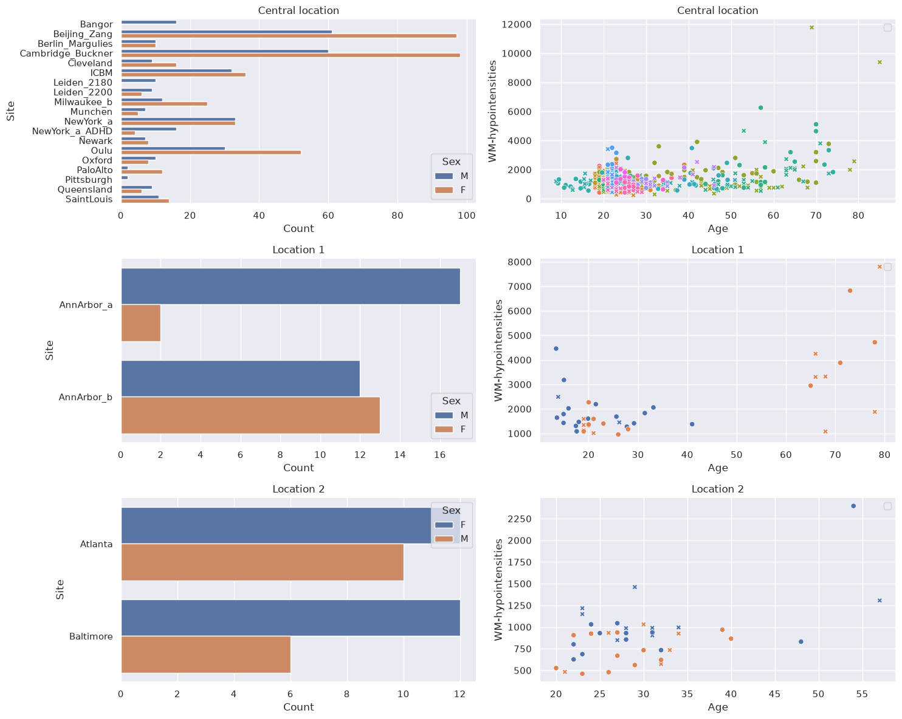
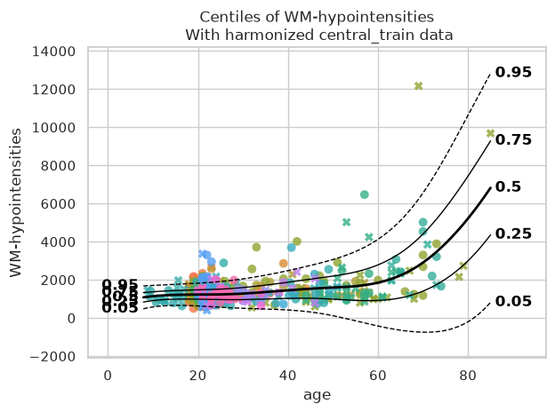
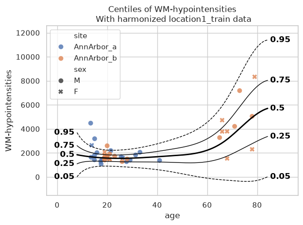
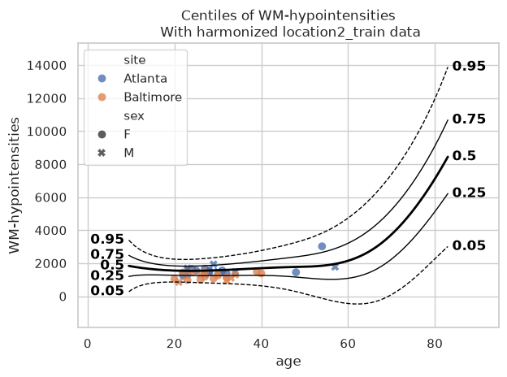
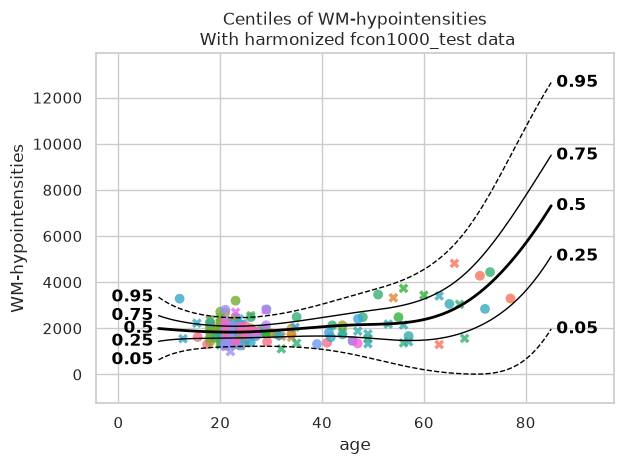
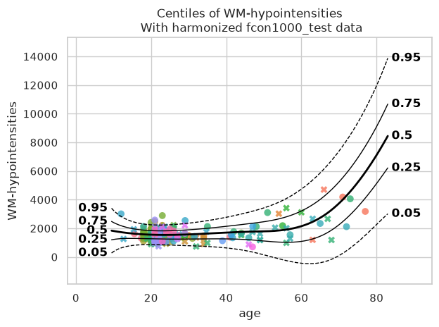

Federated normative modeling
============================

In multi-site neuroimaging studies, data often cannot leave the hospital
or institution where it was collected, due to privacy regulations such
as GDPR. **Federated learning (FL)** addresses this constraint: each
site trains a model locally and shares only the trained model
parameters; never the raw data.

This tutorial demonstrates a FL workflow for normative modeling using
the PCNtoolkit. For more details you can read the paper below:

   | Kia SM, Huijsdens H, Rutherford S, de Boer A, Dinga R, Wolfers T,
     et al. (2022)
   | *Closing the life-cycle of normative modeling using federated
     hierarchical Bayesian regression.*
   | PLoS ONE 17(12): e0278776.
     https://doi.org/10.1371/journal.pone.0278776

What we will do
---------------

**Classic normative modelling workflow**

1. *Fit a model* on all data together (let’s call it *baseline model* as
   later we will compare it with the extended model produced from the FL
   workflow)

**FL workflow**

2. *Split* the data into a large central dataset and two smaller ones
3. *Fit a central model* on the central dataset only
4. *Extend* the central model to each of the two smaller datasets

**Comparison classic vs FL workflow**

5. *Compare* the extended model to the baseline model

The functions that we will use
------------------------------

+-------------------------------------+-----------------------------------+
| Function                            | Role                              |
+=====================================+===================================+
| ``NormativeModel.fit_predict()``    | Fit and predict the baseline and  |
|                                     | central model                     |
+-------------------------------------+-----------------------------------+
| ``NormativeModel.extend_predict()`` | Extend the central model with     |
|                                     | data from a remote location +     |
|                                     | synthetic data (generated from    |
|                                     | the central model) and then       |
|                                     | predict on the test data from a   |
|                                     | remote location.                  |
+-------------------------------------+-----------------------------------+

Imports
-------

.. code:: ipython3

    import logging
    import warnings
    
    import matplotlib.pyplot as plt
    import numpy as np
    import pandas as pd
    import seaborn as sns
    
    import pcntoolkit.util.output
    from pcntoolkit import (
        HBR,
        BsplineBasisFunction,
        NormalLikelihood,
        NormativeModel,
        NormData,
        load_fcon1000,
        make_prior,
        plot_centiles_advanced,
        plot_qq,
    )
    
    sns.set_style("darkgrid")
    
    # Suppress some annoying warnings and logs
    pymc_logger = logging.getLogger("pymc")
    pymc_logger.setLevel(logging.WARNING)
    pymc_logger.propagate = False
    
    warnings.simplefilter(
        action="ignore", category=FutureWarning
    )
    pd.options.mode.chained_assignment = None
    pcntoolkit.util.output.Output.set_show_messages(
        False
    )

Load data
---------

We use the
`fcon1000 <https://fcon_1000.projects.nitrc.org/fcpClassic/FcpTable.html>`__
dataset that is included in PCNtoolkit. This dataset contains derived
structural MRI phenotypes from 1,078 subjects collected across 23 sites,
including cortical thickness measures, subcortical and ventricular
volumes, and global brain-volume estimates.

For this tutorial, we select a single response variable: the
WM-hypointensitieswhich is a measure related to damaged or diseased
tissue within the brain’s white matter.

.. code:: ipython3

    # Download the dataset
    norm_data: NormData = load_fcon1000()
    
    # Select only the white matter hypointensities feature
    features_to_model = ["WM-hypointensities"]
    norm_data = norm_data.sel(
        {"response_vars": features_to_model}
    )
    
    # Show all available sites
    all_sites = np.unique(
        norm_data.batch_effects.sel(
            batch_effect_dims="site"
        ).values
    )
    print(
        f"Total sites: {len(all_sites)}"
    )
    print(f"Sites: {all_sites}")

.. parsed-literal::

    Total sites: 23
    Sites: ['AnnArbor_a' 'AnnArbor_b' 'Atlanta' 'Baltimore' 'Bangor' 'Beijing_Zang'
     'Berlin_Margulies' 'Cambridge_Buckner' 'Cleveland' 'ICBM' 'Leiden_2180'
     'Leiden_2200' 'Milwaukee_b' 'Munchen' 'NewYork_a' 'NewYork_a_ADHD'
     'Newark' 'Oulu' 'Oxford' 'PaloAlto' 'Pittsburgh' 'Queensland'
     'SaintLouis']
    

Split data
----------

We split the data into:

- A large central dataset (19 sites)
- Two smaller datasets (each dataset has 2 sites)

In a FL scenario the large model would be owned by a central location
(e.g., a hospital in the Netherlands) and the smaller ones by remote
locations 1 and 2 (e.g, a hospital in France and in the USA). All these
locations don’t want to share their data due to privacy. For this
reason, they use the FL workflow.

.. code:: ipython3

    # Pick 2 sites for each remote location
    location1_sites = list(all_sites[:2])
    location2_sites = list(all_sites[2:4])
    print(
        f"Location 1 sites: {location1_sites}"
    )
    print(
        f"Location 2 sites: {location2_sites}"
    )
    
    # Split off location 1
    location1_data, remaining = (
        norm_data.batch_effects_split(
            {"site": location1_sites},
            names=("location1", "remaining"),
        )
    )
    
    # Split off location 2 
    location2_data, central_data = (
        remaining.batch_effects_split(
            {"site": location2_sites},
            names=("location2", "central"),
        )
    )
    
    # Create train/test splits for each location
    train_central, test_central = (
        central_data.train_test_split()
    )
    train_location1, test_location1 = (
        location1_data.train_test_split()
    )
    train_location2, test_location2 = (
        location2_data.train_test_split()
    )
    
    # Global train/test for the baseline model
    train_all, test_all = (
        norm_data.train_test_split()
    )
    
    print(
        f"\nCentral: "
        f"{train_central.X.shape[0]} train, "
        f"{test_central.X.shape[0]} test"
    )
    print(
        f"Location 1: "
        f"{train_location1.X.shape[0]} train, "
        f"{test_location1.X.shape[0]} test"
    )
    print(
        f"Location 2: "
        f"{train_location2.X.shape[0]} train, "
        f"{test_location2.X.shape[0]} test"
    )
    print(
        f"All data: "
        f"{train_all.X.shape[0]} train, "
        f"{test_all.X.shape[0]} test"
    )

.. parsed-literal::

    Location 1 sites: [np.str_('AnnArbor_a'), np.str_('AnnArbor_b')]
    Location 2 sites: [np.str_('Atlanta'), np.str_('Baltimore')]
    
    Central: 776 train, 195 test
    Location 1: 44 train, 12 test
    Location 2: 40 train, 11 test
    All data: 862 train, 216 test
    

Visualize the data
------------------

.. code:: ipython3

    feature = features_to_model[0]
    datasets = {
        "Central location": train_central,
        "Location 1": train_location1,
        "Location 2": train_location2,
    }
    
    fig, axes = plt.subplots(
        3, 2, figsize=(15, 12)
    )
    
    # for every dataset
    for i, (name, data) in enumerate(
        datasets.items()
    ):
        df = data.to_dataframe()
        # Count plot
        sns.countplot(
            data=df,
            y=("batch_effects", "site"),
            hue=("batch_effects", "sex"),
            ax=axes[i, 0],
            orient="h",
        )
        axes[i, 0].legend(title="Sex")
        axes[i, 0].set_title(
            f"{name}"
        )
        axes[i, 0].set_xlabel("Count")
        axes[i, 0].set_ylabel("Site")
    
        # Scatter plot
        sns.scatterplot(
            data=df,
            x=("X", "age"),
            y=("Y", feature),
            hue=("batch_effects", "site"),
            style=("batch_effects", "sex"),
            ax=axes[i, 1],
        )
        axes[i, 1].legend([], [])
        axes[i, 1].set_title(
            f"{name}"
        )
        axes[i, 1].set_xlabel("Age")
        axes[i, 1].set_ylabel(feature)
    
    plt.tight_layout()
    plt.show()

Configure the HBR model
-----------------------

We define a shared model configuration that will be used for both
baseline and FL model. This ensures a fair comparison. We use a Normal
likelihood HBR with B-spline basis functions.

.. code:: ipython3

    mu = make_prior(
        linear=True,
        slope=make_prior(dist_name="Normal", dist_params=(0.0, 10.0)),
        intercept=make_prior(
            random=True,
            mu=make_prior(dist_name="Normal", dist_params=(0.0, 1.0)),
            sigma=make_prior(dist_name="Normal", dist_params=(0.0, 1.0), mapping="softplus", mapping_params=(0.0, 3.0)),
        ),
        basis_function=BsplineBasisFunction(basis_column=0, nknots=5, degree=3),
    )
    sigma = make_prior(
        linear=True,
        slope=make_prior(dist_name="Normal", dist_params=(0.0, 2.0)),
        intercept=make_prior(dist_name="Normal", dist_params=(1.0, 1.0)),
        basis_function=BsplineBasisFunction(basis_column=0, nknots=5, degree=3),
        mapping="softplus",
        mapping_params=(0.0, 3.0),
    )
    
    likelihood = NormalLikelihood(mu, sigma)
    
    template_hbr = HBR(
        name="template",
        cores=16,
        progressbar=False,
        draws=1500,
        tune=500,
        chains=4,
        nuts_sampler="nutpie",
        likelihood=likelihood,
    )
    

--------------

Part 1: Baseline model
----------------------

In a non-FL scenario, we would pool all the data from all the 23 sites
into a single dataset and train one model.

.. code:: ipython3

    baseline_model = NormativeModel(
        template_regression_model=template_hbr,
        savemodel=True,
        evaluate_model=True,
        saveresults=True,
        saveplots=False,
        save_dir=(
            "resources/federated/baseline"
        ),
        inscaler="standardize",
        outscaler="standardize",
    );
    
    # Use the data from all 23 sites, before any splitting happened.
    baseline_model.fit_predict(
        train_all, test_all);

.. parsed-literal::

    /opt/hostedtoolcache/Python/3.13.14/x64/lib/python3.13/site-packages/pytensor/link/c/cmodule.py:2986: UserWarning: PyTensor could not link to a BLAS installation. Operations that might benefit from BLAS will be severely degraded.
    This usually happens when PyTensor is installed via pip. We recommend it be installed via conda/mamba/pixi instead.
    Alternatively, you can use an experimental backend such as Numba or JAX that perform their own BLAS optimizations, by setting `pytensor.config.mode == 'NUMBA'` or passing `mode='NUMBA'` when compiling a PyTensor function.
    For more options and details see https://pytensor.readthedocs.io/en/latest/troubleshooting.html#how-do-i-configure-test-my-blas-library
      warnings.warn(
    

Part 2: FL with ``extend()``
----------------------------

Now we simulate the FL scenario. None of the locations (central,
location 1 and 2) share their data with each other. Only model
parameters are exchanged.

Step 1: Train the central model
~~~~~~~~~~~~~~~~~~~~~~~~~~~~~~~

The central location trains an HBR model using only its own 19 sites.

.. code:: ipython3

    central_model = NormativeModel(
        template_regression_model=template_hbr,
        savemodel=True,
        evaluate_model=True,
        saveresults=False,
        saveplots=False,
        save_dir=(
            "resources/federated/central"
        ),
        inscaler="standardize",
        outscaler="standardize",
    );
    
    central_model.fit_predict(train_central, test_central);

.. code:: ipython3

    # Centile curves for the central model
    plot_centiles_advanced(
        central_model,
        scatter_data=train_central,
        batch_effects="all",
        show_legend=False
    )

.. parsed-literal::

    [<Figure size 640x480 with 1 Axes>]

Step 2: Extend the central model to remote locations
~~~~~~~~~~~~~~~~~~~~~~~~~~~~~~~~~~~~~~~~~~~~~~~~~~~~

Location 1 receives the central model json files that are saved in
``resources/federated/central`` and calls ``extend_predict()`` locally
using its own private data.

``extend_predict()`` runs both ``extend()`` and ``predict()``.
``extend()`` synthesizes data from the central model’s learned
distribution, merges it with the real local data, and refits a full
model.

No real data is exchanged only model parameters.

.. code:: ipython3

    # extend() synthesizes random data, so we set a seed to make sure in this tutorial the results are always the same
    import numpy as np
    np.random.seed(42)
    
    # Location 1 loads the central model from disk
    central_model = NormativeModel.load("resources/federated/central")
    
    # Location 1 extends the central model
    # with their private data.
    extended_location_1 = central_model.extend_predict(
        train_location1,
        test_location1,
        save_dir=(
            "resources/federated/extended_location_1"
        ),
    );

.. code:: ipython3

    # Visualize the extended model
    plot_centiles_advanced(
        extended_location_1,
        scatter_data=train_location1,
        batch_effects="all",
    )

.. parsed-literal::

    [<Figure size 640x480 with 1 Axes>]

The extended model from location 1 knows about both the central sites
(via synthetic data) and its own local sites.

Now location 1 shares its extended model parameters with location 2.
Location 2 extends the model further with their own data.

.. code:: ipython3

    # extend() synthesizes random data, so we set a seed to make sure in this tutorial the results are always the same
    import numpy as np
    np.random.seed(42)
    
    # Location 2 loads the extended model from disk
    extended_location_1 = NormativeModel.load("resources/federated/extended_location_1")
    
    # Location 2 extends the model
    # with their private data.
    extended_location_1_and_2 = extended_location_1.extend_predict(
        train_location2,
        test_location2,
        save_dir=(
            "resources/federated/extended_location_1_and_2"
        ),
    )

.. code:: ipython3

    plot_centiles_advanced(
        extended_location_1_and_2,
        scatter_data=train_location2,
        batch_effects="all",
    )

.. parsed-literal::

    [<Figure size 640x480 with 1 Axes>]

The extended model from location 2 knows about both the central and
location 1 sites (via synthetic data) and its own local sites.

--------------

Extended vs baseline model
--------------------------

We now compare the 2 models:

- **baseline**: all data were in one location
- **extended**: data were split in 3 locations

Centile curves
~~~~~~~~~~~~~~

.. code:: ipython3

    # baseline model centiles
    print("=== baseline model ===")
    plot_centiles_advanced(
        baseline_model,
        scatter_data=test_all,
        batch_effects="all",
        show_legend=False
    )
    
    # Extended model centiles
    print("\n=== Extended model ===")
    plot_centiles_advanced(
        extended_location_1_and_2,
        scatter_data=test_all,
        batch_effects="all",
        show_legend=False
    )

.. parsed-literal::

    === baseline model ===
    

.. parsed-literal::

    
    === Extended model ===
    

.. parsed-literal::

    [<Figure size 640x480 with 1 Axes>]

Conclusions
-----------

The two models perform very similarly. So the FL workflow, where the
data are from different locations, performs similar to the baseline
workflow, where all the data are in one location.

A small difference in the centile plots is that, compared to the
baseline, the centiles of the extended model show a downward shift for
old ages (> 80 years), reaching even negative values for WM
hypointensities. This probably happens because there are almost no real
data beyond ~80 years, and the synthetic data have little information in
this range.

Because of this lack of data beyond ~80 years, we should be cautious
with the baseline model as well; the upward trend observed there is not
necessarily more accurate.
