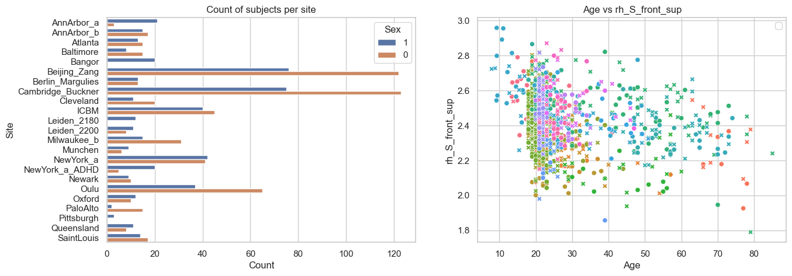
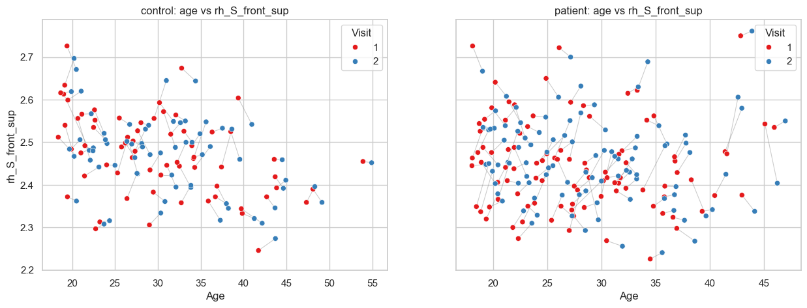
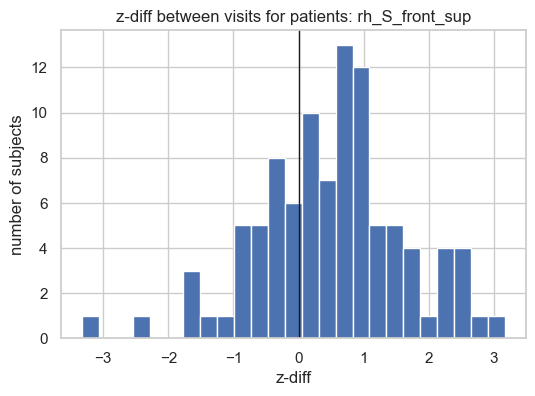
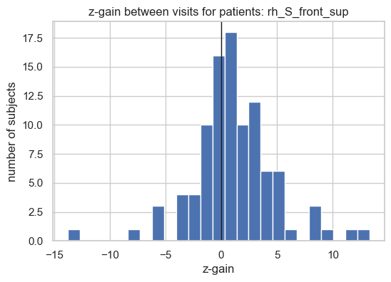
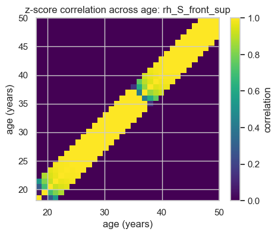
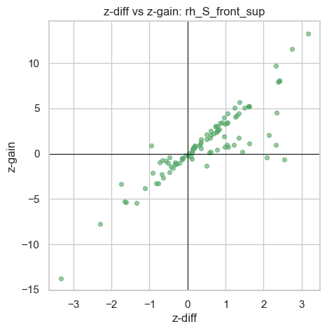

Longitudinal normative modelling
================================

A normative model tells you where a single measurement sits relative to
a reference population (a z-score). With **two or more visits per
person**, we can go further and ask:

   Did this person change *more than expected* between visits?

This notebook shows the two scores PCNtoolkit provides for that
question:

- **z-diff**
- **z-gain**

We use a cross-sectional dataset (``fcon1000``) to build the reference
model, and a longitudinal dataset (``LNM_data``, two visits per subject)
to score change over time.

.. code:: ipython3

    from pathlib import Path
    
    import matplotlib.pyplot as plt
    import numpy as np
    import pandas as pd
    import seaborn as sns
    
    from pcntoolkit import (
        BLR,
        NormData,
        NormativeModel,
        ZDiffScore,
        ZGainScore,
     )
    from pcntoolkit.math_functions.basis_function import (
        BsplineBasisFunction,
     )
    
    
    def find_data_dir():
        """Locate the example-data folder by searching upward."""
        # Check the current folder and each parent folder in turn.
        for base in [Path.cwd(), *Path.cwd().parents]:
            candidate = base / "pcntoolkit_resources" / "data"
            # Stop once both files needed by this notebook are found.
            if (
                (candidate / "fcon1000.csv").exists()
                and (candidate / "LNM_data.csv").exists()
            ):
                return candidate
        raise FileNotFoundError(
            "Could not find pcntoolkit_resources/data with "
            "fcon1000.csv and LNM_data.csv"
        )
    
    
    data_dir = find_data_dir()
    
    
    def tidy_region_names(df):
        """Use one consistent naming for cortical-thickness columns. Makes sure
        that both datasets have the same column names for the same regions."""
        return df.rename(
            columns={
                c: c.replace("&", "_and_").replace(
                    "_thickness", ""
                )
                for c in df.columns
            }
        )
    
    
    # Choose two cortical-thickness regions
    response_vars = ["rh_S_front_sup", "rh_G_front_middle"] # I select these regions as they were found significant in this notebook: https://github.com/predictive-clinical-neuroscience/pu25_code/blob/main/notebooks/secondary_workflows/longitudinal_modelling.ipynb

1. Build the reference model
----------------------------

We fit a normative model of cortical thickness against age on the
cross-sectional reference data.

.. code:: ipython3

    # Load the cross-sectional reference cohort used to fit the model.
    reference_df = tidy_region_names(pd.read_csv(data_dir / "fcon1000.csv"))
    
    reference_data = NormData.from_dataframe(
        name="reference",
        dataframe=reference_df,
        covariates=["age"],
        batch_effects=["site", "sex"],
        response_vars=response_vars,
        subject_ids="sub_id",
    )
    
    fcon1000_model = NormativeModel(
        BLR(
            basis_function_mean=BsplineBasisFunction(degree=3, nknots=5),
            warp_name="warpsinharcsinh",
        ),
        inscaler="standardize",
        outscaler="standardize",
        savemodel=False,
        saveresults=False,
    )
    
    fcon1000_model.fit(reference_data);

.. parsed-literal::

    Process: 12064 - 2026-06-11 11:41:54 - Dataset "reference" created.
        - 1078 observations
        - 1078 unique subjects
        - 1 covariates
        - 2 response variables
        - 2 batch effects:
        	site (23)
    	sex (2)
        
    Process: 12064 - 2026-06-11 11:41:54 - Fitting models on 2 response variables.
    Process: 12064 - 2026-06-11 11:41:54 - Fitting model for rh_S_front_sup.
    Process: 12064 - 2026-06-11 11:41:55 - Fitting model for rh_G_front_middle.
    Process: 12064 - 2026-06-11 11:41:55 - Making predictions on 2 response variables.
    Process: 12064 - 2026-06-11 11:41:55 - Computing z-scores for 2 response variables.
    Process: 12064 - 2026-06-11 11:41:55 - Computing z-scores for rh_S_front_sup.
    Process: 12064 - 2026-06-11 11:41:55 - Computing z-scores for rh_G_front_middle.
    Process: 12064 - 2026-06-11 11:41:55 - Computing centiles for 2 response variables.
    Process: 12064 - 2026-06-11 11:41:55 - Computing centiles for rh_S_front_sup.
    Process: 12064 - 2026-06-11 11:41:55 - Computing centiles for rh_G_front_middle.
    Process: 12064 - 2026-06-11 11:41:55 - Computing log-probabilities for 2 response variables.
    Process: 12064 - 2026-06-11 11:41:55 - Computing log-probabilities for 2 response variables.
    Process: 12064 - 2026-06-11 11:41:55 - Computing log-probabilities for rh_S_front_sup.
    Process: 12064 - 2026-06-11 11:41:55 - Computing log-probabilities for rh_G_front_middle.
    Process: 12064 - 2026-06-11 11:41:55 - Computing yhat for 2 response variables.
    Process: 12064 - 2026-06-11 11:41:55 - Computing yhat for rh_S_front_sup.
    Process: 12064 - 2026-06-11 11:41:55 - Computing yhat for rh_G_front_middle.
    Process: 12064 - 2026-06-11 11:41:56 - Dataset "centile" created.
        - 150 observations
        - 150 unique subjects
        - 1 covariates
        - 2 response variables
        - 2 batch effects:
        	site (1)
    	sex (1)
        
    Process: 12064 - 2026-06-11 11:41:56 - Computing centiles for 2 response variables.
    Process: 12064 - 2026-06-11 11:41:56 - Computing centiles for rh_S_front_sup.
    Process: 12064 - 2026-06-11 11:41:56 - Computing centiles for rh_G_front_middle.
    Process: 12064 - 2026-06-11 11:41:56 - Harmonizing data on 2 response variables.
    Process: 12064 - 2026-06-11 11:41:56 - Harmonizing data for rh_S_front_sup.
    Process: 12064 - 2026-06-11 11:41:56 - Harmonizing data for rh_G_front_middle.
    

Visualize the reference data
~~~~~~~~~~~~~~~~~~~~~~~~~~~~

Before modelling it helps to look at the cross-sectional reference
cohort: how many subjects each site contributes (split by sex), and how
cortical thickness varies with age across sites.

.. code:: ipython3

    # Pick the region to plot and pull the data into a flat dataframe.
    feature_to_plot = response_vars[0]
    df = reference_data.to_dataframe()
    
    fig, ax = plt.subplots(1, 2, figsize=(15, 5))
    
    # Left: how many subjects each site contributes, split by sex.
    sns.countplot(
        data=df,
        y=("batch_effects", "site"),
        hue=("batch_effects", "sex"),
        ax=ax[0],
        orient="h",
    )
    ax[0].legend(title="Sex")
    ax[0].set_title("Count of subjects per site")
    ax[0].set_xlabel("Count")
    ax[0].set_ylabel("Site")
    
    # Right: thickness against age, coloured by site and styled by sex.
    sns.scatterplot(
        data=df,
        x=("X", "age"),
        y=("Y", feature_to_plot),
        hue=("batch_effects", "site"),
        style=("batch_effects", "sex"),
        ax=ax[1],
    )
    # Hide the very long site legend to keep the panel readable.
    ax[1].legend([], [])
    ax[1].set_title(f"Age vs {feature_to_plot}")
    ax[1].set_xlabel("Age")
    ax[1].set_ylabel(feature_to_plot)
    
    plt.show()

2a. Load the longitudinal data
------------------------------

Each subject in ``LNM_data`` has two visits. We load it and line up its
column names with the reference data.

.. code:: ipython3

    # Load the longitudinal data
    longitudinal_df = tidy_region_names(pd.read_csv(data_dir / "LNM_data.csv"))
    
    # Split the longitudinal data into two groups: controls and patients.
    control_df = longitudinal_df[longitudinal_df["group"] == "control"]
    control_data = NormData.from_dataframe(
        name="control",
        dataframe=control_df,
        covariates=["age"],
        batch_effects=["site", "sex"],
        response_vars=response_vars,
        subject_ids="sub_id",
    )
    
    patient_df = longitudinal_df[longitudinal_df["group"] == "patient"]
    patient_data = NormData.from_dataframe(
        name="patient",
        dataframe=patient_df,
        covariates=["age"],
        batch_effects=["site", "sex"],
        response_vars=response_vars,
        subject_ids="sub_id",
    )

.. parsed-literal::

    Process: 12064 - 2026-06-11 11:41:57 - Dataset "control" created.
        - 134 observations
        - 67 unique subjects
        - 1 covariates
        - 2 response variables
        - 2 batch effects:
        	site (1)
    	sex (2)
        
    Process: 12064 - 2026-06-11 11:41:57 - Dataset "patient" created.
        - 196 observations
        - 98 unique subjects
        - 1 covariates
        - 2 response variables
        - 2 batch effects:
        	site (1)
    	sex (2)
        
    

Visualize the longitudinal data
~~~~~~~~~~~~~~~~~~~~~~~~~~~~~~~

Each subject has **two visits**, so we can draw a line per subject
connecting their two timepoints. We colour each point by visit number
and use one panel per group (controls vs patients). This makes the
within-subject change over time visible at a glance.

.. code:: ipython3

    # Region to plot and the two groups, each in its own panel.
    feature_to_plot = response_vars[0]
    groups = {"control": control_df, "patient": patient_df}
    
    fig, ax = plt.subplots(1, 2, figsize=(15, 5), sharey=True)
    
    # One panel per group: controls on the left, patients on the right.
    for axis, (group_name, group_df) in zip(ax, groups.items()):
        # Connect each subject's two visits with a thin grey line so the
        # within-subject trajectory over time is visible.
        for _, subject_rows in group_df.groupby("sub_id"):
            ordered = subject_rows.sort_values("visit")
            axis.plot(
                ordered["age"],
                ordered[feature_to_plot],
                color="grey",
                alpha=0.4,
                lw=0.8,
                zorder=1,
            )
    
        # Overlay the visits as points coloured by visit number.
        sns.scatterplot(
            data=group_df,
            x="age",
            y=feature_to_plot,
            hue="visit",
            palette="Set1",
            s=35,
            ax=axis,
            zorder=2,
        )
        axis.legend(title="Visit")
        axis.set_title(f"{group_name}: age vs {feature_to_plot}")
        axis.set_xlabel("Age")
        axis.set_ylabel(feature_to_plot)
    
    plt.show()

Patients seems to have bigger changes from visit 1 to visit 2 than the
controls

2b. Transfer and predict
------------------------

The LNM and fcon1000 data have different sites. For this reason we need
to first transfer the fcon1000 model to the LNM data and then do our
predictions.

.. code:: ipython3

    # Keep 20% as the adaptation set. We will use this to transfer the fcon1000 model to the LNM data.
    control_adapt, control_test = control_data.train_test_split(splits=[0.2, 0.8])
    
    # transfer
    lnm_model = fcon1000_model.transfer(control_adapt);
    
    # predict
    lnm_model.predict(control_test);
    lnm_model.predict(patient_data);

.. parsed-literal::

    Process: 12064 - 2026-06-11 11:41:57 - Transferring models on 2 response variables.
    Process: 12064 - 2026-06-11 11:41:57 - Transferring model for rh_S_front_sup.
    Process: 12064 - 2026-06-11 11:41:57 - Transferring model for rh_G_front_middle.
    Process: 12064 - 2026-06-11 11:41:57 - Saving model to:
    	C:\Users\kontsi/.pcntoolkit\saves_transfer.
    Process: 12064 - 2026-06-11 11:41:57 - Making predictions on 2 response variables.
    Process: 12064 - 2026-06-11 11:41:57 - Computing z-scores for 2 response variables.
    Process: 12064 - 2026-06-11 11:41:57 - Computing z-scores for rh_S_front_sup.
    Process: 12064 - 2026-06-11 11:41:57 - Computing z-scores for rh_G_front_middle.
    Process: 12064 - 2026-06-11 11:41:57 - Computing centiles for 2 response variables.
    Process: 12064 - 2026-06-11 11:41:57 - Computing centiles for rh_S_front_sup.
    Process: 12064 - 2026-06-11 11:41:58 - Computing centiles for rh_G_front_middle.
    Process: 12064 - 2026-06-11 11:41:58 - Computing log-probabilities for 2 response variables.
    Process: 12064 - 2026-06-11 11:41:58 - Computing log-probabilities for 2 response variables.
    Process: 12064 - 2026-06-11 11:41:58 - Computing log-probabilities for rh_S_front_sup.
    Process: 12064 - 2026-06-11 11:41:58 - Computing log-probabilities for rh_G_front_middle.
    Process: 12064 - 2026-06-11 11:41:58 - Computing yhat for 2 response variables.
    Process: 12064 - 2026-06-11 11:41:58 - Computing yhat for rh_S_front_sup.
    Process: 12064 - 2026-06-11 11:41:58 - Computing yhat for rh_G_front_middle.
    Process: 12064 - 2026-06-11 11:41:58 - Dataset "centile" created.
        - 150 observations
        - 150 unique subjects
        - 1 covariates
        - 2 response variables
        - 2 batch effects:
        	site (1)
    	sex (1)
        
    Process: 12064 - 2026-06-11 11:41:58 - Computing centiles for 2 response variables.
    Process: 12064 - 2026-06-11 11:41:58 - Computing centiles for rh_S_front_sup.
    Process: 12064 - 2026-06-11 11:41:58 - Computing centiles for rh_G_front_middle.
    Process: 12064 - 2026-06-11 11:41:58 - Harmonizing data on 2 response variables.
    Process: 12064 - 2026-06-11 11:41:58 - Harmonizing data for rh_S_front_sup.
    Process: 12064 - 2026-06-11 11:41:58 - Harmonizing data for rh_G_front_middle.
    Process: 12064 - 2026-06-11 11:41:59 - Making predictions on 2 response variables.
    Process: 12064 - 2026-06-11 11:41:59 - Computing z-scores for 2 response variables.
    Process: 12064 - 2026-06-11 11:41:59 - Computing z-scores for rh_S_front_sup.
    Process: 12064 - 2026-06-11 11:41:59 - Computing z-scores for rh_G_front_middle.
    Process: 12064 - 2026-06-11 11:41:59 - Computing centiles for 2 response variables.
    Process: 12064 - 2026-06-11 11:41:59 - Computing centiles for rh_S_front_sup.
    Process: 12064 - 2026-06-11 11:41:59 - Computing centiles for rh_G_front_middle.
    Process: 12064 - 2026-06-11 11:41:59 - Computing log-probabilities for 2 response variables.
    Process: 12064 - 2026-06-11 11:41:59 - Computing log-probabilities for 2 response variables.
    Process: 12064 - 2026-06-11 11:41:59 - Computing log-probabilities for rh_S_front_sup.
    Process: 12064 - 2026-06-11 11:41:59 - Computing log-probabilities for rh_G_front_middle.
    Process: 12064 - 2026-06-11 11:41:59 - Computing yhat for 2 response variables.
    Process: 12064 - 2026-06-11 11:41:59 - Computing yhat for rh_S_front_sup.
    Process: 12064 - 2026-06-11 11:41:59 - Computing yhat for rh_G_front_middle.
    Process: 12064 - 2026-06-11 11:41:59 - Dataset "centile" created.
        - 150 observations
        - 150 unique subjects
        - 1 covariates
        - 2 response variables
        - 2 batch effects:
        	site (1)
    	sex (1)
        
    Process: 12064 - 2026-06-11 11:41:59 - Computing centiles for 2 response variables.
    Process: 12064 - 2026-06-11 11:41:59 - Computing centiles for rh_S_front_sup.
    Process: 12064 - 2026-06-11 11:41:59 - Computing centiles for rh_G_front_middle.
    Process: 12064 - 2026-06-11 11:41:59 - Harmonizing data on 2 response variables.
    Process: 12064 - 2026-06-11 11:41:59 - Harmonizing data for rh_S_front_sup.
    Process: 12064 - 2026-06-11 11:41:59 - Harmonizing data for rh_G_front_middle.
    Process: 12064 - 2026-06-11 11:42:00 - Making predictions on 2 response variables.
    Process: 12064 - 2026-06-11 11:42:00 - Computing z-scores for 2 response variables.
    Process: 12064 - 2026-06-11 11:42:00 - Computing z-scores for rh_S_front_sup.
    Process: 12064 - 2026-06-11 11:42:00 - Computing z-scores for rh_G_front_middle.
    Process: 12064 - 2026-06-11 11:42:00 - Computing centiles for 2 response variables.
    Process: 12064 - 2026-06-11 11:42:00 - Computing centiles for rh_S_front_sup.
    Process: 12064 - 2026-06-11 11:42:00 - Computing centiles for rh_G_front_middle.
    Process: 12064 - 2026-06-11 11:42:00 - Computing log-probabilities for 2 response variables.
    Process: 12064 - 2026-06-11 11:42:00 - Computing log-probabilities for 2 response variables.
    Process: 12064 - 2026-06-11 11:42:00 - Computing log-probabilities for rh_S_front_sup.
    Process: 12064 - 2026-06-11 11:42:00 - Computing log-probabilities for rh_G_front_middle.
    Process: 12064 - 2026-06-11 11:42:00 - Computing yhat for 2 response variables.
    Process: 12064 - 2026-06-11 11:42:00 - Computing yhat for rh_S_front_sup.
    Process: 12064 - 2026-06-11 11:42:00 - Computing yhat for rh_G_front_middle.
    Process: 12064 - 2026-06-11 11:42:00 - Dataset "centile" created.
        - 150 observations
        - 150 unique subjects
        - 1 covariates
        - 2 response variables
        - 2 batch effects:
        	site (1)
    	sex (1)
        
    Process: 12064 - 2026-06-11 11:42:00 - Computing centiles for 2 response variables.
    Process: 12064 - 2026-06-11 11:42:00 - Computing centiles for rh_S_front_sup.
    Process: 12064 - 2026-06-11 11:42:00 - Computing centiles for rh_G_front_middle.
    Process: 12064 - 2026-06-11 11:42:01 - Harmonizing data on 2 response variables.
    Process: 12064 - 2026-06-11 11:42:01 - Harmonizing data for rh_S_front_sup.
    Process: 12064 - 2026-06-11 11:42:01 - Harmonizing data for rh_G_front_middle.
    

3. z-diff
---------

Values near 0 are typical; large positive or negative values indicate
unusual change.

.. code:: ipython3

    # we use as reference daa the control test data
    zdiff = ZDiffScore(
        normative_model=lnm_model,
        reference_data=control_test,
        subject_id_col="sub_id",
    )
    
    # we use as score data the patient data 
    zdiff_scores = zdiff.score(
        score_data = patient_data,
        subject_id_col="sub_id",
        timepoint_col="visit",
    )
    
    # Show the first few subject-level z-diff scores.
    zdiff_scores.to_dataframe(name="z_diff").unstack("response_vars").head()

.. raw:: html

    

    
    <table border="1" class="dataframe">
      <thead>
        <tr>
          <th></th>
          <th colspan="2" halign="left">z_diff</th>
        </tr>
        <tr>
          <th>response_vars</th>
          <th>rh_S_front_sup</th>
          <th>rh_G_front_middle</th>
        </tr>
        <tr>
          <th>subjects</th>
          <th></th>
          <th></th>
        </tr>
      </thead>
      <tbody>
        <tr>
          <th>P000</th>
          <td>-0.322964</td>
          <td>-0.565736</td>
        </tr>
        <tr>
          <th>P001</th>
          <td>-2.297495</td>
          <td>-2.848406</td>
        </tr>
        <tr>
          <th>P002</th>
          <td>-0.516952</td>
          <td>-0.229765</td>
        </tr>
        <tr>
          <th>P003</th>
          <td>0.494147</td>
          <td>1.133814</td>
        </tr>
        <tr>
          <th>P004</th>
          <td>0.192776</td>
          <td>-0.492138</td>
        </tr>
      </tbody>
    </table>
    

.. code:: ipython3

    # Pick one region
    region = response_vars[0]
    
    # Plot the distribution of z-diff values across subjects.
    plt.figure(figsize=(6, 4))
    plt.hist(
        zdiff_scores.sel(response_vars=region).values,
        bins=25,
        color="#4c72b0",
        edgecolor="white",
    )
    
    # Mark zero, which corresponds to typical change.
    plt.axvline(0, color="k", lw=1)
    plt.xlabel("z-diff")
    plt.ylabel("number of subjects")
    plt.title(f"z-diff between visits for patients: {region}")
    plt.show()

4a. z-gain
----------

``ZGainScore`` asks whether a subject’s z-score at the later visit is
surprising given their earlier visit. It relies on how strongly z-scores
are correlated across ages, which it estimates as a **correlation
matrix**.

.. code:: ipython3

    # we use as reference daa the control test data
    zgain = ZGainScore(
        normative_model=lnm_model,
        reference_data=control_test,
        subject_id_col="sub_id",
        bandwidth=3, # we calculate correlation in a 3-year age window
        covariate="age",
    )
    
    # we use as score data the patient data 
    zgain_scores = zgain.score(
        score_data=patient_data,
        subject_id_col="sub_id",
        timepoint_col="visit",
    )
    
    # Show the first few subject-level z-gain scores.
    zgain_scores.to_dataframe(name="z_gain").unstack("response_vars").head()

.. raw:: html

    

    
    <table border="1" class="dataframe">
      <thead>
        <tr>
          <th></th>
          <th colspan="2" halign="left">z_gain</th>
        </tr>
        <tr>
          <th>response_vars</th>
          <th>rh_S_front_sup</th>
          <th>rh_G_front_middle</th>
        </tr>
        <tr>
          <th>subjects</th>
          <th></th>
          <th></th>
        </tr>
      </thead>
      <tbody>
        <tr>
          <th>P000</th>
          <td>-1.218579</td>
          <td>-1.453539</td>
        </tr>
        <tr>
          <th>P001</th>
          <td>-7.754113</td>
          <td>-6.219977</td>
        </tr>
        <tr>
          <th>P002</th>
          <td>-1.012166</td>
          <td>-0.517759</td>
        </tr>
        <tr>
          <th>P003</th>
          <td>1.568706</td>
          <td>2.982843</td>
        </tr>
        <tr>
          <th>P004</th>
          <td>0.860851</td>
          <td>-0.970241</td>
        </tr>
      </tbody>
    </table>
    

.. code:: ipython3

    # Pick one region
    region = response_vars[0]
    
    # Plot the distribution of zgain values across subjects.
    plt.figure(figsize=(6, 4))
    plt.hist(
        zgain_scores.sel(response_vars=region).values,
        bins=25,
        color="#4c72b0",
        edgecolor="white",
    )
    
    # Mark zero, which corresponds to typical change.
    plt.axvline(0, color="k", lw=1)
    plt.xlabel("z-gain")
    plt.ylabel("number of subjects")
    plt.title(f"z-gain between visits for patients: {region}")
    plt.show()

4b. Plot the correlation matrix
===============================

.. code:: ipython3

    # The learned correlation matrix is stored after z-gain is computed.
    R = zgain.correlation_matrix.sel(response_vars=region)
    
    # Restrict both axes to the cohort age range (18-50). Outside this
    # range the matrix is extrapolated and not trustworthy, so we hide it.
    age_lo, age_hi = 18, 50
    R = R.sel(age_1=slice(age_lo, age_hi), age_2=slice(age_lo, age_hi))
    
    # Display the age-to-age z-score correlation matrix as a heatmap.
    plt.figure(figsize=(5, 4))
    plt.imshow(
        R.values,
        origin="lower",
        extent=[age_lo, age_hi, age_lo, age_hi],
        vmin=0,
        vmax=1,
        cmap="viridis",
    )
    plt.colorbar(label="correlation")
    plt.xlabel("age (years)")
    plt.ylabel("age (years)")
    plt.title(f"z-score correlation across age: {region}")
    plt.show()

Note: we have only a few control subjects that the correlation matrix is
computed from (if i counted right there are 67 subjects in the
control_test). Each off-diagonal cell ``(age_1, age_2)`` needs at least
4 control subjects at both ages; otherwise, the value is estimated
through regression and might not be trustworthy (see this dark blue ->
yellow -> dakr blue -> yellow pattern as we go from young to old ages in
the correlation matrix).

I think we would need a bigger LNM dataset to compute the correlation
matrix (TODO: discuss with Andre about that)

5. Are the results as expected?
-------------------------------

We expect z-diff and z-gain to broadly agree on who shows unusual
change, since both measure the same thing on this two-visit data.

.. code:: ipython3

    # Read the two longitudinal scores for one region.
    zd = zdiff_scores.sel(response_vars=region).values
    zg = zgain_scores.sel(response_vars=region).values
    
    
    # Summarise the location and spread of the two score distributions.
    print(f"z-diff: mean = {zd.mean():.2f}, sd = {zd.std():.2f}")
    print(f"z-gain: mean = {zg.mean():.2f}, sd = {zg.std():.2f}")
    print(
        "agreement (same direction): "
        f"{np.mean(np.sign(zd) == np.sign(zg)):.0%}"
    )
    
    # Plot the subject-level agreement between z-diff and z-gain.
    plt.figure(figsize=(5, 5))
    plt.scatter(zd, zg, s=18, alpha=0.6, color="#55a868")
    plt.axhline(0, color="k", lw=0.8)
    plt.axvline(0, color="k", lw=0.8)
    plt.xlabel("z-diff")
    plt.ylabel("z-gain")
    plt.title(f"z-diff vs z-gain: {region}")
    plt.show()

.. parsed-literal::

    z-diff: mean = 0.50, sd = 1.13
    z-gain: mean = 1.17, sd = 3.71
    agreement (same direction): 93%
    

Choosing between z-diff and z-gain
----------------------------------

+-----------------------------------+----------------------------------+
| You have…                         | Use                              |
+===================================+==================================+
| Two timepoints, BLR or wBLR model | ``ZDiffScore`` or ``ZGainScore`` |
+-----------------------------------+----------------------------------+
| Want thrive lines and/or          | ``ZGainScore``                   |
| conditional forecasting           |                                  |
+-----------------------------------+----------------------------------+
| Three or more timepoints          | ``ZGainScore``                   |
+-----------------------------------+----------------------------------+

A large positive or negative score flags a subject whose change over
time is unusual compared with the reference population – could be a
useful metric to find atypical trajectories in clinical populations.
